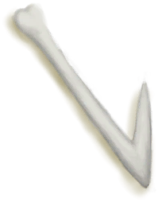
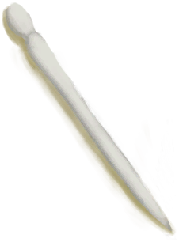

# 骨头碎片  
> 可以做成钩或者针。  
   
> 骨头可以从动物的尸体上获得，有时也可以在巨蜥的食丸中找到。  大的骨头可以用于某些特定的制作配方，也可以砸碎成为<b>骨头碎片</b>用于制作较小的物品，或者进一步磨碎成<b>骨粉</b>用作肥料。 <b>鱼钩和骨针</b>可以用鸟骨或骨头碎片制作，分别用于钓鱼和裁缝。  
  
<table class="table table-bordered" data-toggle="table" ><tbody><tr ><td  style="width:80%;text-align:left;vertical-align:top;"  >**重量：**50</td><td  style="width:20%;text-align:left;vertical-align:top;"  >

</td></tr></tbody></tbody></table>  
  
## 获取来源  
<table class="table table-bordered" data-toggle="table" ><thead><tr ><th  style="text-align:left;vertical-align:top;"  >来源</th><th  style="text-align:left;vertical-align:top;"  >操作</th></tr></thead><tr ><td  style="text-align:left;vertical-align:top;"  >[

[骨头](Bones.md)](Bones.md)</td><td  style="text-align:left;vertical-align:top;"  >打碎 ** 拖入：**[“锤”](tag_Hammer.md)</td></tr><tr ><td  style="text-align:left;vertical-align:top;"  >[

[鱼镖](HarpoonBone.md)](HarpoonBone.md)</td><td  style="text-align:left;vertical-align:top;"  >鱼镖坏了</td></tr><tr ><td  style="text-align:left;vertical-align:top;"  >[

[猕猴窝(丛林高地)](MacaqueDenEntrance.md)](MacaqueDenEntrance.md)</td><td  style="text-align:left;vertical-align:top;"  >我TM来啦！ ** 拖入：**[炸药(开)](DynamiteOn.md)</td></tr></tbody></table>  
  
## 动作  
<table class="table table-bordered" data-toggle="table" ><thead><tr ><th  style="text-align:left;vertical-align:top;"  >动作</th><th  style="text-align:left;vertical-align:top;"  >耗时</th><th  style="text-align:left;vertical-align:top;"  >条件</th><th  style="text-align:left;vertical-align:top;"  >变化</th><th  style="text-align:left;vertical-align:top;"  >状态</th></tr></thead><tr ><td  style="text-align:left;vertical-align:top;"  >制作钩 [“手部动作(组)”](HandAction.md)</td><td  style="text-align:left;vertical-align:top;"  >1TP</td><td  style="text-align:left;vertical-align:top;"  >[

[光亮](Light.md)](Light.md): 10-100</td><td  style="text-align:left;vertical-align:top;"  >** 自身：** → [

[骨钩](HookBone.md)](HookBone.md)</td><td  style="text-align:left;vertical-align:top;"  >[

[制作(技能)](Skill_Crafting.md)](Skill_Crafting.md)+0.5</td></tr><tr ><td  style="text-align:left;vertical-align:top;"  >制作针 [“手部动作(组)”](HandAction.md)</td><td  style="text-align:left;vertical-align:top;"  >1TP</td><td  style="text-align:left;vertical-align:top;"  >[

[光亮](Light.md)](Light.md): 10-100</td><td  style="text-align:left;vertical-align:top;"  >** 自身：** → [

[骨针](BoneNeedle.md)](BoneNeedle.md)</td><td  style="text-align:left;vertical-align:top;"  >[

[制作(技能)](Skill_Crafting.md)](Skill_Crafting.md)+0.5</td></tr></tbody></table>  
  
## 可拖入  
<table class="table table-bordered" data-toggle="table" ><thead><tr ><th  style="text-align:left;vertical-align:top;"  >使用</th><th  style="text-align:left;vertical-align:top;"  >动作</th><th  style="text-align:left;vertical-align:top;"  >耗时</th><th  style="text-align:left;vertical-align:top;"  data-sortable="true"  >条件</th><th  style="text-align:left;vertical-align:top;"  >变化</th><th  style="text-align:left;vertical-align:top;"  data-sortable="true"  >玩家状态</th></tr></thead><tr ><td  style="text-align:left;vertical-align:top;"  >[“锤”](tag_Hammer.md)</td><td  style="text-align:left;vertical-align:top;"  >研磨 </td><td  style="text-align:left;vertical-align:top;"  >4TP</td><td  style="text-align:left;vertical-align:top;"  ></td><td  style="text-align:left;vertical-align:top;"  >** 自身: ** → [

[骨粉](Bonemeal.md)](Bonemeal.md)  ** 使用物: ** 可用次数  -1</td><td  style="text-align:left;vertical-align:top;"  ></td></tr></tbody></table>  
  

