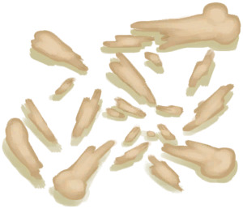

[返回首页](index.md)   |  [查看所有物品](object.md)
# 骨头碎片  
> 可以做成钩或者针。  
  
  属性  |   图片   
 ----  |  ----:   
 **重量：**50  |     
  
## 获取来源  
来源  |  操作  
----  |  ----  
[骨头](Bones.md) , [“锤”](tag_Hammer.md)  |  打碎  
[骨头](Bones.md) , [“锤”](tag_Hammer.md)  |  打碎  
[猕猴窝(丛林高地)](MacaqueDenEntrance.md) , [炸药](DynamiteOn.md)  |  我TM来啦！  
## 动作  
动作  |  时间  |  条件  |  变化  |  状态  
----  |  ----  |  ----  |  ----  |  ----  
制作钩  |  15分  |  [光亮](Light.md):10-100  |  → [骨钩](HookBone.md)   |  [制作(技能)](Skill_Crafting.md)+0.5  
制作针  |  15分  |  [光亮](Light.md):10-100  |  → [骨针](BoneNeedle.md)   |  [制作(技能)](Skill_Crafting.md)+0.5  
## 可拖入  
使用  |  动作  |  时间  |  条件  |  变化  |  状态  
----  |  ----  |  ----  |  ----  |  ----  |  ----  
[“锤”](tag_Hammer.md)  |  研磨  |  1小时  |    |  自身: → [骨粉](Bonemeal.md)  使用物: 可用次数  -1    |    
