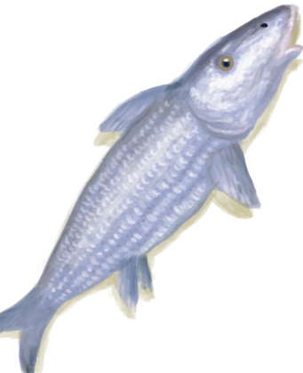

# 北梭鱼  
> 好大一条，我得先把它切成几块。  
  
<table class="table table-bordered" data-toggle="table"  data-show-header="false"><thead style="display:none"><tr ><th  style="width:50%;text-align:left;vertical-align:top;"  >title</th><th  style="width:50%;text-align:left;vertical-align:top;"  ></th></tr></thead><tr ><td  style="width:50%;text-align:left;vertical-align:top;"  >**重量：**225  **标签：**	[“可烹饪的”](tag_Cookable.md), [“饲料”](tag_Feed.md), [“肉”](tag_Meat.md), [“鱼肉”](tag_Fish.md)</td><td  style="width:50%;text-align:left;vertical-align:top;"  >

<a href="Bonefish.md" style="color:black">北梭鱼</a>

一条大到可以提供两份肉的鱼。在岛上较深的水域，如岩石周围的地区或开阔海域更容易发现它。</td></tr></tbody></table>  
  
## 获取来源  
<table class="table table-bordered" data-toggle="table"  ><thead style=""><tr ><th  style="text-align:left;vertical-align:top;"  >来源</th><th  style="text-align:left;vertical-align:top;"  >操作</th></tr></thead><tr ><td  style="text-align:left;vertical-align:top;"  >[

[捕捞拖网](RaftFishTrap.md)](RaftFishTrap.md)</td><td  style="text-align:left;vertical-align:top;"  >捕捉猎物</td></tr><tr ><td  style="text-align:left;vertical-align:top;"  >[

[海水(覆溺洞穴)](Sea_Cave.md)](Sea_Cave.md)</td><td  style="text-align:left;vertical-align:top;"  >钓鱼 ** 拖入：**[“钓鱼线”](tag_FishingLine.md)</td></tr><tr ><td  style="text-align:left;vertical-align:top;"  >[

[海水(覆溺洞穴)](Sea_Cave.md)](Sea_Cave.md)</td><td  style="text-align:left;vertical-align:top;"  >钓鱼 ** 拖入：**[“诱饵（用于钓鱼线）”](tag_FishingLineBait.md)</td></tr><tr ><td  style="text-align:left;vertical-align:top;"  >[

[海(海湾)](Sea_Bay.md)](Sea_Bay.md)</td><td  style="text-align:left;vertical-align:top;"  >钓鱼 ** 拖入：**[“钓鱼线”](tag_FishingLine.md)</td></tr><tr ><td  style="text-align:left;vertical-align:top;"  >[

[海(海湾)](Sea_Bay.md)](Sea_Bay.md)</td><td  style="text-align:left;vertical-align:top;"  >钓鱼 ** 拖入：**[“诱饵（用于钓鱼线）”](tag_FishingLineBait.md)</td></tr><tr ><td  style="text-align:left;vertical-align:top;"  >[

[海(荒芜沙滩)](Sea_DesolateBeach.md)](Sea_DesolateBeach.md)</td><td  style="text-align:left;vertical-align:top;"  >叉鱼 ** 拖入：**[“一级矛”](tag_Spear.md)</td></tr><tr ><td  style="text-align:left;vertical-align:top;"  >[

[海(荒芜沙滩)](Sea_DesolateBeach.md)](Sea_DesolateBeach.md)</td><td  style="text-align:left;vertical-align:top;"  >钓鱼 ** 拖入：**[“钓鱼线”](tag_FishingLine.md)</td></tr><tr ><td  style="text-align:left;vertical-align:top;"  >[

[海(荒芜沙滩)](Sea_DesolateBeach.md)](Sea_DesolateBeach.md)</td><td  style="text-align:left;vertical-align:top;"  >钓鱼 ** 拖入：**[“诱饵（用于钓鱼线）”](tag_FishingLineBait.md)</td></tr><tr ><td  style="text-align:left;vertical-align:top;"  >[

[海(荒芜沙滩)](Sea_DesolateBeach.md)](Sea_DesolateBeach.md)</td><td  style="text-align:left;vertical-align:top;"  >轰隆！ ** 拖入：**[炸‍葯(开)](DynamiteOn.md)</td></tr><tr ><td  style="text-align:left;vertical-align:top;"  >[

[海(红树林)](Sea_Mangroves.md)](Sea_Mangroves.md)</td><td  style="text-align:left;vertical-align:top;"  >钓鱼 ** 拖入：**[“钓鱼线”](tag_FishingLine.md)</td></tr><tr ><td  style="text-align:left;vertical-align:top;"  >[

[海(红树林)](Sea_Mangroves.md)](Sea_Mangroves.md)</td><td  style="text-align:left;vertical-align:top;"  >钓鱼 ** 拖入：**[“诱饵（用于钓鱼线）”](tag_FishingLineBait.md)</td></tr><tr ><td  style="text-align:left;vertical-align:top;"  >[

[海](Sea_Raft.md)](Sea_Raft.md)</td><td  style="text-align:left;vertical-align:top;"  >叉鱼 ** 拖入：**[鱼镖](HarpoonBone.md)</td></tr><tr ><td  style="text-align:left;vertical-align:top;"  >[

[海](Sea_Raft.md)](Sea_Raft.md)</td><td  style="text-align:left;vertical-align:top;"  >钓鱼 ** 拖入：**[“钓鱼线”](tag_FishingLine.md)</td></tr><tr ><td  style="text-align:left;vertical-align:top;"  >[

[海](Sea_Raft.md)](Sea_Raft.md)</td><td  style="text-align:left;vertical-align:top;"  >钓鱼 ** 拖入：**[“诱饵（用于钓鱼线）”](tag_FishingLineBait.md)</td></tr><tr ><td  style="text-align:left;vertical-align:top;"  >[

[海](Sea_Raft.md)](Sea_Raft.md)</td><td  style="text-align:left;vertical-align:top;"  >轰隆！ ** 拖入：**[炸‍葯(开)](DynamiteOn.md)</td></tr><tr ><td  style="text-align:left;vertical-align:top;"  >[

[海(鸟岩岛)](Sea_Rocks.md)](Sea_Rocks.md)</td><td  style="text-align:left;vertical-align:top;"  >叉鱼 ** 拖入：**[“一级矛”](tag_Spear.md)</td></tr><tr ><td  style="text-align:left;vertical-align:top;"  >[

[海(鸟岩岛)](Sea_Rocks.md)](Sea_Rocks.md)</td><td  style="text-align:left;vertical-align:top;"  >钓鱼 ** 拖入：**[“钓鱼线”](tag_FishingLine.md)</td></tr><tr ><td  style="text-align:left;vertical-align:top;"  >[

[海(鸟岩岛)](Sea_Rocks.md)](Sea_Rocks.md)</td><td  style="text-align:left;vertical-align:top;"  >钓鱼 ** 拖入：**[“诱饵（用于钓鱼线）”](tag_FishingLineBait.md)</td></tr><tr ><td  style="text-align:left;vertical-align:top;"  >[

[海(鸟岩岛)](Sea_Rocks.md)](Sea_Rocks.md)</td><td  style="text-align:left;vertical-align:top;"  >轰隆！ ** 拖入：**[炸‍葯(开)](DynamiteOn.md)</td></tr></tbody></table>  
  
## 可拖入  
<table class="table table-bordered" data-toggle="table"  ><thead style=""><tr ><th  style="text-align:left;vertical-align:top;"  >使用</th><th  style="text-align:left;vertical-align:top;"  >动作</th><th  style="text-align:left;vertical-align:top;"  >耗时</th><th  style="text-align:left;vertical-align:top;"  >条件</th><th  style="text-align:left;vertical-align:top;"  >变化</th><th  style="text-align:left;vertical-align:top;"  >玩家状态</th></tr></thead><tr ><td  style="text-align:left;vertical-align:top;"  >[“切割工具”](tag_Cutter.md)</td><td  style="text-align:left;vertical-align:top;"  >剖开 [“手部动作(组)”](HandAction.md) [“制造动作(组)”](CraftAction.md)</td><td  style="text-align:left;vertical-align:top;"  >15分</td><td  style="text-align:left;vertical-align:top;"  >[

[光亮](Light.md)](Light.md): 10-100</td><td  style="text-align:left;vertical-align:top;"  >** 自身: ** →消失  ** 使用物: ** 可用次数  -1  ** 获得: ** ** [Bonefish Meat]  **   [

[北梭鱼肉](BonefishMeat.md)](BonefishMeat.md)(+2)   [

[鱼杂](FishScraps.md)](FishScraps.md)(+3) 基础权重：1</td><td  style="text-align:left;vertical-align:top;"  >[

[污垢](Filth.md)](Filth.md)+10</td></tr></tbody></table>  
  
## 可拖至  

[猪食槽](BoarFeeder.md)

[猪食槽](BoarFeeder.md)

[猪食槽(空)](BoarFeederEmpty.md)

[猪食槽(空)](BoarFeederEmpty.md)

[堆肥箱](CompostBin.md)

[灰山鹑喂食器](PartridgeFeeder.md)

[灰山鹑喂食器(空)](PartridgeFeederEmpty.md)

[中陷阱的猕猴](CageTrapMacaque.md)

[母猪](BoarEnclosureFemale.md)

[母猪](BoarEnclosureFemale.md)

[公猪](BoarEnclosureMale.md)

[公猪](BoarEnclosureMale.md)

[小猪](BoarEnclosurePiglet.md)

[小猪](BoarEnclosurePiglet.md)

[母猪](BoarTiedFemale.md)

[母猪](BoarTiedFemale.md)

[公猪](BoarTiedMale.md)

[公猪](BoarTiedMale.md)

[小猪](BoarTiedPiglet.md)

[小猪](BoarTiedPiglet.md)

[忠犬朋友](DogFriend.md)

[忠犬朋友](DogFriend.md)

[猕猴朋友](MacaqueFriend.md)

[受伤的猕猴](MacaqueWounded.md)

[小灰山鹑](PartridgeChick.md)

[雌灰山鹑](PartridgeFemaleEnclosure.md)

[雌灰山鹑](PartridgeFemaleLive.md)

[雄灰山鹑](PartridgeMaleEnclosure.md)

[雄灰山鹑](PartridgeMaleLive.md)

  
  
## 属性   
<table class="table table-bordered" data-toggle="table"  ><thead style=""><tr ><th  style="text-align:left;vertical-align:top;"  >属性</th><th  style="text-align:left;vertical-align:top;"  >值</th><th  style="text-align:left;vertical-align:top;"  >耗时</th><th  style="text-align:left;vertical-align:top;"  >变化</th></tr></thead><tr ><td  style="text-align:left;vertical-align:top;"  >耐久</td><td  style="text-align:left;vertical-align:top;"  >初始：192</td><td  style="text-align:left;vertical-align:top;"  >每15分钟-1 最多需要：2天</td><td  style="text-align:left;vertical-align:top;"  >** 到达0时： **  ** 自身 ** → [

[腐烂物](RottenRemains.md)](RottenRemains.md)</td></tr></tbody></table>  
  

