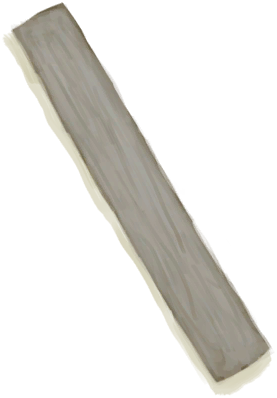

# 木床  
> 一张结实又舒服的木床。我的背会好受些。  
  
<table class="table table-bordered"><tbody><tr ><td  style="width:80%;text-align:left;vertical-align:top;" >** 解锁条件: ** [

[木工(技能)](Skill_Woodworking.md)](Skill_Woodworking.md): 70-150  ** 动作分类: ** [手部动作(组)](HandAction.md) [制造动作(组)](CraftAction.md)</td><td  style="width:20%;text-align:left;vertical-align:top;" >

</td></tr></tbody></tbody></table>  
  
## 制作  
<table class="table table-bordered"><thead><tr ><th  style="text-align:left;vertical-align:top;" >步骤</th><th  style="text-align:left;vertical-align:top;" >耗时</th><th  style="text-align:left;vertical-align:top;" >需求</th><th  style="text-align:left;vertical-align:top;" >状态变化</th><th  style="text-align:left;vertical-align:top;" >成品</th></tr></thead><tr ><td  style="text-align:left;vertical-align:top;" >1. [

[木板](Plank.md)](Plank.md) x 12 + [

[木钉](Treenail.md)](Treenail.md) x 6 + [锋利的斧子(组)](GpTag_AxeAdv.md) x 1 + [锋利的刀(组)](GpTag_CutterAdv.md) x 1 2. [

[超大块布](ClothVeryLarge.md)](ClothVeryLarge.md) x 2 + [

[蛇草](SnakeGrass.md)](SnakeGrass.md) x 16 + [

[细线](CordFiber.md)](CordFiber.md) x 16 + [针(组)](GpTag_Needle.md) x 1 3. [

[大块的布](ClothLarge.md)](ClothLarge.md) x 1 + [

[羽毛](Feathers.md)](Feathers.md) x 40 + [

[细线](CordFiber.md)](CordFiber.md) x 8 + [针(组)](GpTag_Needle.md) x 1 4. [

[超大块布](ClothVeryLarge.md)](ClothVeryLarge.md) x 1</td><td  style="text-align:left;vertical-align:top;" >1小时/每步骤</td><td  style="text-align:left;vertical-align:top;" >** 需要状态: ** [

[光亮](Light.md)](Light.md): 10-100 [

[遮蔽](Sheltered.md)](Sheltered.md): 1-1 [

[遮蔽](Sheltered.md)](Sheltered.md): 1-1 ** 需要卡牌: ** ~~[木床](BedWooden.md)~~</td><td  style="text-align:left;vertical-align:top;" >[

[制作(技能)](Skill_Crafting.md)](Skill_Crafting.md)+1 [

[木工(技能)](Skill_Woodworking.md)](Skill_Woodworking.md)+2 [

[压力](Stress.md)](Stress.md)-10 [

[情绪](Morale.md)](Morale.md)+25</td><td  style="text-align:left;vertical-align:top;" >[木床](BedWooden.md)(+1)</td></tr></tbody></table>  
  

