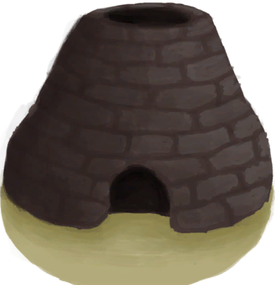
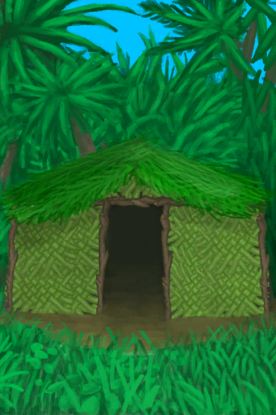
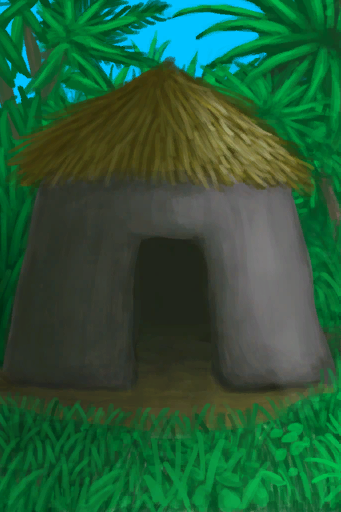
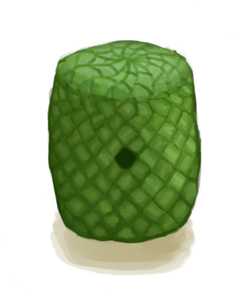
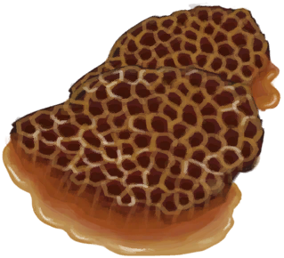
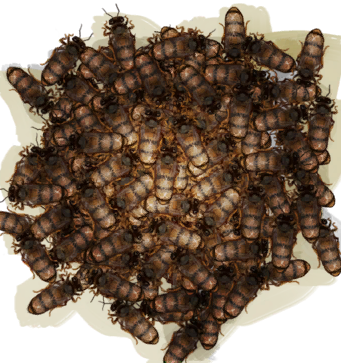
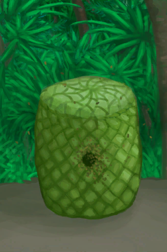

# 蜂箱  
> 一个人造的蜂巢  
  
<table class="table table-bordered" data-toggle="table"  data-show-header="false"><thead style="display:none"><tr ><th  style="width:50%;text-align:left;vertical-align:top;"  >title</th><th  style="width:50%;text-align:left;vertical-align:top;"  ></th></tr></thead><tr ><td  style="width:50%;text-align:left;vertical-align:top;"  >** 解锁需求: ** [空蜂箱](BeeSkepEmpty.md)  ** 动作分类: ** [“手部动作(组)”](HandAction.md) [“制造动作(组)”](CraftAction.md)  ** 制作条件: ** ~~位于[

[木筏(环境)](Env_Raft.md)](Env_Raft.md)~~ ~~位于[

[泥屋(环境)](Env_MudHut.md)](Env_MudHut.md)~~ ~~位于[

[棚屋(环境)](Env_Shed.md)](Env_Shed.md)~~ ~~位于[

[畜栏(环境)](Env_Enclosure.md)](Env_Enclosure.md)~~  ** 制作条件: ** [

[遮蔽](Sheltered.md)](Sheltered.md): <b>0-0</b></td><td  style="width:50%;text-align:left;vertical-align:top;"  >

<a href="Bp_BeeSkep.md" style="color:black">蜂箱</a>

</td></tr></tbody></table>  
  
## 制作  

<table><tr><td style="width:100px;"><b>材料总计：</b></td><td>[

[空蜂箱](BeeSkepEmpty.md)](BeeSkepEmpty.md) x 1 , [

[巢脾](BeeHoneycomb.md)](BeeHoneycomb.md) x 1 , [

[蜂后](QueenBee.md)](QueenBee.md) x 1 , [

[蜜蜂](Bees.md)](Bees.md) x 1</td></tr><tr><td><b>耗时：</b></td><td>30分</td></tr><tr><td><b>需求：</b></td><td>[

[光亮](Light.md)](Light.md): <b>10-100</b></td></tr><tr><td><b>状态变化：</b></td><td>[

[压力](Stress.md)](Stress.md)<b>-5</b>, [

[情绪](Morale.md)](Morale.md)<b>+5</b></td></tr><tr><td colspan=2><b>步骤：</b></td></tr><tr><td style="text-align:right"><b>1.</b></td><td>[

[空蜂箱](BeeSkepEmpty.md)](BeeSkepEmpty.md) x 1 + [

[巢脾](BeeHoneycomb.md)](BeeHoneycomb.md) x 1 + [

[蜂后](QueenBee.md)](QueenBee.md) x 1 + [

[蜜蜂](Bees.md)](Bees.md) x 1</td></tr><tr style="background-color:#fff;font-size:1.2em;"><td></td><td style="text-align:right"><b>成品：</b>[

[蜂箱](BeeSkep.md)](BeeSkep.md)(<b>+1</b>)</td></tr></table>
  
  

