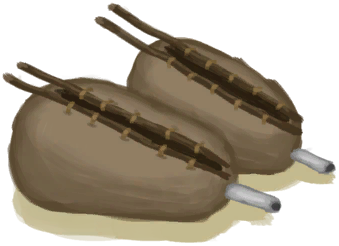

# 风箱  
> 应该能帮助我让窑炉和熔炉升温得更快。  
  
<table class="table table-bordered" data-toggle="table"  data-show-header="false"><thead style="display:none"><tr ><th  style="width:50%;text-align:left;vertical-align:top;"  >title</th><th  style="width:50%;text-align:left;vertical-align:top;"  ></th></tr></thead><tr ><td  style="width:50%;text-align:left;vertical-align:top;"  >** 解锁需求: ** [窑炉](Kiln.md) [窑炉(熄灭)](KilnExtinguished.md) [高级窑炉](KilnAdvanced.md) [高级窑炉(熄灭)](KilnAdvancedExtinguished.md) [熔炉](Forge.md) [熔炉(熄灭)](ForgeExtinguished.md)  ** 研究耗时: ** 1天  ** 动作分类: ** [“手部动作(组)”](HandAction.md) [“制造动作(组)”](CraftAction.md)</td><td  style="width:50%;text-align:left;vertical-align:top;"  >

<a href="Bp_Bellows.md" style="color:black">风箱</a>

</td></tr></tbody></table>  
  
## 制作  

<table><tr><td style="width:100px;"><b>材料总计：</b></td><td>[“皮革(组)”](GpTag_Leather.md) x 4 , [

[脂肪](Fat.md)](Fat.md) x 1 , [

[细线](CordFiber.md)](CordFiber.md) x 8 , [“针(组)”](GpTag_Needle.md) x 1(使用次数-2) , [

[小树枝](Sticks.md)](Sticks.md) x 2 , [“切割工具(组)”](GpTag_Cutter.md) x 1(使用次数-1)</td></tr><tr><td><b>耗时：</b></td><td>1小时30分/每步骤 , 共计：3小时</td></tr><tr><td><b>需求：</b></td><td>[

[光亮](Light.md)](Light.md): <b>10-100</b></td></tr><tr><td><b>状态变化：</b></td><td>[

[纺织(技能)](Skill_Tailoring.md)](Skill_Tailoring.md)<b>+1</b>, [

[制作(技能)](Skill_Crafting.md)](Skill_Crafting.md)<b>+1</b>, [

[压力](Stress.md)](Stress.md)<b>-10</b>, [

[情绪](Morale.md)](Morale.md)<b>+10</b></td></tr><tr><td colspan=2><b>步骤：</b></td></tr><tr><td style="text-align:right"><b>1.</b></td><td>[“皮革(组)”](GpTag_Leather.md) x 4 + [

[脂肪](Fat.md)](Fat.md) x 1 + [

[细线](CordFiber.md)](CordFiber.md) x 4 + [“针(组)”](GpTag_Needle.md) x 1(使用次数-1)</td></tr><tr><td style="text-align:right"><b>2.</b></td><td>[

[小树枝](Sticks.md)](Sticks.md) x 2 + [

[细线](CordFiber.md)](CordFiber.md) x 4 + [“针(组)”](GpTag_Needle.md) x 1(使用次数-1) + [“切割工具(组)”](GpTag_Cutter.md) x 1(使用次数-1)</td></tr><tr style="background-color:#fff;font-size:1.2em;"><td></td><td style="text-align:right"><b>成品：</b>[

[风箱](Bellows.md)](Bellows.md)(<b>+1</b>)</td></tr></table>
  
  

