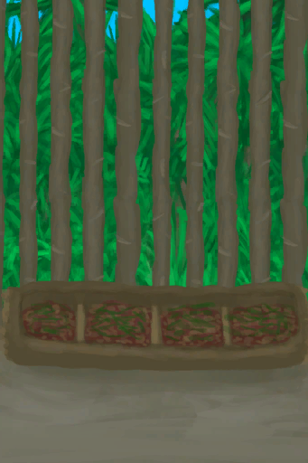
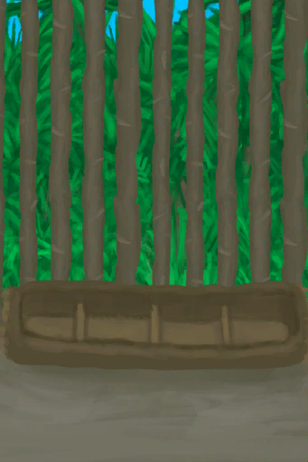

# 猪食槽  
> 最省事的野猪喂养装置。  
  
<table class="table table-bordered" data-toggle="table"  data-show-header="false"><thead style="display:none"><tr ><th  style="width:50%;text-align:left;vertical-align:top;"  >title</th><th  style="width:50%;text-align:left;vertical-align:top;"  ></th></tr></thead><tr ><td  style="width:50%;text-align:left;vertical-align:top;"  >** 解锁需求: ** [母猪](BoarEnclosureFemale.md) [公猪](BoarEnclosureMale.md)  ** 动作分类: ** [“手部动作(组)”](HandAction.md)  ** 制作条件: ** [

[畜栏(环境)](Env_Enclosure.md)](Env_Enclosure.md)存在于手中/面板 ~~[

[猪食槽](BoarFeeder.md)](BoarFeeder.md)存在于手中/面板~~ ~~[

[猪食槽(空)](BoarFeederEmpty.md)](BoarFeederEmpty.md)存在于手中/面板~~ ~~[

[猪食槽(蓝图)](Bp_BoarFeeder.md)](Bp_BoarFeeder.md)存在于手中/面板~~</td><td  style="width:50%;text-align:left;vertical-align:top;"  >

<a href="Bp_BoarFeeder.md" style="color:black">猪食槽</a>

</td></tr></tbody></table>  
  
## 制作  
<table class="table table-bordered" data-toggle="table"  ><thead style=""><tr ><th  style="text-align:left;vertical-align:top;"  >步骤</th><th  style="text-align:left;vertical-align:top;"  >耗时</th><th  style="text-align:left;vertical-align:top;"  >需求</th><th  style="text-align:left;vertical-align:top;"  >状态</th><th  style="text-align:left;vertical-align:top;"  >成品</th></tr></thead><tr ><td  style="text-align:left;vertical-align:top;"  >1. [

[原木](Log.md)](Log.md) x 1 + [“斧子(组)”](GpTag_Axe.md) x 1 2. [“斧子(组)”](GpTag_Axe.md) x 1 + [

[小树枝](Sticks.md)](Sticks.md) x 3</td><td  style="text-align:left;vertical-align:top;"  >2小时/每步骤</td><td  style="text-align:left;vertical-align:top;"  >** 需要状态: ** [

[光亮](Light.md)](Light.md): 10-100 ** 需要卡牌: ** [畜栏(环境)](Env_Enclosure.md) ~~[猪食槽](BoarFeeder.md)~~ ~~[猪食槽(空)](BoarFeederEmpty.md)~~ ~~[猪食槽(蓝图)](Bp_BoarFeeder.md)~~</td><td  style="text-align:left;vertical-align:top;"  >[

[制作(技能)](Skill_Crafting.md)](Skill_Crafting.md)+1 [

[木工(技能)](Skill_Woodworking.md)](Skill_Woodworking.md)+2 [

[压力](Stress.md)](Stress.md)-10 [

[情绪](Morale.md)](Morale.md)+5</td><td  style="text-align:left;vertical-align:top;"  >[猪食槽(空)](BoarFeederEmpty.md)(+1)</td></tr></tbody></table>  
  

