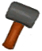

# 猪食槽  
> 最省事的野猪喂养装置。  
  
<table class="table table-bordered"><tbody><tr ><td  style="width:80%;text-align:left;vertical-align:top;" >** 解锁需求: ** [母猪](BoarEnclosureFemale.md) [公猪](BoarEnclosureMale.md)  ** 动作分类: ** [手部动作(组)](HandAction.md)</td><td  style="width:20%;text-align:left;vertical-align:top;" >

</td></tr></tbody></tbody></table>  
  
## 制作  
<table class="table table-bordered"><thead><tr ><th  style="text-align:left;vertical-align:top;" >步骤</th><th  style="text-align:left;vertical-align:top;" >耗时</th><th  style="text-align:left;vertical-align:top;" >需求</th><th  style="text-align:left;vertical-align:top;" >状态变化</th><th  style="text-align:left;vertical-align:top;" >成品</th></tr></thead><tr ><td  style="text-align:left;vertical-align:top;" >1. [

[原木](Log.md)](Log.md) x 1 + [斧子(组)](GpTag_Axe.md) x 1 2. [斧子(组)](GpTag_Axe.md) x 1 + [

[小树枝](Sticks.md)](Sticks.md) x 3</td><td  style="text-align:left;vertical-align:top;" >2小时/每步骤</td><td  style="text-align:left;vertical-align:top;" >** 需要状态: ** [

[光亮](Light.md)](Light.md): 10-100 ** 需要卡牌: ** [畜栏(环境)](Env_Enclosure.md) ~~[猪食槽](BoarFeeder.md)~~ ~~[猪食槽(空)](BoarFeederEmpty.md)~~ ~~[猪食槽(蓝图)](Bp_BoarFeeder.md)~~</td><td  style="text-align:left;vertical-align:top;" >[

[制作(技能)](Skill_Crafting.md)](Skill_Crafting.md)+1 [

[木工(技能)](Skill_Woodworking.md)](Skill_Woodworking.md)+2 [

[压力](Stress.md)](Stress.md)-10 [

[情绪](Morale.md)](Morale.md)+5</td><td  style="text-align:left;vertical-align:top;" >[猪食槽(空)](BoarFeederEmpty.md)(+1)</td></tr></tbody></table>  
  

