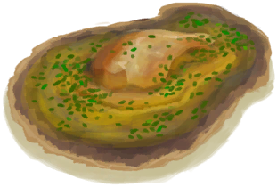

# 黄油焗牡蛎  
> 噢！美味！  
  
<table class="table table-bordered" data-toggle="table"  data-show-header="false"><thead style="display:none"><tr ><th  style="width:50%;text-align:left;vertical-align:top;"  >title</th><th  style="width:50%;text-align:left;vertical-align:top;"  ></th></tr></thead><tr ><td  style="width:50%;text-align:left;vertical-align:top;"  >** 解锁条件: ** [

[烹饪(技能)](Skill_Cooking.md)](Skill_Cooking.md): <b>150-150</b>  ** 研究耗时: ** 12小时  ** 动作分类: ** [“手部动作(组)”](HandAction.md) [“制造动作(组)”](CraftAction.md)</td><td  style="width:50%;text-align:left;vertical-align:top;"  >

<a href="Bp_ButterBakedOysters.md" style="color:black">黄油焗牡蛎</a>

</td></tr></tbody></table>  
  
## 制作  

<table><tr><td style="width:100px;"><b>材料总计：</b></td><td>[

[烹饪锅](CookingPot.md)](CookingPot.md) x 1 , [

[牡蛎肉](OysterMeat.md)](OysterMeat.md) x 4 , [

[黄油](Butter.md)](Butter.md) x 1(使用次数-1) , [

[柠檬草](LemongrassStalks.md)](LemongrassStalks.md) x 1</td></tr><tr><td><b>耗时：</b></td><td>30分</td></tr><tr><td><b>需求：</b></td><td>[

[光亮](Light.md)](Light.md): <b>10-100</b></td></tr><tr><td><b>状态变化：</b></td><td>[

[烹饪(技能)](Skill_Cooking.md)](Skill_Cooking.md)<b>+0.5</b>, [

[压力](Stress.md)](Stress.md)<b>-10</b></td></tr><tr><td colspan=2><b>步骤：</b></td></tr><tr><td style="text-align:right"><b>1.</b></td><td>[

[烹饪锅](CookingPot.md)](CookingPot.md) x 1 + [

[牡蛎肉](OysterMeat.md)](OysterMeat.md) x 4 + [

[黄油](Butter.md)](Butter.md) x 1(使用次数-1) + [

[柠檬草](LemongrassStalks.md)](LemongrassStalks.md) x 1</td></tr><tr style="background-color:#fff;font-size:1.2em;"><td></td><td style="text-align:right"><b>成品：</b>[

[未烹饪的黄油牡蛎](ButterBakedOystersUncooked.md)](ButterBakedOystersUncooked.md)(<b>+1</b>)</td></tr></table>
  
  

