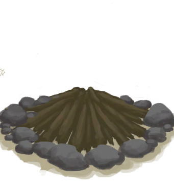

# 营火  
> 完美的烹饪工具，应该能给我提供取暖和照明。  
  
<table class="table table-bordered" data-toggle="table"  data-show-header="false"><thead style="display:none"><tr ><th  style="width:50%;text-align:left;vertical-align:top;"  >title</th><th  style="width:50%;text-align:left;vertical-align:top;"  ></th></tr></thead><tr ><td  style="width:50%;text-align:left;vertical-align:top;"  >** 解锁条件: ** [计数](Counter.md): <b>0-9000</b>  ** 动作分类: ** [“手部动作(组)”](HandAction.md)  ** 制作条件: ** ~~位于[

[木筏(环境)](Env_Raft.md)](Env_Raft.md)~~</td><td  style="width:50%;text-align:left;vertical-align:top;"  >

<a href="Bp_Campfire.md" style="color:black">营火</a>

</td></tr></tbody></table>  
  
## 制作  

<table><tr><td style="width:100px;"><b>材料总计：</b></td><td>[

[石头](Stone.md)](Stone.md) x 4 , [

[木材](Wood.md)](Wood.md) x 1 , [

[小树枝](Sticks.md)](Sticks.md) x 1</td></tr><tr><td><b>耗时：</b></td><td>15分</td></tr><tr><td><b>状态变化：</b></td><td>[

[制作(技能)](Skill_Crafting.md)](Skill_Crafting.md)<b>+1</b>, [

[压力](Stress.md)](Stress.md)<b>-10</b></td></tr><tr><td colspan=2><b>步骤：</b></td></tr><tr><td style="text-align:right"><b>1.</b></td><td>[

[石头](Stone.md)](Stone.md) x 4 + [

[木材](Wood.md)](Wood.md) x 1 + [

[小树枝](Sticks.md)](Sticks.md) x 1</td></tr><tr style="background-color:#fff;font-size:1.2em;"><td></td><td style="text-align:right"><b>成品：</b>[

[营火(熄灭)](CampfireExtinguished.md)](CampfireExtinguished.md)(<b>+1</b>)</td></tr></table>
  
  

