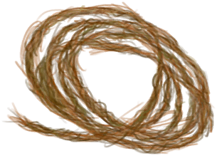

# 地窖  
> 一个地下房间，食物在这里可以储存更久。  
  
<table class="table table-bordered" data-toggle="table"  data-show-header="false"><thead style="display:none"><tr ><th  style="width:50%;text-align:left;vertical-align:top;"  >title</th><th  style="width:50%;text-align:left;vertical-align:top;"  ></th></tr></thead><tr ><td  style="width:50%;text-align:left;vertical-align:top;"  >** 解锁条件: ** [

[制作(技能)](Skill_Crafting.md)](Skill_Crafting.md): <b>75-150</b>  ** 解锁需求: **   ** 动作分类: ** [“手部动作(组)”](HandAction.md)  ** 制作条件: ** ~~位于[

[木筏(环境)](Env_Raft.md)](Env_Raft.md)~~ ~~位于[

[湿地(环境)](Env_Wetlands.md)](Env_Wetlands.md)~~ ~~位于[

[丛林边缘(环境)](Env_Outskirts.md)](Env_Outskirts.md)~~ ~~位于[

[畜栏(环境)](Env_Enclosure.md)](Env_Enclosure.md)~~  ** 制作条件: ** ~~[“可能出现海鸥”](tag_Coastal.md)存在于手中/面板~~ ~~[“室内”](tag_EnvIndoors.md)存在于手中/面板~~  ** 制作条件: ** [

[遮蔽](Sheltered.md)](Sheltered.md): <b>0-0</b></td><td  style="width:50%;text-align:left;vertical-align:top;"  >

<a href="Bp_Cellar.md" style="color:black">地窖</a>

</td></tr></tbody></table>  
  
## 制作  

<table><tr><td style="width:100px;"><b>材料总计：</b></td><td>[“铲子(组)”](GpTag_Shovel.md) x 1(使用次数-8) , [

[石头](Stone.md)](Stone.md) x 30 , [

[砂浆](Mortar.md)](Mortar.md) x 24 , [

[粘土](Clay.md)](Clay.md) x 22 , [

[原木](Log.md)](Log.md) x 9 , [

[干土堆](DirtPile.md)](DirtPile.md) x 15 , [

[细线](CordFiber.md)](CordFiber.md) x 4 , [“皮革(组)”](GpTag_Leather.md) x 2 , [“针(组)”](GpTag_Needle.md) x 1(使用次数-2)</td></tr><tr><td><b>耗时：</b></td><td>2小时/每步骤 , 共计：22小时</td></tr><tr><td><b>需求：</b></td><td>[

[光亮](Light.md)](Light.md): <b>10-100</b></td></tr><tr><td><b>状态变化：</b></td><td>[

[制作(技能)](Skill_Crafting.md)](Skill_Crafting.md)<b>+1</b>, [

[压力](Stress.md)](Stress.md)<b>-10</b>, [

[情绪](Morale.md)](Morale.md)<b>+10</b></td></tr><tr><td colspan=2><b>步骤：</b></td></tr><tr><td style="text-align:right"><b>1.</b></td><td>[“铲子(组)”](GpTag_Shovel.md) x 1(使用次数-1)</td></tr><tr><td style="text-align:right"><b>2.</b></td><td>[“铲子(组)”](GpTag_Shovel.md) x 1(使用次数-1)</td></tr><tr><td style="text-align:right"><b>3.</b></td><td>[“铲子(组)”](GpTag_Shovel.md) x 1(使用次数-1)</td></tr><tr><td style="text-align:right"><b>4.</b></td><td>[“铲子(组)”](GpTag_Shovel.md) x 1(使用次数-1)</td></tr><tr><td style="text-align:right"><b>5.</b></td><td>[“铲子(组)”](GpTag_Shovel.md) x 1(使用次数-1)</td></tr><tr><td style="text-align:right"><b>6.</b></td><td>[“铲子(组)”](GpTag_Shovel.md) x 1(使用次数-1)</td></tr><tr><td style="text-align:right"><b>7.</b></td><td>[“铲子(组)”](GpTag_Shovel.md) x 1(使用次数-1)</td></tr><tr><td style="text-align:right"><b>8.</b></td><td>[“铲子(组)”](GpTag_Shovel.md) x 1(使用次数-1)</td></tr><tr><td style="text-align:right"><b>9.</b></td><td>[

[石头](Stone.md)](Stone.md) x 30 + [

[砂浆](Mortar.md)](Mortar.md) x 24 + [

[粘土](Clay.md)](Clay.md) x 12</td></tr><tr><td style="text-align:right"><b>10.</b></td><td>[

[原木](Log.md)](Log.md) x 6 + [

[粘土](Clay.md)](Clay.md) x 10 + [

[干土堆](DirtPile.md)](DirtPile.md) x 15</td></tr><tr><td style="text-align:right"><b>11.</b></td><td>[

[原木](Log.md)](Log.md) x 3 + [

[细线](CordFiber.md)](CordFiber.md) x 4 + [“皮革(组)”](GpTag_Leather.md) x 2 + [“针(组)”](GpTag_Needle.md) x 1(使用次数-2)</td></tr><tr style="background-color:#fff;font-size:1.2em;"><td></td><td style="text-align:right"><b>成品：</b>[

[地窖](CellarEntrance.md)](CellarEntrance.md)(<b>+1</b>) , [

[干土堆](DirtPile.md)](DirtPile.md)(<b>+16</b>)</td></tr></table>
  
  

