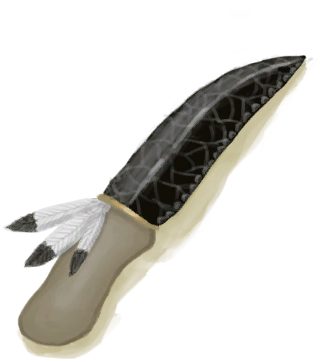

[返回首页](index.md)   |  [查看所有蓝图](blueprint.md)
# 仪式匕首  
> 一把非常锋利的黑曜石匕首。  
  
  属性  |   图片   
 ----  |  ----:   
   |     
  
## 制作  
步骤  |  时间  |  状态  |  成品  
----  |  ----  |  ----  |  ----  
1. [黑曜石](Obsidian.md) x 1 + [野猪牙](Tusk.md) x 1 + [细线](CordFiber.md) x 1 + [羽毛](Feathers.md) x 1 + [锤击工具(组)](GpTag_Hammer.md) x 1  |  3小时  |  [制作(技能)](Skill_Crafting.md)+2 [石工(技能)](Skill_Knapping.md)+1 [压力](Stress.md)-10  |  [仪式匕首](CeremonialDagger.md)(1)  
