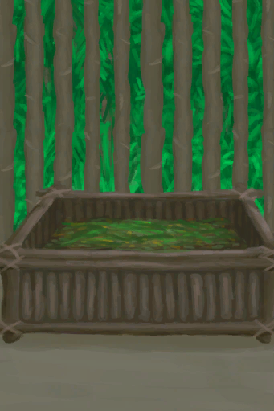

# 羊食槽  
> 最省事的山羊喂养装置。  
  
  羊食槽  |   图片   
 ----  |  ----:   
 ** 解锁需求: ** [母山羊](GoatEnclosureFemale.md) [公山羊](GoatEnclosureMale.md)  |     
  
## 制作  
步骤  |  耗时  |  需求  |  状态变化  |  成品  
----  |  ----  |  ----  |  ----  |  ----  
1. [长木棍](StickLong.md) x 4 + [斧子(组)](GpTag_Axe.md) x 1 + [细线](CordFiber.md) x 6 2. [斧子(组)](GpTag_Axe.md) x 1 + [细线](CordFiber.md) x 2 + [木材](Wood.md) x 10  |  1小时/每步骤  |  ** 需要状态: ** [光亮](Light.md): 10-100 ** 需要卡牌: ** [畜栏(环境)](Env_Enclosure.md) ~~[羊食槽](GoatFeeder.md)~~ ~~[羊食槽(空)](GoatFeederEmpty.md)~~ ~~[羊食槽(蓝图)](Bp_GoatFeeder.md)~~  |  [制作(技能)](Skill_Crafting.md)+1 [压力](Stress.md)-10 [情绪](Morale.md)+5  |  [羊食槽(空)](GoatFeederEmpty.md)(+1)  
