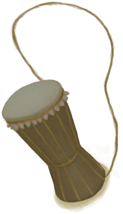
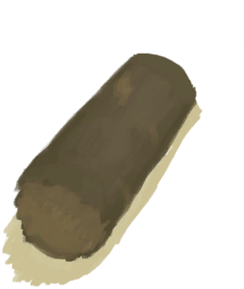
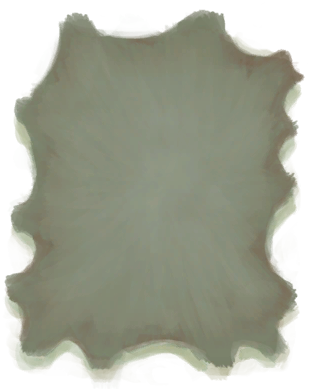
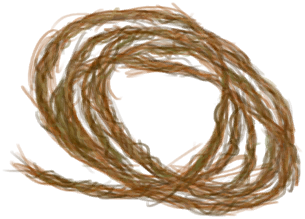
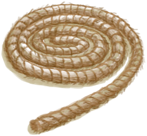
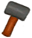
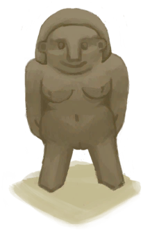

# 蜥蜴皮手鼓  
> 让魂灵们听到你的召唤。  
  
<table class="table table-bordered table7166" data-toggle="table"  data-show-header="false"><thead style="display:none"><tr ><th  style="width:50%;"  >title</th><th  style="width:50%;"  ></th></tr></thead><tr ><td  style="width:50%;"  >** 动作分类: ** [“手部动作(组)”](HandAction.md) [“制造动作(组)”](CraftAction.md)</td><td  style="width:50%;"  >

<a href="Bp_LizardDrum.md" style="color:black">蜥蜴皮手鼓</a>

</td></tr></tbody></table>  
  
## 制作  

<table><tr><td style="width:100px;"><b>材料总计：</b></td><td>[

[半根原木](HalfLog.md)](HalfLog.md) x 1 , [“锋利的斧子(组)”](GpTag_AxeAdv.md) x 1(使用次数-8) , [“锋利的刀(组)”](GpTag_CutterAdv.md) x 1(使用次数-6) , [

[鞣制巨蜥皮](CuredSkinReptile.md)](CuredSkinReptile.md) x 1 , [

[细线](CordFiber.md)](CordFiber.md) x 12 , [

[绳子](Rope.md)](Rope.md) x 1</td></tr><tr><td><b>耗时：</b></td><td>1小时/每步骤 , 共计：5小时</td></tr><tr><td><b>需求：</b></td><td>[

[光亮](Light.md)](Light.md): <b>10-100</b></td></tr><tr><td><b>状态变化：</b></td><td>[

[制作(技能)](Skill_Crafting.md)](Skill_Crafting.md)<b>+1</b>, [

[木工(技能)](Skill_Woodworking.md)](Skill_Woodworking.md)<b>+2</b>, [

[压力](Stress.md)](Stress.md)<b>-10</b>, [

[情绪](Morale.md)](Morale.md)<b>+25</b></td></tr><tr><td colspan=2><b>步骤：</b></td></tr><tr><td style="text-align:right"><b>1.</b></td><td>[

[半根原木](HalfLog.md)](HalfLog.md) x 1 + [“锋利的斧子(组)”](GpTag_AxeAdv.md) x 1(使用次数-2)</td></tr><tr><td style="text-align:right"><b>2.</b></td><td>[“锋利的斧子(组)”](GpTag_AxeAdv.md) x 1(使用次数-2) + [“锋利的刀(组)”](GpTag_CutterAdv.md) x 1(使用次数-2)</td></tr><tr><td style="text-align:right"><b>3.</b></td><td>[“锋利的斧子(组)”](GpTag_AxeAdv.md) x 1(使用次数-2) + [“锋利的刀(组)”](GpTag_CutterAdv.md) x 1(使用次数-2)</td></tr><tr><td style="text-align:right"><b>4.</b></td><td>[“锋利的斧子(组)”](GpTag_AxeAdv.md) x 1(使用次数-2) + [“锋利的刀(组)”](GpTag_CutterAdv.md) x 1(使用次数-2)</td></tr><tr><td style="text-align:right"><b>5.</b></td><td>[

[鞣制巨蜥皮](CuredSkinReptile.md)](CuredSkinReptile.md) x 1 + [

[细线](CordFiber.md)](CordFiber.md) x 12 + [

[绳子](Rope.md)](Rope.md) x 1</td></tr><tr style="background-color:#fff;font-size:1.2em;"><td></td><td style="text-align:right"><b>成品：</b>[

[蜥蜴皮手鼓](LizardDrum.md)](LizardDrum.md)(<b>+1</b>)</td></tr></table>
  

