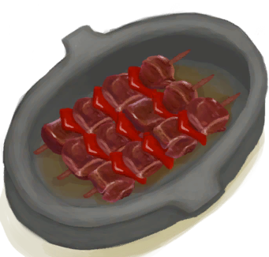

# 猕猴肉串  
> 味道鲜美，营养丰富又容易做。  
  
  属性  |   图片   
 ----  |  ----:   
   |     
  
## 制作  
步骤  |  时间  |  状态  |  成品  
----  |  ----  |  ----  |  ----  
1. [烹饪锅](CookingPot.md) x 1 + [小树枝](Sticks.md) x 1 + [猕猴肉](MacaqueMeat.md) x 1 + [辣椒(组)](GpTag_Chilli.md) x 1  |  30分  |  [烹饪(技能)](Skill_Cooking.md)+0.5 [压力](Stress.md)-10  |  [未烹饪的猕猴肉串](MacaqueSkewersUncooked.md)(+1)  
