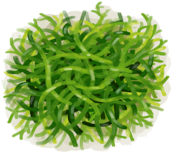

# 人鱼巢  
> 由海藻制成的巢。有助于保持湿润并对抗内陆恐惧症。  
  
<table class="table table-bordered"><tbody><tr ><td  style="width:80%;text-align:left;vertical-align:top;" >** 动作分类: ** [手部动作(组)](HandAction.md)</td><td  style="width:20%;text-align:left;vertical-align:top;" >

</td></tr></tbody></tbody></table>  
  
## 制作  
<table class="table table-bordered"><thead><tr ><th  style="text-align:left;vertical-align:top;" >步骤</th><th  style="text-align:left;vertical-align:top;" >耗时</th><th  style="text-align:left;vertical-align:top;" >需求</th><th  style="text-align:left;vertical-align:top;" >状态变化</th><th  style="text-align:left;vertical-align:top;" >成品</th></tr></thead><tr ><td  style="text-align:left;vertical-align:top;" >1. [

[海藻](Seaweed.md)](Seaweed.md) x 6</td><td  style="text-align:left;vertical-align:top;" >30分</td><td  style="text-align:left;vertical-align:top;" >** 需要状态: ** [

[光亮](Light.md)](Light.md): 10-100 ** 需要卡牌: ** ~~[人鱼巢](MermaidNest.md)~~ ~~[人鱼巢(蓝图)](Bp_MermaidNest.md)~~</td><td  style="text-align:left;vertical-align:top;" >[

[压力](Stress.md)](Stress.md)-10</td><td  style="text-align:left;vertical-align:top;" >[人鱼巢](MermaidNest.md)(+1)</td></tr></tbody></table>  
  

