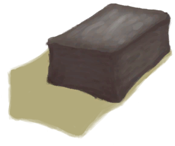

# 泥屋  
> 一栋算得上家的房子。能够抵御蚊虫和恶劣天气。  
  
<table class="table table-bordered" data-toggle="table"  data-show-header="false"><thead style="display:none"><tr ><th  style="width:50%;text-align:left;vertical-align:top;"  >title</th><th  style="width:50%;text-align:left;vertical-align:top;"  ></th></tr></thead><tr ><td  style="width:50%;text-align:left;vertical-align:top;"  >** 解锁需求: ** [原木](Log.md)  ** 研究耗时: ** 2天  ** 动作分类: ** [“手部动作(组)”](HandAction.md)  ** 制作条件: ** ~~位于[

[木筏(环境)](Env_Raft.md)](Env_Raft.md)~~ ~~位于[

[畜栏(环境)](Env_Enclosure.md)](Env_Enclosure.md)~~ ~~位于[

[岩滩(环境)](Env_Rocks.md)](Env_Rocks.md)~~ ~~位于[洞穴(环境)](Env_CaveSea.md)~~ ~~位于[

[泥屋(环境)](Env_MudHut.md)](Env_MudHut.md)~~  ** 制作条件: ** [

[遮蔽](Sheltered.md)](Sheltered.md): <b>0-0</b></td><td  style="width:50%;text-align:left;vertical-align:top;"  >

<a href="Bp_MudHut.md" style="color:black">泥屋</a>

</td></tr></tbody></table>  
  
## 制作  

<table><tr><td style="width:100px;"><b>材料总计：</b></td><td>[

[原木](Log.md)](Log.md) x 5 , [

[长木棍](StickLong.md)](StickLong.md) x 17 , [

[细线](CordFiber.md)](CordFiber.md) x 22 , [

[泥砖](MudBrick.md)](MudBrick.md) x 28 , [

[小树枝](Sticks.md)](Sticks.md) x 35 , [

[棕榈叶](PalmFronds.md)](PalmFronds.md) x 60</td></tr><tr><td><b>耗时：</b></td><td>1小时30分/每步骤 , 共计：13小时30分</td></tr><tr><td><b>需求：</b></td><td>[

[光亮](Light.md)](Light.md): <b>10-100</b></td></tr><tr><td><b>状态变化：</b></td><td>[

[制作(技能)](Skill_Crafting.md)](Skill_Crafting.md)<b>+10</b>, [

[压力](Stress.md)](Stress.md)<b>-10</b>, [

[情绪](Morale.md)](Morale.md)<b>+50</b>, [

[决心](Determination.md)](Determination.md)<b>+250</b></td></tr><tr><td colspan=2><b>步骤：</b></td></tr><tr><td style="text-align:right"><b>1.</b></td><td>[

[原木](Log.md)](Log.md) x 5 + [

[长木棍](StickLong.md)](StickLong.md) x 5</td></tr><tr><td style="text-align:right"><b>2.</b></td><td>[

[长木棍](StickLong.md)](StickLong.md) x 8 + [

[细线](CordFiber.md)](CordFiber.md) x 8</td></tr><tr><td style="text-align:right"><b>3.</b></td><td>[

[泥砖](MudBrick.md)](MudBrick.md) x 8 + [

[小树枝](Sticks.md)](Sticks.md) x 10</td></tr><tr><td style="text-align:right"><b>4.</b></td><td>[

[泥砖](MudBrick.md)](MudBrick.md) x 8 + [

[小树枝](Sticks.md)](Sticks.md) x 10</td></tr><tr><td style="text-align:right"><b>5.</b></td><td>[

[泥砖](MudBrick.md)](MudBrick.md) x 8 + [

[小树枝](Sticks.md)](Sticks.md) x 10</td></tr><tr><td style="text-align:right"><b>6.</b></td><td>[

[泥砖](MudBrick.md)](MudBrick.md) x 4 + [

[小树枝](Sticks.md)](Sticks.md) x 5</td></tr><tr><td style="text-align:right"><b>7.</b></td><td>[

[长木棍](StickLong.md)](StickLong.md) x 4 + [

[细线](CordFiber.md)](CordFiber.md) x 5</td></tr><tr><td style="text-align:right"><b>8.</b></td><td>[

[棕榈叶](PalmFronds.md)](PalmFronds.md) x 30 + [

[细线](CordFiber.md)](CordFiber.md) x 6</td></tr><tr><td style="text-align:right"><b>9.</b></td><td>[

[棕榈叶](PalmFronds.md)](PalmFronds.md) x 30 + [

[细线](CordFiber.md)](CordFiber.md) x 3</td></tr><tr style="background-color:#fff;font-size:1.2em;"><td></td><td style="text-align:right"><b>成品：</b>[

[泥屋](MudHutEntrance.md)](MudHutEntrance.md)(<b>+1</b>)</td></tr></table>
  
  

