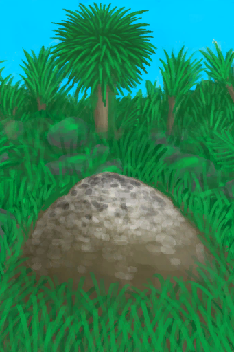

# 硝石矿床  
> 用于制作硝酸钾。  
  
  硝石矿床  |   图片   
 ----  |  ----:   
 ** 解锁条件: ** [药草学(技能)](Skill_Herbology.md): 30-150  |     
  
## 制作  
步骤  |  耗时  |  需求  |  状态变化  |  成品  
----  |  ----  |  ----  |  ----  |  ----  
1. [粘土](Clay.md) x 6 + [粪便(组)](GpTag_Poop.md) x 6 + [碱液](LQ_Lye.md) x 1  |  1小时  |  ** 需要状态: ** [光亮](Light.md): 10-100 [遮蔽](Sheltered.md): 0-0 ** 需要卡牌: ** ~~[木筏(环境)](Env_Raft.md)~~ ~~[畜栏(环境)](Env_Enclosure.md)~~  |  [压力](Stress.md)-10  |  [硝石矿床](NiterBed.md)(+1)  
