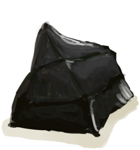
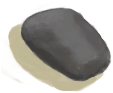

# 黑曜石长矛  
> 岛上最好的长矛。  
  
<table class="table table-bordered table7633" data-toggle="table"  data-show-header="false"><thead style="display:none"><tr ><th  style="width:50%;"  >title</th><th  style="width:50%;"  ></th></tr></thead><tr ><td  style="width:50%;"  >** 解锁条件: ** [

[石工(技能)](Skill_Knapping.md)](Skill_Knapping.md): <b>75-150</b>  ** 动作分类: ** [“手部动作(组)”](HandAction.md) [“制造动作(组)”](CraftAction.md)</td><td  style="width:50%;"  >

<a href="Bp_ObsidianSpear.md" style="color:black">黑曜石长矛</a>

</td></tr></tbody></table>  
  
## 获取来源  

特质影响

[石匠](Pk_5_Knapper.md)

  
  
## 制作  

<table><tr><td style="width:100px;"><b>材料总计：</b></td><td>[

[长木棍](StickLong.md)](StickLong.md) x 1 , [“切割工具(组)”](GpTag_Cutter.md) x 1(使用次数-1) , [

[绳子](Rope.md)](Rope.md) x 1 , [

[黑曜石](Obsidian.md)](Obsidian.md) x 1 , [

[细线](CordFiber.md)](CordFiber.md) x 1 , [

[石头](Stone.md)](Stone.md) x 1(使用次数-1) , [

[羽毛](Feathers.md)](Feathers.md) x 4</td></tr><tr><td><b>耗时：</b></td><td>1小时/每步骤 , 共计：2小时</td></tr><tr><td><b>需求：</b></td><td>[

[光亮](Light.md)](Light.md): <b>10-100</b></td></tr><tr><td><b>状态变化：</b></td><td>[

[石工(技能)](Skill_Knapping.md)](Skill_Knapping.md)<b>+5</b>, [

[压力](Stress.md)](Stress.md)<b>-10</b></td></tr><tr><td colspan=2><b>步骤：</b></td></tr><tr><td style="text-align:right"><b>1.</b></td><td>[

[长木棍](StickLong.md)](StickLong.md) x 1 + [“切割工具(组)”](GpTag_Cutter.md) x 1(使用次数-1) + [

[绳子](Rope.md)](Rope.md) x 1</td></tr><tr><td style="text-align:right"><b>2.</b></td><td>[

[黑曜石](Obsidian.md)](Obsidian.md) x 1 + [

[细线](CordFiber.md)](CordFiber.md) x 1 + [

[石头](Stone.md)](Stone.md) x 1(使用次数-1) + [

[羽毛](Feathers.md)](Feathers.md) x 4</td></tr><tr style="background-color:#fff;font-size:1.2em;"><td></td><td style="text-align:right"><b>成品：</b>[

[黑曜石长矛](SpearObsidian.md)](SpearObsidian.md)(<b>+1</b>)</td></tr></table>
  

