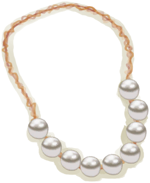

[返回首页](index.md)   |  [查看所有蓝图](blueprint.md)
# 珍珠项链  
> 一条珍珠串成的美丽项链！  
  
  属性  |   图片   
 ----  |  ----:   
   |     
  
## 制作  
步骤  |  时间  |  状态  |  成品  
----  |  ----  |  ----  |  ----  
1. [细线](CordFiber.md) x 2 + [珍珠](Pearl.md) x 9  |  30分  |  [制作(技能)](Skill_Crafting.md)+1 [压力](Stress.md)-10 [情绪](Morale.md)+10  |  [珍珠项链](PearlNecklace.md)(1)  
