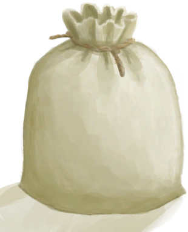

# 布袋  
> 一个布制的袋子，很适合装东西。  
  
<table class="table table-bordered" data-toggle="table" ><tbody><tr ><td  style="width:80%;text-align:left;vertical-align:top;"  >** 解锁条件: ** [

[纺织(技能)](Skill_Tailoring.md)](Skill_Tailoring.md): 10-150  ** 动作分类: ** [“手部动作(组)”](HandAction.md) [“制造动作(组)”](CraftAction.md)</td><td  style="width:20%;text-align:left;vertical-align:top;"  >

</td></tr></tbody></tbody></table>  
  
## 制作  
<table class="table table-bordered" data-toggle="table" ><thead><tr ><th  style="text-align:left;vertical-align:top;"  >步骤</th><th  style="text-align:left;vertical-align:top;"  >耗时</th><th  style="text-align:left;vertical-align:top;"  >需求</th><th  style="text-align:left;vertical-align:top;"  >状态</th><th  style="text-align:left;vertical-align:top;"  >成品</th></tr></thead><tr ><td  style="text-align:left;vertical-align:top;"  >1. [

[超大块布](ClothVeryLarge.md)](ClothVeryLarge.md) x 1 + [

[细线](CordFiber.md)](CordFiber.md) x 3 + [“针(组)”](GpTag_Needle.md) x 1</td><td  style="text-align:left;vertical-align:top;"  >3TP</td><td  style="text-align:left;vertical-align:top;"  >** 需要状态: ** [

[光亮](Light.md)](Light.md): 10-100</td><td  style="text-align:left;vertical-align:top;"  >[

[纺织(技能)](Skill_Tailoring.md)](Skill_Tailoring.md)+2 [

[压力](Stress.md)](Stress.md)-10 [

[情绪](Morale.md)](Morale.md)+2</td><td  style="text-align:left;vertical-align:top;"  >[布袋](Sack.md)(+1)</td></tr></tbody></table>  
  

