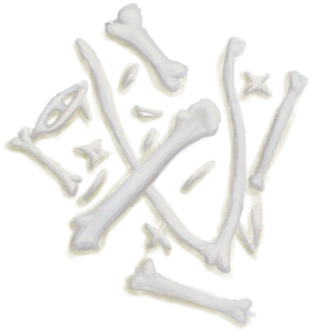

# 海鸥护符  
> 承载着海鸥灵魂的护符。对捕鱼有帮助。  
  
<table class="table table-bordered"><tbody><tr ><td  style="width:80%;text-align:left;vertical-align:top;" >** 动作分类: ** [手部动作(组)](HandAction.md) [制造动作(组)](CraftAction.md)</td><td  style="width:20%;text-align:left;vertical-align:top;" >

</td></tr></tbody></tbody></table>  
  
## 制作  
<table class="table table-bordered"><thead><tr ><th  style="text-align:left;vertical-align:top;" >步骤</th><th  style="text-align:left;vertical-align:top;" >耗时</th><th  style="text-align:left;vertical-align:top;" >需求</th><th  style="text-align:left;vertical-align:top;" >状态变化</th><th  style="text-align:left;vertical-align:top;" >成品</th></tr></thead><tr ><td  style="text-align:left;vertical-align:top;" >1. [

[细线](CordFiber.md)](CordFiber.md) x 2 + [

[鸟骨](BonesBird.md)](BonesBird.md) x 3 + [

[羽毛](Feathers.md)](Feathers.md) x 4</td><td  style="text-align:left;vertical-align:top;" >30分</td><td  style="text-align:left;vertical-align:top;" >** 需要状态: ** [

[光亮](Light.md)](Light.md): 10-100 ** 需要卡牌: ** ~~[海鸥护符(蓝图)](Bp_SeagullCharm.md)~~</td><td  style="text-align:left;vertical-align:top;" >[

[制作(技能)](Skill_Crafting.md)](Skill_Crafting.md)+1 [

[压力](Stress.md)](Stress.md)-10 [

[情绪](Morale.md)](Morale.md)+10</td><td  style="text-align:left;vertical-align:top;" >[海鸥护符](SeagullCharm.md)(+1)</td></tr></tbody></table>  
  

