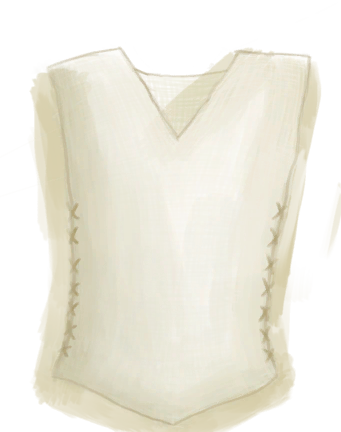

# 衬衫  
> 应该能稍微抵御蚊虫叮咬和日晒。  
  
  衬衫  |   图片   
 ----  |  ----:   
 ** 解锁条件: ** [纺织(技能)](Skill_Tailoring.md): 20-150  |     
  
## 制作  
步骤  |  耗时  |  需求  |  状态变化  |  成品  
----  |  ----  |  ----  |  ----  |  ----  
1. [大块的布](ClothLarge.md) x 1 + [细线](CordFiber.md) x 6 + [针(组)](GpTag_Needle.md) x 1  |  1小时  |  ** 需要状态: ** [光亮](Light.md): 10-100  |  [纺织(技能)](Skill_Tailoring.md)+1 [压力](Stress.md)-10 [情绪](Morale.md)+5  |  [衬衫](ShirtFiber.md)(+1)  
