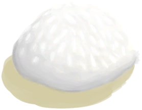

# 肥皂  
> 非常适合用来清洗我的伤口和我自己。  
  
  肥皂  |   图片   
 ----  |  ----:   
 ** 解锁需求: ** [脂肪](Fat.md) [油](LQ_Oil.md)  ** 动作分类: ** [手部动作](HandAction.md) [制造动作](CraftAction.md)  |     
  
## 制作  
步骤  |  耗时  |  需求  |  状态变化  |  成品  
----  |  ----  |  ----  |  ----  |  ----  
1. [碗(组)](GpTag_Bowl.md) x 1 + [油/脂肪(组)](GpTag_OilFat.md) x 1  |  30分  |  ** 需要状态: ** [光亮](Light.md): 10-100  |  [压力](Stress.md)-10  |  [肥皂混合物](LQ_SoapMix.md)(+1)  

