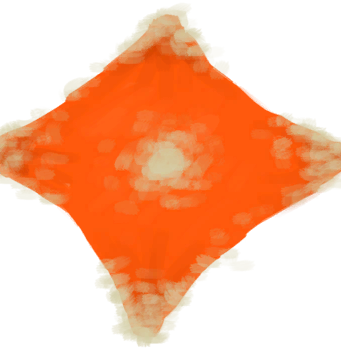

# 太阳能蒸馏器  
>   
  
  太阳能蒸馏器  |   图片   
 ----  |  ----:   
 ** 解锁需求: ** [塑料布](PlasticSheet.md)  |     
  
## 制作  
步骤  |  耗时  |  需求  |  状态变化  |  成品  
----  |  ----  |  ----  |  ----  |  ----  
1. [塑料布](PlasticSheet.md) x 1 + [石头](Stone.md) x 5  |  45分  |  ** 需要状态: ** [光亮](Light.md): 10-100 [遮蔽](Sheltered.md): 0-0 ** 需要卡牌: ** ~~[木筏(环境)](Env_Raft.md)~~  |  [压力](Stress.md)-10  |  [太阳能蒸馏器](SolarStill.md)(+1)  

