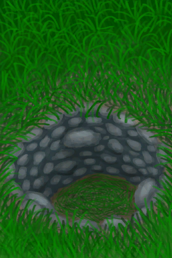

[返回首页](index.md)   |  [查看所有蓝图](blueprint.md)
# 陷坑  
> 一个针对大型猎物的陷阱。  
  
  属性  |   图片   
 ----  |  ----:   
   |     
  
## 制作  
步骤  |  时间  |  状态  |  成品  
----  |  ----  |  ----  |  ----  
1. [铲子(组)](GpTag_Shovel.md) x 1 2. [铲子(组)](GpTag_Shovel.md) x 1 3. [铲子(组)](GpTag_Shovel.md) x 1 4. [大石块](StoneHeavy.md) x 4 + [石头](Stone.md) x 16 5. [长木棍](StickLong.md) x 6 + [棕榈叶](PalmFronds.md) x 12  |  1小时30分/每步骤  |  [制作(技能)](Skill_Crafting.md)+1 [陷阱(技能)](Skill_Trapping.md)+0.5 [压力](Stress.md)-10 [情绪](Morale.md)+5  |  [陷坑](TrappingPit.md)(1)  
