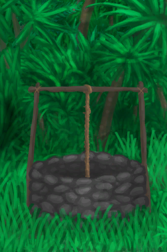

# 水井  
>   
  
  水井  |   图片   
 ----  |  ----:   
   |     
  
## 制作  
步骤  |  耗时  |  需求  |  状态变化  |  成品  
----  |  ----  |  ----  |  ----  |  ----  
1. [铲子(组)](GpTag_Shovel.md) x 1 2. [铲子(组)](GpTag_Shovel.md) x 1 3. [铲子(组)](GpTag_Shovel.md) x 1 4. [铲子(组)](GpTag_Shovel.md) x 1 5. [铲子(组)](GpTag_Shovel.md) x 1 6. [铲子(组)](GpTag_Shovel.md) x 1 7. [铲子(组)](GpTag_Shovel.md) x 1 8. [铲子(组)](GpTag_Shovel.md) x 1 9. [石头](Stone.md) x 20 + [砂浆](Mortar.md) x 12 10. [长木棍](StickLong.md) x 3 + [细线](CordFiber.md) x 4 11. [绳子](Rope.md) x 2 + [细线](CordFiber.md) x 2 + [碗(组)](GpTag_Bowl.md) x 1  |  1小时30分/每步骤  |  ** 需要状态: ** [光亮](Light.md): 10-100 [遮蔽](Sheltered.md): 0-0 ** 需要卡牌: ** ~~[木筏(环境)](Env_Raft.md)~~ [湿地(环境)](Env_Wetlands.md)  |  [制作(技能)](Skill_Crafting.md)+1 [压力](Stress.md)-10 [情绪](Morale.md)+10  |  [水井](Well.md)(+1) , [干土堆](DirtPile.md)(+10) , [泥堆](MudPile.md)(+6)  
