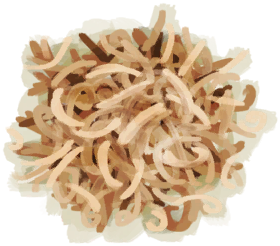

# 木屑  
> 用于生火的理想火绒。  
  
  木屑  |   图片   
 ----  |  ----:   
 ** 解锁条件: ** [木工(技能)](Skill_Woodworking.md): 5-150  |     
  
## 制作  
步骤  |  耗时  |  需求  |  状态变化  |  成品  
----  |  ----  |  ----  |  ----  |  ----  
1. [木材](Wood.md) x 1 + [锋利的刀(组)](GpTag_CutterAdv.md) x 1  |  30分  |  ** 需要状态: ** [光亮](Light.md): 10-100  |  [木工(技能)](Skill_Woodworking.md)+0.5 [压力](Stress.md)-10 [手掌损伤](HandDamage.md)+40  |  [木屑](WoodShavings.md)(+4～+6)  
