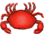

# 虫子  
> 可以用作诱饵  
  
<table class="table table-bordered" data-toggle="table"  data-show-header="false"><thead style="display:none"><tr ><th  style="width:50%;text-align:left;vertical-align:top;"  >title</th><th  style="width:50%;text-align:left;vertical-align:top;"  ></th></tr></thead><tr ><td  style="width:50%;text-align:left;vertical-align:top;"  >**重量：**25  **标签：**	[“饲料”](tag_Feed.md), [“诱饵”](tag_Bait.md)</td><td  style="width:50%;text-align:left;vertical-align:top;"  >

<a href="Bugs.md" style="color:black">虫子</a>

虫子可以在黑暗潮湿的洞穴中被发现，也可以在地下挖到。  有点恶心，但你饿得不行时还是可以吃的。它们可以提供一定的蛋白质。如果你的<b>烹饪技巧</b>足够高，还可以用它们来制作蛋白棒。  它们也是<b>灰山鹑</b>的良好饲料。</td></tr></tbody></table>  
  
## 获取来源  

看看礼物

[礼物！(事件)](Event_MacaqueFriendGift.md)

探索

[潮湿洞穴](DampChamber.md)

探索

[幽暗洞穴](DarkCave.md)

** 使用**[“铲子”](tag_Shovel.md)挖土

[东部草原](GrasslandsE.md)

** 使用**[“铲子”](tag_Shovel.md)挖土

[西部草原](GrasslandsW.md)

** 使用**[“铲子”](tag_Shovel.md)挖土

[神秘谷](SecretValley.md)

挖干土

[干涸的小水塘(湿地)](Puddle.md)

** 使用**[“铲子”](tag_Shovel.md)挖干土

[干涸的小水塘(湿地)](Puddle.md)

  
  
## 动作  

<table><tr><td rowspan="2" style="width:200px;text-align:center;font-size:1.3em;font-weight:bold">

食用

</td><td>[“食用肉类动作(组)”](CarnivorousAction.md), [“食用海鲜动作(组)”](ShellfishAction.md), [“进食动作(组)”](EatingAction.md)</td></tr><tr><td><b>自身：</b>→消失</td></tr><tr><td colspan="2"><b>状态变化：</b>[

[饱食](Satiation.md)](Satiation.md)<b>+2</b>, [

[胃](Stomach.md)](Stomach.md)<b>+1</b>, [

[水分](Hydration.md)](Hydration.md)<b>+0.25</b>, [

[污垢](Filth.md)](Filth.md)<b>+1</b>, [

[情绪](Morale.md)](Morale.md)<b>-10</b>, [

[世界观](Structure.md)](Structure.md)<b>-10</b>, [

[甲壳类<nobr>厌倦度</nobr>](SaturationCrustaceans.md)](SaturationCrustaceans.md)<b>+10</b></td></tr></table>
  
  
  
## 可拖至  

[猪食槽](BoarFeeder.md)

[猪食槽(空)](BoarFeederEmpty.md)

[堆肥箱](CompostBin.md)

[灰山鹑喂食器](PartridgeFeeder.md)

[灰山鹑喂食器(空)](PartridgeFeederEmpty.md)

[中陷阱的猕猴](CageTrapMacaque.md)

[母猪](BoarEnclosureFemale.md)

[公猪](BoarEnclosureMale.md)

[小猪](BoarEnclosurePiglet.md)

[母猪](BoarTiedFemale.md)

[公猪](BoarTiedMale.md)

[小猪](BoarTiedPiglet.md)

[猕猴朋友](MacaqueFriend.md)

[受伤的猕猴](MacaqueWounded.md)

[小灰山鹑](PartridgeChick.md)

[雌灰山鹑](PartridgeFemaleEnclosure.md)

[雌灰山鹑](PartridgeFemaleLive.md)

[雄灰山鹑](PartridgeMaleEnclosure.md)

[雄灰山鹑](PartridgeMaleLive.md)

[钓鱼线](FishingLine.md)

[钓鱼线](FishingLineRustic.md)

[钓鱼竿](FishingRod.md)

  
  
## 可用于蓝图  

<a href="Bp_FeedBird.md" style="color:black">鸟食</a>

<a href="Bp_ProteinBar.md" style="color:black">蛋白棒</a>

  
  
  
## 属性   

<table style="margin-bottom:0px;"><tr><td style="width:30%;text-align:left; background-color:#FEFEFE;font-size:1.3em;font-weight:bold;">耐久</td><td style="font-size:1em;background-color:#FEFEFE">初始：278 每15分钟-1 , 最多需要：2天21小时30分</td></tr><tr style="background-color:#FFFFFF"><td colspan=2>** 到达0时： ** 自身: →消失</td></tr></table>
  

