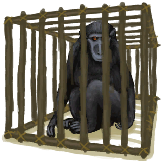

[返回首页](index.md)   |  [查看所有物品](object.md)
# 中陷阱的猕猴  
> 一只活的猕猴。宰杀以取其皮肉，抑或试与之交友，一切取决于你。  
  
  属性  |   图片   
 ----  |  ----:   
 **重量：**1500  **标签：**	[“大的”](tag_Large.md)  **可使用次数：**144  |     
  
## 动作  
动作  |  时间  |  条件  |  变化  |  状态  
----  |  ----  |  ----  |  ----  |  ----  
放生  |  15分  |    |  → [诱捕笼](CageTrap.md)   |  [猕猴种群数量](Pop_Macaque.md)+1000  
抚摸  |  15分  |    |  能量 + 250  [(事件)啊！！！！](Event_MacaqueFriendAnger.md)(1)  |    
## 可拖入  
使用  |  动作  |  时间  |  条件  |  变化  |  状态  
----  |  ----  |  ----  |  ----  |  ----  |  ----  
[鱼片](FishSlices.md)  |  喂食  |  -  |    |  自身: 耐久 + 288 能量 + 50  使用物: 可用次数  -1  获得: [(事件)啊！！！！](Event_MacaqueFriendAnger.md)(1)   |    
[“喂/添加”](tag_Feed.md)  |  喂食  |  -  |    |  自身: 耐久 + 288 能量 + 250  获得: [(事件)啊！！！！](Event_MacaqueFriendAnger.md)(1)   |    
[“储水容器”](tag_WaterContainer.md)  |  喂水  |  -  |    |  自身: 可用次数 + 48 能量 + 250  使用物: 含水量  -300    |    
[“切割工具”](tag_Cutter.md)  |  杀害  |  15分  |  [光亮](Light.md):10-100  |  自身: → [猕猴尸体](MacaqueCarcass.md)  使用物: 可用次数  -1    |  [污垢](Filth.md)+20  
## 变化  
操作  |  值  |  时间  |  变化  
----  |  ----  |  ----  |  ----  
饥饿  |  初始：288 最大：576  |  每天-1 最多需要：6天  |  [诱捕笼](CageTrap.md)1   → [猕猴尸体](MacaqueCarcass.md)  
口渴  |  初始：144 最大：288  |  每天-1 最多需要：3天  |  [诱捕笼](CageTrap.md)1   → [猕猴尸体](MacaqueCarcass.md)  
驯服进度  |  初始：288 最大：672  |  每天-1 最多需要：7天  |  [诱捕笼](CageTrap.md)1   → [猕猴朋友](MacaqueFriend.md)  
压力  |  初始：0 最大：1000  |  每天-4 最多需要：2天14小时30分  |    
便便  |  初始：192 最大：192  |  每天-1 最多需要：2天  |  [粪便](Manure.md)1   
