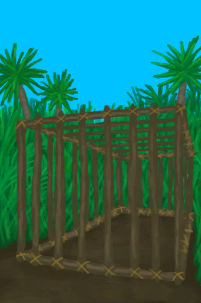

# 诱捕笼  
> 我应该在里面放上诱饵，过段时间再来看看。（更换诱饵会重置陷阱）  
  
<table class="table table-bordered" data-toggle="table"  data-show-header="false"><thead style="display:none"><tr ><th  style="width:50%;text-align:left;vertical-align:top;"  >title</th><th  style="width:50%;text-align:left;vertical-align:top;"  ></th></tr></thead><tr ><td  style="width:50%;text-align:left;vertical-align:top;"  >** 不可删除 **  ** 不可堆叠 **  **重量：**1000  **标签：**	[“大的”](tag_Large.md)  **槽位：**1  **过滤器：**[“诱饵”](tag_Bait.md) , [“饲料”](tag_Feed.md)</td><td  style="width:50%;text-align:left;vertical-align:top;"  >

<a href="CageTrapPlaced.md" style="color:black">诱捕笼</a>

一种先进的陷阱，需要<b>长木棍和细线</b>来建造。  可以随身携带并且非常适合用来活捉<b>猕猴和灰山鹑</b>。  这些陷阱需要<b>诱饵</b>才能用，并且每次触发后必须<b>重置</b>。 除非真的有必要，否则不要更换诱饵，不然会重置陷阱的计时器。</td></tr></tbody></table>  
  
## 获取来源  

放置

[诱捕笼](CageTrap.md)

重置陷阱

[解除陷阱](CageTrapPlacedTriggered.md)

重置陷阱

[解除陷阱(雌灰山鹑)](CageTrapPlacedTriggeredPartridgeFemale.md)

重置陷阱

[解除陷阱(雄灰山鹑)](CageTrapPlacedTriggeredPartridgeMale.md)

重置陷阱

[解除陷阱(海鸥)](CageTrapPlacedTriggeredSeagull.md)

  
  
## 动作  

<table><tr><td rowspan="2" style="width:200px;text-align:center;font-size:1.3em;font-weight:bold">

捡起

15分

</td><td>[“手部动作(组)”](HandAction.md)</td></tr><tr><td><b>自身：</b>→ [

[诱捕笼](CageTrap.md)](CageTrap.md)</td></tr><tr><td colspan="2"><b>需求：</b>[

[光亮](Light.md)](Light.md): <b>10-100</b></td></tr></table>
  
  
  
## 转化  

<table style="margin-bottom:0px;"><tr><td  colspan=2 style="font-size:1em;font-weight:bold;background-color:#FEFEFE">捕捉猎物</td><td style="text-align:right; background-color:#FEFEFE"></td></tr><tr style="background-color:#FFFFFF"><td style="width:30%;font-size:1em;text-align:right;vertical-align:middle;">[“诱饵”](tag_Bait.md) [“饲料”](tag_Feed.md)</td><td style="text-align:center;width:20%;vertical-align:middle;">
18小时45分 ～ 1天13小时30分

捕捉猎物
</td><td style="text-align:left;vertical-align:middle;"></td></tr><tr><td colspan="3"><b>自身：</b>诱捕笼  <b>+1(100%)</b></td></tr></table>
  
## 属性   

<table style="margin-bottom:0px;"><tr><td style="width:30%;text-align:left; background-color:#FEFEFE;font-size:1.3em;font-weight:bold;">诱捕笼</td><td style="font-size:1em;background-color:#FEFEFE">初始：0 , 最大：1 -</td></tr><tr style="background-color:#FFFFFF"><td colspan=2>** 到达上限时：陷阱触发了！ ** 自身: →消失 

<table style="margin-bottom:3px;"><tr><td rowspan=2 style="text-align:center" width="80px">
基础权重

100
</td><td style="font-size:0.6em;line-height:0.6em;font-weight:bold">Fail</td></tr><tr><td>[

[解除陷阱](CageTrapPlacedTriggered.md)](CageTrapPlacedTriggered.md)(<b>+1</b>)</td></tr><tr><td colspan=2><li>[

[陷阱(技能)](Skill_Trapping.md)](Skill_Trapping.md)为<b>0～150</b>时权重<b>+0～-75</b></li><li>[

[陷阱栅栏](Imp_TrappingFences.md)](Imp_TrappingFences.md)存在于*手中/面板*，权重<b>-20</b>(可叠加),</li></td></tr></table>

<table style="margin-bottom:3px;"><tr><td rowspan=2 style="text-align:center" width="80px">
基础权重

0
</td><td style="font-size:0.6em;line-height:0.6em;font-weight:bold">Seagull</td></tr><tr><td>[

[解除陷阱(海鸥)](CageTrapPlacedTriggeredSeagull.md)](CageTrapPlacedTriggeredSeagull.md)(<b>+1</b>)[海鸥种群数量](Pop_Seagull.md)<b>-1000</b> [海鸥之惧](SeagullFear.md)<b>+100</b></td></tr><tr><td colspan=2><li>位于[

[沙滩(环境)](Env_Beach.md)](Env_Beach.md),[海鸥种群数量](Pop_Seagull.md)为<b>1000～4500</b>时权重限定为<b>+0～+10</b></li></td></tr></table>

<table style="margin-bottom:3px;"><tr><td rowspan=2 style="text-align:center" width="80px">
基础权重

0
</td><td style="font-size:0.6em;line-height:0.6em;font-weight:bold">Partridge Female</td></tr><tr><td>[

[解除陷阱(雌灰山鹑)](CageTrapPlacedTriggeredPartridgeFemale.md)](CageTrapPlacedTriggeredPartridgeFemale.md)(<b>+1</b>)[灰山鹑种群数量](Pop_Partridge.md)<b>-1000</b></td></tr><tr><td colspan=2><li>位于[

[丛林(环境)](Env_Jungle.md)](Env_Jungle.md),[灰山鹑种群数量](Pop_Partridge.md)为<b>1000～40000</b>时权重限定为<b>+0～+22</b></li><li>位于[

[丛林高地(环境)](Env_JungleHighlands.md)](Env_JungleHighlands.md),[灰山鹑种群数量](Pop_Partridge.md)为<b>1000～40000</b>时权重限定为<b>+0～+22</b></li><li>位于[

[丛林深处(环境)](Env_DeepJungle.md)](Env_DeepJungle.md),[灰山鹑种群数量](Pop_Partridge.md)为<b>1000～40000</b>时权重限定为<b>+0～+22</b></li><li>位于[

[湿地(环境)](Env_Wetlands.md)](Env_Wetlands.md),[灰山鹑种群数量](Pop_Partridge.md)为<b>1000～40000</b>时权重限定为<b>+0～+22</b></li><li>位于[

[西部高地(环境)](Env_HighlandsWestern.md)](Env_HighlandsWestern.md),[灰山鹑种群数量](Pop_Partridge.md)为<b>1000～40000</b>时权重限定为<b>+0～+22</b></li><li>位于[

[西部草原(环境)](Env_GrasslandsW.md)](Env_GrasslandsW.md),[灰山鹑种群数量](Pop_Partridge.md)为<b>1000～40000</b>时权重限定为<b>+0～+22</b>[巨蜥种群数量](Pop_Monitor.md)为<b>1000～14000</b>时权重限定为<b>+0～-30</b></li><li>位于[

[东部草原(环境)](Env_GrasslandsE.md)](Env_GrasslandsE.md),[灰山鹑种群数量](Pop_Partridge.md)为<b>1000～40000</b>时权重限定为<b>+0～+22</b>[巨蜥种群数量](Pop_Monitor.md)为<b>1000～14000</b>时权重限定为<b>+0～-30</b></li><li>位于[

[神秘谷(环境)](Env_SecretValley.md)](Env_SecretValley.md),[灰山鹑种群数量](Pop_Partridge.md)为<b>1000～40000</b>时权重限定为<b>+0～+4</b></li></td></tr></table>

<table style="margin-bottom:3px;"><tr><td rowspan=2 style="text-align:center" width="80px">
基础权重

0
</td><td style="font-size:0.6em;line-height:0.6em;font-weight:bold">Partridge Male</td></tr><tr><td>[

[解除陷阱(雄灰山鹑)](CageTrapPlacedTriggeredPartridgeMale.md)](CageTrapPlacedTriggeredPartridgeMale.md)(<b>+1</b>)[灰山鹑种群数量](Pop_Partridge.md)<b>-1000</b></td></tr><tr><td colspan=2><li>位于[

[丛林(环境)](Env_Jungle.md)](Env_Jungle.md),[灰山鹑种群数量](Pop_Partridge.md)为<b>1000～40000</b>时权重限定为<b>+0～+8</b></li><li>位于[

[丛林高地(环境)](Env_JungleHighlands.md)](Env_JungleHighlands.md),[灰山鹑种群数量](Pop_Partridge.md)为<b>1000～40000</b>时权重限定为<b>+0～+8</b></li><li>位于[

[丛林深处(环境)](Env_DeepJungle.md)](Env_DeepJungle.md),[灰山鹑种群数量](Pop_Partridge.md)为<b>1000～40000</b>时权重限定为<b>+0～+8</b></li><li>位于[

[湿地(环境)](Env_Wetlands.md)](Env_Wetlands.md),[灰山鹑种群数量](Pop_Partridge.md)为<b>1000～40000</b>时权重限定为<b>+0～+8</b></li><li>位于[

[西部高地(环境)](Env_HighlandsWestern.md)](Env_HighlandsWestern.md),[灰山鹑种群数量](Pop_Partridge.md)为<b>1000～40000</b>时权重限定为<b>+0～+8</b></li><li>位于[

[西部草原(环境)](Env_GrasslandsW.md)](Env_GrasslandsW.md),[灰山鹑种群数量](Pop_Partridge.md)为<b>1000～40000</b>时权重限定为<b>+0～+8</b>[巨蜥种群数量](Pop_Monitor.md)为<b>1000～14000</b>时权重限定为<b>+0～-30</b></li><li>位于[

[东部草原(环境)](Env_GrasslandsE.md)](Env_GrasslandsE.md),[灰山鹑种群数量](Pop_Partridge.md)为<b>1000～40000</b>时权重限定为<b>+0～+8</b>[巨蜥种群数量](Pop_Monitor.md)为<b>1000～14000</b>时权重限定为<b>+0～-30</b></li><li>位于[

[神秘谷(环境)](Env_SecretValley.md)](Env_SecretValley.md),[灰山鹑种群数量](Pop_Partridge.md)为<b>1000～40000</b>时权重限定为<b>+0～+4</b></li></td></tr></table>

<table style="margin-bottom:3px;"><tr><td rowspan=2 style="text-align:center" width="80px">
基础权重

0
</td><td style="font-size:0.6em;line-height:0.6em;font-weight:bold">Macaque</td></tr><tr><td>[

[中陷阱的猕猴](CageTrapMacaque.md)](CageTrapMacaque.md)(<b>+1</b>)[猕猴种群数量](Pop_Macaque.md)<b>-1000</b> 诱捕笼: <b><b>-1</b></b></td></tr><tr><td colspan=2><li>位于[

[丛林(环境)](Env_Jungle.md)](Env_Jungle.md),[猕猴种群数量](Pop_Macaque.md)为<b>1000～25000</b>时权重限定为<b>+0～+22</b></li><li>位于[

[丛林高地(环境)](Env_JungleHighlands.md)](Env_JungleHighlands.md),[猕猴种群数量](Pop_Macaque.md)为<b>1000～25000</b>时权重限定为<b>+0～+22</b></li><li>位于[

[丛林深处(环境)](Env_DeepJungle.md)](Env_DeepJungle.md),[猕猴种群数量](Pop_Macaque.md)为<b>1000～25000</b>时权重限定为<b>+0～+22</b></li><li>位于[

[湿地(环境)](Env_Wetlands.md)](Env_Wetlands.md),[猕猴种群数量](Pop_Macaque.md)为<b>1000～25000</b>时权重限定为<b>+0～+22</b></li><li>位于[

[西部高地(环境)](Env_HighlandsWestern.md)](Env_HighlandsWestern.md),[猕猴种群数量](Pop_Macaque.md)为<b>1000～25000</b>时权重限定为<b>+0～+22</b></li><li>位于[

[海湾(环境)](Env_Bay.md)](Env_Bay.md),[猕猴种群数量](Pop_Macaque.md)为<b>1000～25000</b>时权重限定为<b>+0～+22</b></li><li>位于[

[神秘谷(环境)](Env_SecretValley.md)](Env_SecretValley.md),[猕猴种群数量](Pop_Macaque.md)为<b>1000～25000</b>时权重限定为<b>+0～+4</b></li></td></tr></table>
<button class="btn btn-secondary btn-sm" style="" data-toggle="modal" onclick="setCollectionDataBase64('eyJ0aXRsZSI6IuamgueOh+aooeaLnzogdW5kZWZpbmVkIiwiY29sbGVjdGlvbnMiOlt7ImRyb3AiOiI8ZGl2IHN0eWxlPVwid2lkdGg6MjVweDtkaXNwbGF5OmlubGluZS1ibG9jazt0ZXh0LWFsaWduOmNlbnRlclwiPjxpbWcgZGVjb2Rpbmc9XCJhc3luY1wiIHNyYz1cIi4uL3dpa2kvU3ByaXRlL0NhZ2VQbGFjZWRTaHV0LnBuZ1wiIGhyZWY9XCJhLm1kXCIgc3R5bGU9XCJtYXgtd2lkdGg6MjVweDttYXgtaGVpZ2h0OjI1cHg7XCI+PC9kaXY+6Kej6Zmk6Zm36ZixIiwiYmFzZSI6MTAwLCJjb25kaXRpb24iOlt7ImtleSI6IlNraWxsX1RyYXBwaW5nIiwidGl0bGUiOiLpmbfpmLEo5oqA6IO9KSIsInR5cGUiOiJyYW5nZSIsIm1heCI6WzAsMTUwXSwicmFuZ2UiOlswLDE1MF0sIndlaWdodCI6WzAsLTc1XSwiZGVmYXVsdFZhbHVlIjowLCJ3aGVuT3V0T2ZSYW5nZSI6MH0seyJrZXkiOiJJbXBfVHJhcHBpbmdGZW5jZXNfYW1vdW50IiwidGl0bGUiOiLpmbfpmLHmoIXmoI8iLCJ0eXBlIjoicmFuZ2UiLCJyYW5nZSI6WzAsMjBdLCJtYXgiOlswLDIwXSwid2VpZ2h0IjpbMCwtNDAwXSwiZGVmYXVsdFZhbHVlIjowLCJ3aGVuT3V0T2ZSYW5nZSI6MCwibWF4U3RhY2tHcm91cCI6IiJ9XX0seyJkcm9wIjoiPGRpdiBzdHlsZT1cIndpZHRoOjI1cHg7ZGlzcGxheTppbmxpbmUtYmxvY2s7dGV4dC1hbGlnbjpjZW50ZXJcIj48aW1nIGRlY29kaW5nPVwiYXN5bmNcIiBzcmM9XCIuLi93aWtpL1Nwcml0ZS9DYWdlUGxhY2VkU2h1dC5wbmdcIiBocmVmPVwiYS5tZFwiIHN0eWxlPVwibWF4LXdpZHRoOjI1cHg7bWF4LWhlaWdodDoyNXB4O1wiPjwvZGl2Puino+mZpOmZt+mYsSjmtbfpuKUpIiwiYmFzZSI6MCwiY29uZGl0aW9uIjpbeyJrZXkiOiJFbnZfQmVhY2giLCJ0aXRsZSI6IuS9jeS6jjxkaXYgc3R5bGU9XCJ3aWR0aDoyMHB4O2Rpc3BsYXk6aW5saW5lLWJsb2NrO3RleHQtYWxpZ246Y2VudGVyXCI+PGltZyBkZWNvZGluZz1cImFzeW5jXCIgc3JjPVwiLi4vd2lraS9TcHJpdGUvQmlnSXNsYW5kLnBuZ1wiIGhyZWY9XCJhLm1kXCIgc3R5bGU9XCJtYXgtd2lkdGg6MjBweDttYXgtaGVpZ2h0OjIwcHg7XCI+PC9kaXY+5rKZ5rupKOeOr+WigykiLCJ0eXBlIjoidG9nZ2xlIiwicmFuZ2UiOlswLDFdLCJtYXgiOlswLDFdLCJ3ZWlnaHQiOlswLDBdLCJkZWZhdWx0VmFsdWUiOjAsIndoZW5PdXRPZlJhbmdlIjowLCJtYXhTdGFja0dyb3VwIjoiIn0seyJrZXkiOiJQb3BfU2VhZ3VsbCIsInRpdGxlIjoi5rW36bil56eN576k5pWw6YePIiwidHlwZSI6InJhbmdlIiwibWF4IjpbMCw0NTAwMF0sInJhbmdlIjpbMTAwMCw0NTAwXSwid2VpZ2h0IjpbMCwxMF0sImRlZmF1bHRWYWx1ZSI6NDUwMDAsIndoZW5PdXRPZlJhbmdlIjoxLCJwcmVkIjoiRW52X0JlYWNoIn1dfSx7ImRyb3AiOiI8ZGl2IHN0eWxlPVwid2lkdGg6MjVweDtkaXNwbGF5OmlubGluZS1ibG9jazt0ZXh0LWFsaWduOmNlbnRlclwiPjxpbWcgZGVjb2Rpbmc9XCJhc3luY1wiIHNyYz1cIi4uL3dpa2kvU3ByaXRlL0NhZ2VQbGFjZWRTaHV0LnBuZ1wiIGhyZWY9XCJhLm1kXCIgc3R5bGU9XCJtYXgtd2lkdGg6MjVweDttYXgtaGVpZ2h0OjI1cHg7XCI+PC9kaXY+6Kej6Zmk6Zm36ZixKOmbjOeBsOWxsem5kSkiLCJiYXNlIjowLCJjb25kaXRpb24iOlt7ImtleSI6IkVudl9KdW5nbGUiLCJ0aXRsZSI6IuS9jeS6jjxkaXYgc3R5bGU9XCJ3aWR0aDoyMHB4O2Rpc3BsYXk6aW5saW5lLWJsb2NrO3RleHQtYWxpZ246Y2VudGVyXCI+PGltZyBkZWNvZGluZz1cImFzeW5jXCIgc3JjPVwiLi4vd2lraS9TcHJpdGUvSnVuZ2xlLnBuZ1wiIGhyZWY9XCJhLm1kXCIgc3R5bGU9XCJtYXgtd2lkdGg6MjBweDttYXgtaGVpZ2h0OjIwcHg7XCI+PC9kaXY+5Lib5p6XKOeOr+WigykiLCJ0eXBlIjoidG9nZ2xlIiwicmFuZ2UiOlswLDFdLCJtYXgiOlswLDFdLCJ3ZWlnaHQiOlswLDBdLCJkZWZhdWx0VmFsdWUiOjAsIndoZW5PdXRPZlJhbmdlIjowLCJtYXhTdGFja0dyb3VwIjoiIn0seyJrZXkiOiJQb3BfUGFydHJpZGdlIiwidGl0bGUiOiLngbDlsbHpuZHnp43nvqTmlbDph48iLCJ0eXBlIjoicmFuZ2UiLCJtYXgiOlswLDQwMDAwXSwicmFuZ2UiOlsxMDAwLDQwMDAwXSwid2VpZ2h0IjpbMCwyMl0sImRlZmF1bHRWYWx1ZSI6NDAwMDAsIndoZW5PdXRPZlJhbmdlIjoxLCJwcmVkIjoiRW52X0p1bmdsZSJ9LHsia2V5IjoiRW52X0p1bmdsZUhpZ2hsYW5kcyIsInRpdGxlIjoi5L2N5LqOPGRpdiBzdHlsZT1cIndpZHRoOjIwcHg7ZGlzcGxheTppbmxpbmUtYmxvY2s7dGV4dC1hbGlnbjpjZW50ZXJcIj48aW1nIGRlY29kaW5nPVwiYXN5bmNcIiBzcmM9XCIuLi93aWtpL1Nwcml0ZS9KdW5nbGUucG5nXCIgaHJlZj1cImEubWRcIiBzdHlsZT1cIm1heC13aWR0aDoyMHB4O21heC1oZWlnaHQ6MjBweDtcIj48L2Rpdj7kuJvmnpfpq5jlnLAo546v5aKDKSIsInR5cGUiOiJ0b2dnbGUiLCJyYW5nZSI6WzAsMV0sIm1heCI6WzAsMV0sIndlaWdodCI6WzAsMF0sImRlZmF1bHRWYWx1ZSI6MCwid2hlbk91dE9mUmFuZ2UiOjAsIm1heFN0YWNrR3JvdXAiOiIifSx7ImtleSI6IlBvcF9QYXJ0cmlkZ2UiLCJ0aXRsZSI6IueBsOWxsem5keenjee+pOaVsOmHjyIsInR5cGUiOiJyYW5nZSIsIm1heCI6WzAsNDAwMDBdLCJyYW5nZSI6WzEwMDAsNDAwMDBdLCJ3ZWlnaHQiOlswLDIyXSwiZGVmYXVsdFZhbHVlIjo0MDAwMCwid2hlbk91dE9mUmFuZ2UiOjEsInByZWQiOiJFbnZfSnVuZ2xlSGlnaGxhbmRzIn0seyJrZXkiOiJFbnZfRGVlcEp1bmdsZSIsInRpdGxlIjoi5L2N5LqOPGRpdiBzdHlsZT1cIndpZHRoOjIwcHg7ZGlzcGxheTppbmxpbmUtYmxvY2s7dGV4dC1hbGlnbjpjZW50ZXJcIj48aW1nIGRlY29kaW5nPVwiYXN5bmNcIiBzcmM9XCIuLi93aWtpL1Nwcml0ZS9KdW5nbGUucG5nXCIgaHJlZj1cImEubWRcIiBzdHlsZT1cIm1heC13aWR0aDoyMHB4O21heC1oZWlnaHQ6MjBweDtcIj48L2Rpdj7kuJvmnpfmt7HlpIQo546v5aKDKSIsInR5cGUiOiJ0b2dnbGUiLCJyYW5nZSI6WzAsMV0sIm1heCI6WzAsMV0sIndlaWdodCI6WzAsMF0sImRlZmF1bHRWYWx1ZSI6MCwid2hlbk91dE9mUmFuZ2UiOjAsIm1heFN0YWNrR3JvdXAiOiIifSx7ImtleSI6IlBvcF9QYXJ0cmlkZ2UiLCJ0aXRsZSI6IueBsOWxsem5keenjee+pOaVsOmHjyIsInR5cGUiOiJyYW5nZSIsIm1heCI6WzAsNDAwMDBdLCJyYW5nZSI6WzEwMDAsNDAwMDBdLCJ3ZWlnaHQiOlswLDIyXSwiZGVmYXVsdFZhbHVlIjo0MDAwMCwid2hlbk91dE9mUmFuZ2UiOjEsInByZWQiOiJFbnZfRGVlcEp1bmdsZSJ9LHsia2V5IjoiRW52X1dldGxhbmRzIiwidGl0bGUiOiLkvY3kuo48ZGl2IHN0eWxlPVwid2lkdGg6MjBweDtkaXNwbGF5OmlubGluZS1ibG9jazt0ZXh0LWFsaWduOmNlbnRlclwiPjxpbWcgZGVjb2Rpbmc9XCJhc3luY1wiIHNyYz1cIi4uL3dpa2kvU3ByaXRlL1dldGxhbmRzLnBuZ1wiIGhyZWY9XCJhLm1kXCIgc3R5bGU9XCJtYXgtd2lkdGg6MjBweDttYXgtaGVpZ2h0OjIwcHg7XCI+PC9kaXY+5rm/5ZywKOeOr+WigykiLCJ0eXBlIjoidG9nZ2xlIiwicmFuZ2UiOlswLDFdLCJtYXgiOlswLDFdLCJ3ZWlnaHQiOlswLDBdLCJkZWZhdWx0VmFsdWUiOjAsIndoZW5PdXRPZlJhbmdlIjowLCJtYXhTdGFja0dyb3VwIjoiIn0seyJrZXkiOiJQb3BfUGFydHJpZGdlIiwidGl0bGUiOiLngbDlsbHpuZHnp43nvqTmlbDph48iLCJ0eXBlIjoicmFuZ2UiLCJtYXgiOlswLDQwMDAwXSwicmFuZ2UiOlsxMDAwLDQwMDAwXSwid2VpZ2h0IjpbMCwyMl0sImRlZmF1bHRWYWx1ZSI6NDAwMDAsIndoZW5PdXRPZlJhbmdlIjoxLCJwcmVkIjoiRW52X1dldGxhbmRzIn0seyJrZXkiOiJFbnZfSGlnaGxhbmRzV2VzdGVybiIsInRpdGxlIjoi5L2N5LqOPGRpdiBzdHlsZT1cIndpZHRoOjIwcHg7ZGlzcGxheTppbmxpbmUtYmxvY2s7dGV4dC1hbGlnbjpjZW50ZXJcIj48aW1nIGRlY29kaW5nPVwiYXN5bmNcIiBzcmM9XCIuLi93aWtpL1Nwcml0ZS9KdW5nbGUucG5nXCIgaHJlZj1cImEubWRcIiBzdHlsZT1cIm1heC13aWR0aDoyMHB4O21heC1oZWlnaHQ6MjBweDtcIj48L2Rpdj7opb/pg6jpq5jlnLAo546v5aKDKSIsInR5cGUiOiJ0b2dnbGUiLCJyYW5nZSI6WzAsMV0sIm1heCI6WzAsMV0sIndlaWdodCI6WzAsMF0sImRlZmF1bHRWYWx1ZSI6MCwid2hlbk91dE9mUmFuZ2UiOjAsIm1heFN0YWNrR3JvdXAiOiIifSx7ImtleSI6IlBvcF9QYXJ0cmlkZ2UiLCJ0aXRsZSI6IueBsOWxsem5keenjee+pOaVsOmHjyIsInR5cGUiOiJyYW5nZSIsIm1heCI6WzAsNDAwMDBdLCJyYW5nZSI6WzEwMDAsNDAwMDBdLCJ3ZWlnaHQiOlswLDIyXSwiZGVmYXVsdFZhbHVlIjo0MDAwMCwid2hlbk91dE9mUmFuZ2UiOjEsInByZWQiOiJFbnZfSGlnaGxhbmRzV2VzdGVybiJ9LHsia2V5IjoiRW52X0dyYXNzbGFuZHNXIiwidGl0bGUiOiLkvY3kuo48ZGl2IHN0eWxlPVwid2lkdGg6MjBweDtkaXNwbGF5OmlubGluZS1ibG9jazt0ZXh0LWFsaWduOmNlbnRlclwiPjxpbWcgZGVjb2Rpbmc9XCJhc3luY1wiIHNyYz1cIi4uL3dpa2kvU3ByaXRlL0p1bmdsZS5wbmdcIiBocmVmPVwiYS5tZFwiIHN0eWxlPVwibWF4LXdpZHRoOjIwcHg7bWF4LWhlaWdodDoyMHB4O1wiPjwvZGl2Puilv+mDqOiNieWOnyjnjq/looMpIiwidHlwZSI6InRvZ2dsZSIsInJhbmdlIjpbMCwxXSwibWF4IjpbMCwxXSwid2VpZ2h0IjpbMCwwXSwiZGVmYXVsdFZhbHVlIjowLCJ3aGVuT3V0T2ZSYW5nZSI6MCwibWF4U3RhY2tHcm91cCI6IiJ9LHsia2V5IjoiUG9wX1BhcnRyaWRnZSIsInRpdGxlIjoi54Gw5bGx6bmR56eN576k5pWw6YePIiwidHlwZSI6InJhbmdlIiwibWF4IjpbMCw0MDAwMF0sInJhbmdlIjpbMTAwMCw0MDAwMF0sIndlaWdodCI6WzAsMjJdLCJkZWZhdWx0VmFsdWUiOjQwMDAwLCJ3aGVuT3V0T2ZSYW5nZSI6MSwicHJlZCI6IkVudl9HcmFzc2xhbmRzVyJ9LHsia2V5IjoiRW52X0dyYXNzbGFuZHNFIiwidGl0bGUiOiLkvY3kuo48ZGl2IHN0eWxlPVwid2lkdGg6MjBweDtkaXNwbGF5OmlubGluZS1ibG9jazt0ZXh0LWFsaWduOmNlbnRlclwiPjxpbWcgZGVjb2Rpbmc9XCJhc3luY1wiIHNyYz1cIi4uL3dpa2kvU3ByaXRlL0p1bmdsZS5wbmdcIiBocmVmPVwiYS5tZFwiIHN0eWxlPVwibWF4LXdpZHRoOjIwcHg7bWF4LWhlaWdodDoyMHB4O1wiPjwvZGl2PuS4nOmDqOiNieWOnyjnjq/looMpIiwidHlwZSI6InRvZ2dsZSIsInJhbmdlIjpbMCwxXSwibWF4IjpbMCwxXSwid2VpZ2h0IjpbMCwwXSwiZGVmYXVsdFZhbHVlIjowLCJ3aGVuT3V0T2ZSYW5nZSI6MCwibWF4U3RhY2tHcm91cCI6IiJ9LHsia2V5IjoiUG9wX1BhcnRyaWRnZSIsInRpdGxlIjoi54Gw5bGx6bmR56eN576k5pWw6YePIiwidHlwZSI6InJhbmdlIiwibWF4IjpbMCw0MDAwMF0sInJhbmdlIjpbMTAwMCw0MDAwMF0sIndlaWdodCI6WzAsMjJdLCJkZWZhdWx0VmFsdWUiOjQwMDAwLCJ3aGVuT3V0T2ZSYW5nZSI6MSwicHJlZCI6IkVudl9HcmFzc2xhbmRzRSJ9LHsia2V5IjoiRW52X1NlY3JldFZhbGxleSIsInRpdGxlIjoi5L2N5LqOPGRpdiBzdHlsZT1cIndpZHRoOjIwcHg7ZGlzcGxheTppbmxpbmUtYmxvY2s7dGV4dC1hbGlnbjpjZW50ZXJcIj48aW1nIGRlY29kaW5nPVwiYXN5bmNcIiBzcmM9XCIuLi93aWtpL1Nwcml0ZS9KdW5nbGUucG5nXCIgaHJlZj1cImEubWRcIiBzdHlsZT1cIm1heC13aWR0aDoyMHB4O21heC1oZWlnaHQ6MjBweDtcIj48L2Rpdj7npZ7np5josLco546v5aKDKSIsInR5cGUiOiJ0b2dnbGUiLCJyYW5nZSI6WzAsMV0sIm1heCI6WzAsMV0sIndlaWdodCI6WzAsMF0sImRlZmF1bHRWYWx1ZSI6MCwid2hlbk91dE9mUmFuZ2UiOjAsIm1heFN0YWNrR3JvdXAiOiIifSx7ImtleSI6IlBvcF9QYXJ0cmlkZ2UiLCJ0aXRsZSI6IueBsOWxsem5keenjee+pOaVsOmHjyIsInR5cGUiOiJyYW5nZSIsIm1heCI6WzAsNDAwMDBdLCJyYW5nZSI6WzEwMDAsNDAwMDBdLCJ3ZWlnaHQiOlswLDRdLCJkZWZhdWx0VmFsdWUiOjQwMDAwLCJ3aGVuT3V0T2ZSYW5nZSI6MSwicHJlZCI6IkVudl9TZWNyZXRWYWxsZXkifV19LHsiZHJvcCI6IjxkaXYgc3R5bGU9XCJ3aWR0aDoyNXB4O2Rpc3BsYXk6aW5saW5lLWJsb2NrO3RleHQtYWxpZ246Y2VudGVyXCI+PGltZyBkZWNvZGluZz1cImFzeW5jXCIgc3JjPVwiLi4vd2lraS9TcHJpdGUvQ2FnZVBsYWNlZFNodXQucG5nXCIgaHJlZj1cImEubWRcIiBzdHlsZT1cIm1heC13aWR0aDoyNXB4O21heC1oZWlnaHQ6MjVweDtcIj48L2Rpdj7op6PpmaTpmbfpmLEo6ZuE54Gw5bGx6bmRKSIsImJhc2UiOjAsImNvbmRpdGlvbiI6W3sia2V5IjoiRW52X0p1bmdsZSIsInRpdGxlIjoi5L2N5LqOPGRpdiBzdHlsZT1cIndpZHRoOjIwcHg7ZGlzcGxheTppbmxpbmUtYmxvY2s7dGV4dC1hbGlnbjpjZW50ZXJcIj48aW1nIGRlY29kaW5nPVwiYXN5bmNcIiBzcmM9XCIuLi93aWtpL1Nwcml0ZS9KdW5nbGUucG5nXCIgaHJlZj1cImEubWRcIiBzdHlsZT1cIm1heC13aWR0aDoyMHB4O21heC1oZWlnaHQ6MjBweDtcIj48L2Rpdj7kuJvmnpco546v5aKDKSIsInR5cGUiOiJ0b2dnbGUiLCJyYW5nZSI6WzAsMV0sIm1heCI6WzAsMV0sIndlaWdodCI6WzAsMF0sImRlZmF1bHRWYWx1ZSI6MCwid2hlbk91dE9mUmFuZ2UiOjAsIm1heFN0YWNrR3JvdXAiOiIifSx7ImtleSI6IlBvcF9QYXJ0cmlkZ2UiLCJ0aXRsZSI6IueBsOWxsem5keenjee+pOaVsOmHjyIsInR5cGUiOiJyYW5nZSIsIm1heCI6WzAsNDAwMDBdLCJyYW5nZSI6WzEwMDAsNDAwMDBdLCJ3ZWlnaHQiOlswLDhdLCJkZWZhdWx0VmFsdWUiOjQwMDAwLCJ3aGVuT3V0T2ZSYW5nZSI6MSwicHJlZCI6IkVudl9KdW5nbGUifSx7ImtleSI6IkVudl9KdW5nbGVIaWdobGFuZHMiLCJ0aXRsZSI6IuS9jeS6jjxkaXYgc3R5bGU9XCJ3aWR0aDoyMHB4O2Rpc3BsYXk6aW5saW5lLWJsb2NrO3RleHQtYWxpZ246Y2VudGVyXCI+PGltZyBkZWNvZGluZz1cImFzeW5jXCIgc3JjPVwiLi4vd2lraS9TcHJpdGUvSnVuZ2xlLnBuZ1wiIGhyZWY9XCJhLm1kXCIgc3R5bGU9XCJtYXgtd2lkdGg6MjBweDttYXgtaGVpZ2h0OjIwcHg7XCI+PC9kaXY+5Lib5p6X6auY5ZywKOeOr+WigykiLCJ0eXBlIjoidG9nZ2xlIiwicmFuZ2UiOlswLDFdLCJtYXgiOlswLDFdLCJ3ZWlnaHQiOlswLDBdLCJkZWZhdWx0VmFsdWUiOjAsIndoZW5PdXRPZlJhbmdlIjowLCJtYXhTdGFja0dyb3VwIjoiIn0seyJrZXkiOiJQb3BfUGFydHJpZGdlIiwidGl0bGUiOiLngbDlsbHpuZHnp43nvqTmlbDph48iLCJ0eXBlIjoicmFuZ2UiLCJtYXgiOlswLDQwMDAwXSwicmFuZ2UiOlsxMDAwLDQwMDAwXSwid2VpZ2h0IjpbMCw4XSwiZGVmYXVsdFZhbHVlIjo0MDAwMCwid2hlbk91dE9mUmFuZ2UiOjEsInByZWQiOiJFbnZfSnVuZ2xlSGlnaGxhbmRzIn0seyJrZXkiOiJFbnZfRGVlcEp1bmdsZSIsInRpdGxlIjoi5L2N5LqOPGRpdiBzdHlsZT1cIndpZHRoOjIwcHg7ZGlzcGxheTppbmxpbmUtYmxvY2s7dGV4dC1hbGlnbjpjZW50ZXJcIj48aW1nIGRlY29kaW5nPVwiYXN5bmNcIiBzcmM9XCIuLi93aWtpL1Nwcml0ZS9KdW5nbGUucG5nXCIgaHJlZj1cImEubWRcIiBzdHlsZT1cIm1heC13aWR0aDoyMHB4O21heC1oZWlnaHQ6MjBweDtcIj48L2Rpdj7kuJvmnpfmt7HlpIQo546v5aKDKSIsInR5cGUiOiJ0b2dnbGUiLCJyYW5nZSI6WzAsMV0sIm1heCI6WzAsMV0sIndlaWdodCI6WzAsMF0sImRlZmF1bHRWYWx1ZSI6MCwid2hlbk91dE9mUmFuZ2UiOjAsIm1heFN0YWNrR3JvdXAiOiIifSx7ImtleSI6IlBvcF9QYXJ0cmlkZ2UiLCJ0aXRsZSI6IueBsOWxsem5keenjee+pOaVsOmHjyIsInR5cGUiOiJyYW5nZSIsIm1heCI6WzAsNDAwMDBdLCJyYW5nZSI6WzEwMDAsNDAwMDBdLCJ3ZWlnaHQiOlswLDhdLCJkZWZhdWx0VmFsdWUiOjQwMDAwLCJ3aGVuT3V0T2ZSYW5nZSI6MSwicHJlZCI6IkVudl9EZWVwSnVuZ2xlIn0seyJrZXkiOiJFbnZfV2V0bGFuZHMiLCJ0aXRsZSI6IuS9jeS6jjxkaXYgc3R5bGU9XCJ3aWR0aDoyMHB4O2Rpc3BsYXk6aW5saW5lLWJsb2NrO3RleHQtYWxpZ246Y2VudGVyXCI+PGltZyBkZWNvZGluZz1cImFzeW5jXCIgc3JjPVwiLi4vd2lraS9TcHJpdGUvV2V0bGFuZHMucG5nXCIgaHJlZj1cImEubWRcIiBzdHlsZT1cIm1heC13aWR0aDoyMHB4O21heC1oZWlnaHQ6MjBweDtcIj48L2Rpdj7mub/lnLAo546v5aKDKSIsInR5cGUiOiJ0b2dnbGUiLCJyYW5nZSI6WzAsMV0sIm1heCI6WzAsMV0sIndlaWdodCI6WzAsMF0sImRlZmF1bHRWYWx1ZSI6MCwid2hlbk91dE9mUmFuZ2UiOjAsIm1heFN0YWNrR3JvdXAiOiIifSx7ImtleSI6IlBvcF9QYXJ0cmlkZ2UiLCJ0aXRsZSI6IueBsOWxsem5keenjee+pOaVsOmHjyIsInR5cGUiOiJyYW5nZSIsIm1heCI6WzAsNDAwMDBdLCJyYW5nZSI6WzEwMDAsNDAwMDBdLCJ3ZWlnaHQiOlswLDhdLCJkZWZhdWx0VmFsdWUiOjQwMDAwLCJ3aGVuT3V0T2ZSYW5nZSI6MSwicHJlZCI6IkVudl9XZXRsYW5kcyJ9LHsia2V5IjoiRW52X0hpZ2hsYW5kc1dlc3Rlcm4iLCJ0aXRsZSI6IuS9jeS6jjxkaXYgc3R5bGU9XCJ3aWR0aDoyMHB4O2Rpc3BsYXk6aW5saW5lLWJsb2NrO3RleHQtYWxpZ246Y2VudGVyXCI+PGltZyBkZWNvZGluZz1cImFzeW5jXCIgc3JjPVwiLi4vd2lraS9TcHJpdGUvSnVuZ2xlLnBuZ1wiIGhyZWY9XCJhLm1kXCIgc3R5bGU9XCJtYXgtd2lkdGg6MjBweDttYXgtaGVpZ2h0OjIwcHg7XCI+PC9kaXY+6KW/6YOo6auY5ZywKOeOr+WigykiLCJ0eXBlIjoidG9nZ2xlIiwicmFuZ2UiOlswLDFdLCJtYXgiOlswLDFdLCJ3ZWlnaHQiOlswLDBdLCJkZWZhdWx0VmFsdWUiOjAsIndoZW5PdXRPZlJhbmdlIjowLCJtYXhTdGFja0dyb3VwIjoiIn0seyJrZXkiOiJQb3BfUGFydHJpZGdlIiwidGl0bGUiOiLngbDlsbHpuZHnp43nvqTmlbDph48iLCJ0eXBlIjoicmFuZ2UiLCJtYXgiOlswLDQwMDAwXSwicmFuZ2UiOlsxMDAwLDQwMDAwXSwid2VpZ2h0IjpbMCw4XSwiZGVmYXVsdFZhbHVlIjo0MDAwMCwid2hlbk91dE9mUmFuZ2UiOjEsInByZWQiOiJFbnZfSGlnaGxhbmRzV2VzdGVybiJ9LHsia2V5IjoiRW52X0dyYXNzbGFuZHNXIiwidGl0bGUiOiLkvY3kuo48ZGl2IHN0eWxlPVwid2lkdGg6MjBweDtkaXNwbGF5OmlubGluZS1ibG9jazt0ZXh0LWFsaWduOmNlbnRlclwiPjxpbWcgZGVjb2Rpbmc9XCJhc3luY1wiIHNyYz1cIi4uL3dpa2kvU3ByaXRlL0p1bmdsZS5wbmdcIiBocmVmPVwiYS5tZFwiIHN0eWxlPVwibWF4LXdpZHRoOjIwcHg7bWF4LWhlaWdodDoyMHB4O1wiPjwvZGl2Puilv+mDqOiNieWOnyjnjq/looMpIiwidHlwZSI6InRvZ2dsZSIsInJhbmdlIjpbMCwxXSwibWF4IjpbMCwxXSwid2VpZ2h0IjpbMCwwXSwiZGVmYXVsdFZhbHVlIjowLCJ3aGVuT3V0T2ZSYW5nZSI6MCwibWF4U3RhY2tHcm91cCI6IiJ9LHsia2V5IjoiUG9wX1BhcnRyaWRnZSIsInRpdGxlIjoi54Gw5bGx6bmR56eN576k5pWw6YePIiwidHlwZSI6InJhbmdlIiwibWF4IjpbMCw0MDAwMF0sInJhbmdlIjpbMTAwMCw0MDAwMF0sIndlaWdodCI6WzAsOF0sImRlZmF1bHRWYWx1ZSI6NDAwMDAsIndoZW5PdXRPZlJhbmdlIjoxLCJwcmVkIjoiRW52X0dyYXNzbGFuZHNXIn0seyJrZXkiOiJFbnZfR3Jhc3NsYW5kc0UiLCJ0aXRsZSI6IuS9jeS6jjxkaXYgc3R5bGU9XCJ3aWR0aDoyMHB4O2Rpc3BsYXk6aW5saW5lLWJsb2NrO3RleHQtYWxpZ246Y2VudGVyXCI+PGltZyBkZWNvZGluZz1cImFzeW5jXCIgc3JjPVwiLi4vd2lraS9TcHJpdGUvSnVuZ2xlLnBuZ1wiIGhyZWY9XCJhLm1kXCIgc3R5bGU9XCJtYXgtd2lkdGg6MjBweDttYXgtaGVpZ2h0OjIwcHg7XCI+PC9kaXY+5Lic6YOo6I2J5Y6fKOeOr+WigykiLCJ0eXBlIjoidG9nZ2xlIiwicmFuZ2UiOlswLDFdLCJtYXgiOlswLDFdLCJ3ZWlnaHQiOlswLDBdLCJkZWZhdWx0VmFsdWUiOjAsIndoZW5PdXRPZlJhbmdlIjowLCJtYXhTdGFja0dyb3VwIjoiIn0seyJrZXkiOiJQb3BfUGFydHJpZGdlIiwidGl0bGUiOiLngbDlsbHpuZHnp43nvqTmlbDph48iLCJ0eXBlIjoicmFuZ2UiLCJtYXgiOlswLDQwMDAwXSwicmFuZ2UiOlsxMDAwLDQwMDAwXSwid2VpZ2h0IjpbMCw4XSwiZGVmYXVsdFZhbHVlIjo0MDAwMCwid2hlbk91dE9mUmFuZ2UiOjEsInByZWQiOiJFbnZfR3Jhc3NsYW5kc0UifSx7ImtleSI6IkVudl9TZWNyZXRWYWxsZXkiLCJ0aXRsZSI6IuS9jeS6jjxkaXYgc3R5bGU9XCJ3aWR0aDoyMHB4O2Rpc3BsYXk6aW5saW5lLWJsb2NrO3RleHQtYWxpZ246Y2VudGVyXCI+PGltZyBkZWNvZGluZz1cImFzeW5jXCIgc3JjPVwiLi4vd2lraS9TcHJpdGUvSnVuZ2xlLnBuZ1wiIGhyZWY9XCJhLm1kXCIgc3R5bGU9XCJtYXgtd2lkdGg6MjBweDttYXgtaGVpZ2h0OjIwcHg7XCI+PC9kaXY+56We56eY6LC3KOeOr+WigykiLCJ0eXBlIjoidG9nZ2xlIiwicmFuZ2UiOlswLDFdLCJtYXgiOlswLDFdLCJ3ZWlnaHQiOlswLDBdLCJkZWZhdWx0VmFsdWUiOjAsIndoZW5PdXRPZlJhbmdlIjowLCJtYXhTdGFja0dyb3VwIjoiIn0seyJrZXkiOiJQb3BfUGFydHJpZGdlIiwidGl0bGUiOiLngbDlsbHpuZHnp43nvqTmlbDph48iLCJ0eXBlIjoicmFuZ2UiLCJtYXgiOlswLDQwMDAwXSwicmFuZ2UiOlsxMDAwLDQwMDAwXSwid2VpZ2h0IjpbMCw0XSwiZGVmYXVsdFZhbHVlIjo0MDAwMCwid2hlbk91dE9mUmFuZ2UiOjEsInByZWQiOiJFbnZfU2VjcmV0VmFsbGV5In1dfSx7ImRyb3AiOiI8ZGl2IHN0eWxlPVwid2lkdGg6MjVweDtkaXNwbGF5OmlubGluZS1ibG9jazt0ZXh0LWFsaWduOmNlbnRlclwiPjxpbWcgZGVjb2Rpbmc9XCJhc3luY1wiIHNyYz1cIi4uL3dpa2kvU3ByaXRlL0NhZ2VNYWNhcXVlLnBuZ1wiIGhyZWY9XCJhLm1kXCIgc3R5bGU9XCJtYXgtd2lkdGg6MjVweDttYXgtaGVpZ2h0OjI1cHg7XCI+PC9kaXY+5Lit6Zm36Zix55qE54yV54y0IiwiYmFzZSI6MCwiY29uZGl0aW9uIjpbeyJrZXkiOiJFbnZfSnVuZ2xlIiwidGl0bGUiOiLkvY3kuo48ZGl2IHN0eWxlPVwid2lkdGg6MjBweDtkaXNwbGF5OmlubGluZS1ibG9jazt0ZXh0LWFsaWduOmNlbnRlclwiPjxpbWcgZGVjb2Rpbmc9XCJhc3luY1wiIHNyYz1cIi4uL3dpa2kvU3ByaXRlL0p1bmdsZS5wbmdcIiBocmVmPVwiYS5tZFwiIHN0eWxlPVwibWF4LXdpZHRoOjIwcHg7bWF4LWhlaWdodDoyMHB4O1wiPjwvZGl2PuS4m+aelyjnjq/looMpIiwidHlwZSI6InRvZ2dsZSIsInJhbmdlIjpbMCwxXSwibWF4IjpbMCwxXSwid2VpZ2h0IjpbMCwwXSwiZGVmYXVsdFZhbHVlIjowLCJ3aGVuT3V0T2ZSYW5nZSI6MCwibWF4U3RhY2tHcm91cCI6IiJ9LHsia2V5IjoiUG9wX01hY2FxdWUiLCJ0aXRsZSI6IueMleeMtOenjee+pOaVsOmHjyIsInR5cGUiOiJyYW5nZSIsIm1heCI6WzAsMjUwMDBdLCJyYW5nZSI6WzEwMDAsMjUwMDBdLCJ3ZWlnaHQiOlswLDIyXSwiZGVmYXVsdFZhbHVlIjoyNTAwMCwid2hlbk91dE9mUmFuZ2UiOjEsInByZWQiOiJFbnZfSnVuZ2xlIn0seyJrZXkiOiJFbnZfSnVuZ2xlSGlnaGxhbmRzIiwidGl0bGUiOiLkvY3kuo48ZGl2IHN0eWxlPVwid2lkdGg6MjBweDtkaXNwbGF5OmlubGluZS1ibG9jazt0ZXh0LWFsaWduOmNlbnRlclwiPjxpbWcgZGVjb2Rpbmc9XCJhc3luY1wiIHNyYz1cIi4uL3dpa2kvU3ByaXRlL0p1bmdsZS5wbmdcIiBocmVmPVwiYS5tZFwiIHN0eWxlPVwibWF4LXdpZHRoOjIwcHg7bWF4LWhlaWdodDoyMHB4O1wiPjwvZGl2PuS4m+ael+mrmOWcsCjnjq/looMpIiwidHlwZSI6InRvZ2dsZSIsInJhbmdlIjpbMCwxXSwibWF4IjpbMCwxXSwid2VpZ2h0IjpbMCwwXSwiZGVmYXVsdFZhbHVlIjowLCJ3aGVuT3V0T2ZSYW5nZSI6MCwibWF4U3RhY2tHcm91cCI6IiJ9LHsia2V5IjoiUG9wX01hY2FxdWUiLCJ0aXRsZSI6IueMleeMtOenjee+pOaVsOmHjyIsInR5cGUiOiJyYW5nZSIsIm1heCI6WzAsMjUwMDBdLCJyYW5nZSI6WzEwMDAsMjUwMDBdLCJ3ZWlnaHQiOlswLDIyXSwiZGVmYXVsdFZhbHVlIjoyNTAwMCwid2hlbk91dE9mUmFuZ2UiOjEsInByZWQiOiJFbnZfSnVuZ2xlSGlnaGxhbmRzIn0seyJrZXkiOiJFbnZfRGVlcEp1bmdsZSIsInRpdGxlIjoi5L2N5LqOPGRpdiBzdHlsZT1cIndpZHRoOjIwcHg7ZGlzcGxheTppbmxpbmUtYmxvY2s7dGV4dC1hbGlnbjpjZW50ZXJcIj48aW1nIGRlY29kaW5nPVwiYXN5bmNcIiBzcmM9XCIuLi93aWtpL1Nwcml0ZS9KdW5nbGUucG5nXCIgaHJlZj1cImEubWRcIiBzdHlsZT1cIm1heC13aWR0aDoyMHB4O21heC1oZWlnaHQ6MjBweDtcIj48L2Rpdj7kuJvmnpfmt7HlpIQo546v5aKDKSIsInR5cGUiOiJ0b2dnbGUiLCJyYW5nZSI6WzAsMV0sIm1heCI6WzAsMV0sIndlaWdodCI6WzAsMF0sImRlZmF1bHRWYWx1ZSI6MCwid2hlbk91dE9mUmFuZ2UiOjAsIm1heFN0YWNrR3JvdXAiOiIifSx7ImtleSI6IlBvcF9NYWNhcXVlIiwidGl0bGUiOiLnjJXnjLTnp43nvqTmlbDph48iLCJ0eXBlIjoicmFuZ2UiLCJtYXgiOlswLDI1MDAwXSwicmFuZ2UiOlsxMDAwLDI1MDAwXSwid2VpZ2h0IjpbMCwyMl0sImRlZmF1bHRWYWx1ZSI6MjUwMDAsIndoZW5PdXRPZlJhbmdlIjoxLCJwcmVkIjoiRW52X0RlZXBKdW5nbGUifSx7ImtleSI6IkVudl9XZXRsYW5kcyIsInRpdGxlIjoi5L2N5LqOPGRpdiBzdHlsZT1cIndpZHRoOjIwcHg7ZGlzcGxheTppbmxpbmUtYmxvY2s7dGV4dC1hbGlnbjpjZW50ZXJcIj48aW1nIGRlY29kaW5nPVwiYXN5bmNcIiBzcmM9XCIuLi93aWtpL1Nwcml0ZS9XZXRsYW5kcy5wbmdcIiBocmVmPVwiYS5tZFwiIHN0eWxlPVwibWF4LXdpZHRoOjIwcHg7bWF4LWhlaWdodDoyMHB4O1wiPjwvZGl2Pua5v+WcsCjnjq/looMpIiwidHlwZSI6InRvZ2dsZSIsInJhbmdlIjpbMCwxXSwibWF4IjpbMCwxXSwid2VpZ2h0IjpbMCwwXSwiZGVmYXVsdFZhbHVlIjowLCJ3aGVuT3V0T2ZSYW5nZSI6MCwibWF4U3RhY2tHcm91cCI6IiJ9LHsia2V5IjoiUG9wX01hY2FxdWUiLCJ0aXRsZSI6IueMleeMtOenjee+pOaVsOmHjyIsInR5cGUiOiJyYW5nZSIsIm1heCI6WzAsMjUwMDBdLCJyYW5nZSI6WzEwMDAsMjUwMDBdLCJ3ZWlnaHQiOlswLDIyXSwiZGVmYXVsdFZhbHVlIjoyNTAwMCwid2hlbk91dE9mUmFuZ2UiOjEsInByZWQiOiJFbnZfV2V0bGFuZHMifSx7ImtleSI6IkVudl9IaWdobGFuZHNXZXN0ZXJuIiwidGl0bGUiOiLkvY3kuo48ZGl2IHN0eWxlPVwid2lkdGg6MjBweDtkaXNwbGF5OmlubGluZS1ibG9jazt0ZXh0LWFsaWduOmNlbnRlclwiPjxpbWcgZGVjb2Rpbmc9XCJhc3luY1wiIHNyYz1cIi4uL3dpa2kvU3ByaXRlL0p1bmdsZS5wbmdcIiBocmVmPVwiYS5tZFwiIHN0eWxlPVwibWF4LXdpZHRoOjIwcHg7bWF4LWhlaWdodDoyMHB4O1wiPjwvZGl2Puilv+mDqOmrmOWcsCjnjq/looMpIiwidHlwZSI6InRvZ2dsZSIsInJhbmdlIjpbMCwxXSwibWF4IjpbMCwxXSwid2VpZ2h0IjpbMCwwXSwiZGVmYXVsdFZhbHVlIjowLCJ3aGVuT3V0T2ZSYW5nZSI6MCwibWF4U3RhY2tHcm91cCI6IiJ9LHsia2V5IjoiUG9wX01hY2FxdWUiLCJ0aXRsZSI6IueMleeMtOenjee+pOaVsOmHjyIsInR5cGUiOiJyYW5nZSIsIm1heCI6WzAsMjUwMDBdLCJyYW5nZSI6WzEwMDAsMjUwMDBdLCJ3ZWlnaHQiOlswLDIyXSwiZGVmYXVsdFZhbHVlIjoyNTAwMCwid2hlbk91dE9mUmFuZ2UiOjEsInByZWQiOiJFbnZfSGlnaGxhbmRzV2VzdGVybiJ9LHsia2V5IjoiRW52X0JheSIsInRpdGxlIjoi5L2N5LqOPGRpdiBzdHlsZT1cIndpZHRoOjIwcHg7ZGlzcGxheTppbmxpbmUtYmxvY2s7dGV4dC1hbGlnbjpjZW50ZXJcIj48aW1nIGRlY29kaW5nPVwiYXN5bmNcIiBzcmM9XCIuLi93aWtpL1Nwcml0ZS9CYXkucG5nXCIgaHJlZj1cImEubWRcIiBzdHlsZT1cIm1heC13aWR0aDoyMHB4O21heC1oZWlnaHQ6MjBweDtcIj48L2Rpdj7mtbfmub4o546v5aKDKSIsInR5cGUiOiJ0b2dnbGUiLCJyYW5nZSI6WzAsMV0sIm1heCI6WzAsMV0sIndlaWdodCI6WzAsMF0sImRlZmF1bHRWYWx1ZSI6MCwid2hlbk91dE9mUmFuZ2UiOjAsIm1heFN0YWNrR3JvdXAiOiIifSx7ImtleSI6IlBvcF9NYWNhcXVlIiwidGl0bGUiOiLnjJXnjLTnp43nvqTmlbDph48iLCJ0eXBlIjoicmFuZ2UiLCJtYXgiOlswLDI1MDAwXSwicmFuZ2UiOlsxMDAwLDI1MDAwXSwid2VpZ2h0IjpbMCwyMl0sImRlZmF1bHRWYWx1ZSI6MjUwMDAsIndoZW5PdXRPZlJhbmdlIjoxLCJwcmVkIjoiRW52X0JheSJ9LHsia2V5IjoiRW52X1NlY3JldFZhbGxleSIsInRpdGxlIjoi5L2N5LqOPGRpdiBzdHlsZT1cIndpZHRoOjIwcHg7ZGlzcGxheTppbmxpbmUtYmxvY2s7dGV4dC1hbGlnbjpjZW50ZXJcIj48aW1nIGRlY29kaW5nPVwiYXN5bmNcIiBzcmM9XCIuLi93aWtpL1Nwcml0ZS9KdW5nbGUucG5nXCIgaHJlZj1cImEubWRcIiBzdHlsZT1cIm1heC13aWR0aDoyMHB4O21heC1oZWlnaHQ6MjBweDtcIj48L2Rpdj7npZ7np5josLco546v5aKDKSIsInR5cGUiOiJ0b2dnbGUiLCJyYW5nZSI6WzAsMV0sIm1heCI6WzAsMV0sIndlaWdodCI6WzAsMF0sImRlZmF1bHRWYWx1ZSI6MCwid2hlbk91dE9mUmFuZ2UiOjAsIm1heFN0YWNrR3JvdXAiOiIifSx7ImtleSI6IlBvcF9NYWNhcXVlIiwidGl0bGUiOiLnjJXnjLTnp43nvqTmlbDph48iLCJ0eXBlIjoicmFuZ2UiLCJtYXgiOlswLDI1MDAwXSwicmFuZ2UiOlsxMDAwLDI1MDAwXSwid2VpZ2h0IjpbMCw0XSwiZGVmYXVsdFZhbHVlIjoyNTAwMCwid2hlbk91dE9mUmFuZ2UiOjEsInByZWQiOiJFbnZfU2VjcmV0VmFsbGV5In1dfV19')" data-target="#modelCollectionSimulator">概率模拟</button>
</td></tr></table>
  

