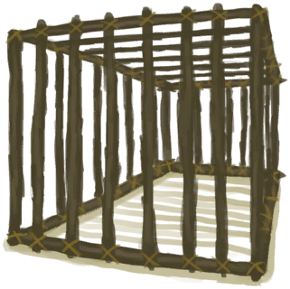

# 解除陷阱  
> 需要先重置它。  
  
<table class="table table-bordered" data-toggle="table"  data-show-header="false"><thead style="display:none"><tr ><th  style="width:50%;text-align:left;vertical-align:top;"  >title</th><th  style="width:50%;text-align:left;vertical-align:top;"  ></th></tr></thead><tr ><td  style="width:50%;text-align:left;vertical-align:top;"  >** 不可删除 **  ** 不可堆叠 **  **重量：**1000  **槽位：**1  **初始卡牌：**[

[雄灰山鹑](PartridgeMaleLive.md)](PartridgeMaleLive.md)  **过滤器：**[“饲料”](tag_Feed.md) , [“诱饵”](tag_Bait.md)</td><td  style="width:50%;text-align:left;vertical-align:top;"  >

<a href="CageTrapPlacedTriggeredPartridgeMale.md" style="color:black">解除陷阱</a>

一种先进的，需要<b>长木棍和细线</b>来建造的陷阱。  可以随身携带并且非常适合用来活捉 <b>猕猴和灰山鹑</b>。  这些陷阱需要<b>诱饵</b>才能用，并且每次触发后必须<b>重置</b>。 除非真的有必要，否则不要更换诱饵，不然会重置陷阱的计时器。</td></tr></tbody></table>  
  
## 获取来源  

陷阱触发了！

[诱捕笼](CageTrapPlaced.md)

  
  
## 动作  

<table><tr><td rowspan="2" style="width:200px;text-align:center;font-size:1.5em;font-weight:bold">

重置陷阱

15分

</td><td>[“手部动作(组)”](HandAction.md)</td></tr><tr><td><b>自身：</b>→ [

[诱捕笼](CageTrapPlaced.md)](CageTrapPlaced.md)</td></tr><tr><td colspan="2"><b>需求：</b>[

[光亮](Light.md)](Light.md): 10-100</td></tr><tr><td colspan="2"><b>状态变化：</b>[

[陷阱(技能)](Skill_Trapping.md)](Skill_Trapping.md)+0.5</td></tr></table>
  

<table><tr><td rowspan="2" style="width:200px;text-align:center;font-size:1.5em;font-weight:bold">

捡起

15分

</td><td>[“手部动作(组)”](HandAction.md)</td></tr><tr><td><b>自身：</b>→ [

[诱捕笼](CageTrap.md)](CageTrap.md)</td></tr><tr><td colspan="2"><b>需求：</b>[

[光亮](Light.md)](Light.md): 10-100</td></tr></table>
  
  
  

