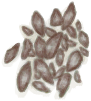

# 营火  
> 烹饪和取暖的最佳选择。  
  
<table class="table table-bordered" data-toggle="table"  data-show-header="false"><thead style="display:none"><tr ><th  style="width:50%;text-align:left;vertical-align:top;"  >title</th><th  style="width:50%;text-align:left;vertical-align:top;"  ></th></tr></thead><tr ><td  style="width:50%;text-align:left;vertical-align:top;"  >** 不可删除 **  **重量：**1000  **标签：**	[“火”](tag_Fire.md)  **槽位：**2  **过滤器：**[“可烹饪的”](tag_Cookable.md) , [“储水容器”](tag_WaterContainer.md)  ** 效果: ** [

[保温](InsulationCold.md)](InsulationCold.md)<b>+20</b> [

[湿度](Wetness.md)](Wetness.md)加成<b>-2</b> [

[光亮](Light.md)](Light.md)<b>+25</b> [

[蚊虫数量](BugPopulation.md)](BugPopulation.md)<b>-1</b></td><td  style="width:50%;text-align:left;vertical-align:top;"  >

<a href="Campfire.md" style="color:black">营火</a>

营火对生存至关重要。它们不仅可以让你在寒冷时保持温暖和干燥，而且可以在夜间提供照明，更重要的是，可以烹饪食物使其更安全、美味和更有营养。  你只需要收集石头、木材和树枝，就可以制作一个像样的营火。搭好后，用一个手钻点燃一些火绒，把它放在营火上使其点燃。  营火也会产生<b>木炭和灰烬</b>，在熄灭的状态下才可以取出它们。</td></tr></tbody></table>  
  
## 获取来源  

取出

[蒸馏器(开)](AlembicOn.md)

** 使用**[火种](TinderLit.md)点燃

[营火(熄灭)](CampfireExtinguished.md)

移除烟熏炉

[烟熏炉](Smoker.md)

移除烟熏炉

[烟熏炉(塑料布)(点燃)](SmokerPlastic.md)

  
  
## 动作  

<table><tr><td rowspan="2" style="width:200px;text-align:center;font-size:1.3em;font-weight:bold">

取出火炭

15分

</td><td></td></tr><tr><td><b>自身：</b>燃料  <b>-16(-16.67%)</b>, 

  <b>-16(-100%)</b></td></tr><tr><td colspan="2"><b>需求：</b>

: <b>16(100%)</b></td></tr><tr><td colspan="2">[

[火炭](Embers.md)](Embers.md)(<b>+1</b>)</td></tr></table>
  

<table><tr><td rowspan="2" style="width:200px;text-align:center;font-size:1.3em;font-weight:bold">

熄灭火焰

</td><td></td></tr><tr><td><b>自身：</b>→ [

[营火(熄灭)](CampfireExtinguished.md)](CampfireExtinguished.md)</td></tr></table>
  

<table><tr><td rowspan="2" style="width:200px;text-align:center;font-size:1.3em;font-weight:bold">

拆解

</td><td></td></tr><tr><td><b>自身：</b>→消失</td></tr><tr><td colspan="2">[

[石头](Stone.md)](Stone.md)(<b>+4</b>)</td></tr></table>
  
  
  
## 可拖入  

<table style="margin-bottom:0px;"><tr><td style="width:40%;text-align:left; background-color:#FEFEFE"><b>拖入：</b>[

[椰子壳](CoconutShell.md)](CoconutShell.md)</td><td style="width:40%;font-size:1em;font-weight:bold;background-color:#FEFEFE">添入椰子壳  </td></tr><tr style="background-color:#FFFFFF"><td style=""><b>使用物：</b>→消失</td><td style=""><b>自身：</b>燃料  <b>+3(3.13%)</b></td></tr></table>
  

<table style="margin-bottom:0px;"><tr><td style="width:40%;text-align:left; background-color:#FEFEFE"><b>拖入：</b>[

[木材](Wood.md)](Wood.md)</td><td style="width:40%;font-size:1em;font-weight:bold;background-color:#FEFEFE">添入柴火  </td></tr><tr style="background-color:#FFFFFF"><td style=""><b>使用物：</b>→消失</td><td style=""><b>自身：</b>燃料  <b>+28(29.17%)</b></td></tr></table>
  

<table style="margin-bottom:0px;"><tr><td style="width:40%;text-align:left; background-color:#FEFEFE"><b>拖入：</b>[“燃料”](tag_Fuel.md)</td><td style="width:40%;font-size:1em;font-weight:bold;background-color:#FEFEFE">添入燃料  </td></tr><tr style="background-color:#FFFFFF"><td style=""><b>使用物：</b>→消失</td><td style=""><b>自身：</b>燃料  <b>+7(7.29%)</b></td></tr></table>
  

<table style="margin-bottom:0px;"><tr><td style="width:40%;text-align:left; background-color:#FEFEFE"><b>拖入：</b>[

[木炭](Charcoal.md)](Charcoal.md) | [

[火炭](Embers.md)](Embers.md)</td><td style="width:40%;font-size:1em;font-weight:bold;background-color:#FEFEFE">添入木炭  </td></tr><tr style="background-color:#FFFFFF"><td style=""><b>使用物：</b>→消失</td><td style=""><b>自身：</b>燃料  <b>+7(7.29%)</b>, 

  <b>+7(43.75%)</b></td></tr></table>
  

<table style="margin-bottom:0px;"><tr><td style="width:40%;text-align:left; background-color:#FEFEFE"><b>拖入：</b>[

[蛇草](SnakeGrass.md)](SnakeGrass.md)</td><td style="width:40%;font-size:1em;font-weight:bold;background-color:#FEFEFE">添入蛇草 (15分) </td></tr><tr style="background-color:#FFFFFF"><td style=""><b>使用物：</b>→消失</td><td style=""><b>自身：</b></td></tr><tr><td colspan="2"><b>状态变化：</b>[

[驱虫](BugRepellentApplied.md)](BugRepellentApplied.md)<b>+25</b></td></tr></table>
  

<table style="margin-bottom:0px;"><tr><td style="width:40%;text-align:left; background-color:#FEFEFE"><b>拖入：</b>[

[枯叶](LeavesDry.md)](LeavesDry.md) | [

[鸟巢](Nest.md)](Nest.md) | [

[木屑](WoodShavings.md)](WoodShavings.md) | [

[纤维](Fibers.md)](Fibers.md) | [

[纸](Papers.md)](Papers.md)</td><td style="width:40%;font-size:1em;font-weight:bold;background-color:#FEFEFE">点燃火绒  </td></tr><tr style="background-color:#FFFFFF"><td style=""><b>使用物：</b>→ [

[火种](TinderLit.md)](TinderLit.md)</td><td style=""><b>自身：</b></td></tr></table>
  

<table style="margin-bottom:0px;"><tr><td style="width:40%;text-align:left; background-color:#FEFEFE"><b>拖入：</b>[“树叶”](tag_Leaves.md)</td><td style="width:40%;font-size:1em;font-weight:bold;background-color:#FEFEFE">添入树叶  </td></tr><tr style="background-color:#FFFFFF"><td style=""><b>使用物：</b>→消失</td><td style=""><b>自身：</b>燃料  <b>+2(2.08%)</b></td></tr></table>
  

<table style="margin-bottom:0px;"><tr><td style="width:40%;text-align:left; background-color:#FEFEFE"><b>拖入：</b>[

[长木棍](StickLong.md)](StickLong.md)</td><td style="width:40%;font-size:1em;font-weight:bold;background-color:#FEFEFE">制作简易长矛 (45分) </td></tr><tr style="background-color:#FFFFFF"><td style=""><b>使用物：</b>→ [

[简易长矛](SpearRustic.md)](SpearRustic.md)</td><td style=""><b>自身：</b></td></tr><tr><td colspan="2"><b>状态变化：</b>[

[情绪](Morale.md)](Morale.md)<b>+1</b></td></tr></table>
  

<table style="margin-bottom:0px;"><tr><td style="width:40%;text-align:left; background-color:#FEFEFE"><b>拖入：</b>[

[椰子皮](CoconutHusk.md)](CoconutHusk.md)</td><td style="width:40%;font-size:1em;font-weight:bold;background-color:#FEFEFE">添入椰子皮  </td></tr><tr style="background-color:#FFFFFF"><td style=""><b>使用物：</b>→消失</td><td style=""><b>自身：</b>燃料  <b>+3(3.13%)</b></td></tr></table>
  

<table style="margin-bottom:0px;"><tr><td style="width:40%;text-align:left; background-color:#FEFEFE"><b>拖入：</b>[

[蒸馏器](AlembicUndeployed.md)](AlembicUndeployed.md)</td><td style="width:40%;font-size:1em;font-weight:bold;background-color:#FEFEFE">放置蒸馏器  </td></tr><tr style="background-color:#FFFFFF"><td style=""><b>使用物：</b>→消失</td><td style=""><b>自身：</b>→ [

[蒸馏器(开)](AlembicOn.md)](AlembicOn.md), 燃料  <b>+2(2.08%)</b></td></tr></table>
  
  
## 可拖至  

[装有燃料的油桶](JerrycanFuel.md)

[熏蜂器(关)](BeeSmokerOff.md)

[香茅蜡烛(关)](CandleCitronellaOff.md)

[茉莉蜡烛(关)](CandleJasmineOff.md)

[蜡烛(关)](CandleOff.md)

[炸药(关)](DynamiteOff.md)

[火把(关)](TorchOff.md)

  
  
## 转化  

<table style="margin-bottom:0px;"><tr><td  colspan=2 style="font-size:1em;font-weight:bold;background-color:#FEFEFE">蝙蝠肉</td><td style="text-align:right; background-color:#FEFEFE">[

[烹饪(技能)](Skill_Cooking.md)](Skill_Cooking.md)<b>+0.25</b></td></tr><tr style="background-color:#FFFFFF"><td style="width:30%;font-size:1em;text-align:right;vertical-align:middle;">[

[蝙蝠尸体](Bat.md)](Bat.md)</td><td style="text-align:center;width:20%;vertical-align:middle;">
30分

蝙蝠肉
</td><td style="text-align:left;vertical-align:middle;">[

[烤蝙蝠](BatCooked.md)](BatCooked.md)(<b>+1</b>)</td></tr></table>
  

<table style="margin-bottom:0px;"><tr><td  colspan=2 style="font-size:1em;font-weight:bold;background-color:#FEFEFE">鸟肉</td><td style="text-align:right; background-color:#FEFEFE">[

[烹饪(技能)](Skill_Cooking.md)](Skill_Cooking.md)<b>+0.25</b></td></tr><tr style="background-color:#FFFFFF"><td style="width:30%;font-size:1em;text-align:right;vertical-align:middle;">[

[鸟肉](BirdMeat.md)](BirdMeat.md)</td><td style="text-align:center;width:20%;vertical-align:middle;">
30分

鸟肉
</td><td style="text-align:left;vertical-align:middle;">[

[烤鸟肉](BirdMeatCooked.md)](BirdMeatCooked.md)(<b>+1</b>)</td></tr></table>
  

<table style="margin-bottom:0px;"><tr><td  colspan=2 style="font-size:1em;font-weight:bold;background-color:#FEFEFE">野猪肉</td><td style="text-align:right; background-color:#FEFEFE">[

[烹饪(技能)](Skill_Cooking.md)](Skill_Cooking.md)<b>+0.25</b></td></tr><tr style="background-color:#FFFFFF"><td style="width:30%;font-size:1em;text-align:right;vertical-align:middle;">[

[野猪肉](BoarMeat.md)](BoarMeat.md)</td><td style="text-align:center;width:20%;vertical-align:middle;">
30分

野猪肉
</td><td style="text-align:left;vertical-align:middle;">[

[烤野猪肉](BoarMeatCooked.md)](BoarMeatCooked.md)(<b>+1</b>)</td></tr></table>
  

<table style="margin-bottom:0px;"><tr><td  colspan=2 style="font-size:1em;font-weight:bold;background-color:#FEFEFE">熬制香茅精油</td><td style="text-align:right; background-color:#FEFEFE"></td></tr><tr style="background-color:#FFFFFF"><td style="width:30%;font-size:1em;text-align:right;vertical-align:middle;">[

[香茅油混合物](LQ_OilCitronellaMix.md)](LQ_OilCitronellaMix.md)</td><td style="text-align:center;width:20%;vertical-align:middle;">
1小时

熬制香茅精油
</td><td style="text-align:left;vertical-align:middle;">→ [

[香茅精油](LQ_OilCitronella.md)](LQ_OilCitronella.md)</td></tr></table>
  

<table style="margin-bottom:0px;"><tr><td  colspan=2 style="font-size:1em;font-weight:bold;background-color:#FEFEFE">熬制胶水</td><td style="text-align:right; background-color:#FEFEFE"></td></tr><tr style="background-color:#FFFFFF"><td style="width:30%;font-size:1em;text-align:right;vertical-align:middle;">[

[未熬制的胶水](GlueUncooked.md)](GlueUncooked.md)</td><td style="text-align:center;width:20%;vertical-align:middle;">
2小时

熬制胶水
</td><td style="text-align:left;vertical-align:middle;">[

[熬制好的胶水](GlueCooked.md)](GlueCooked.md)(<b>+1</b>)</td></tr></table>
  

<table style="margin-bottom:0px;"><tr><td  colspan=2 style="font-size:1em;font-weight:bold;background-color:#FEFEFE">熬制茉莉精油</td><td style="text-align:right; background-color:#FEFEFE"></td></tr><tr style="background-color:#FFFFFF"><td style="width:30%;font-size:1em;text-align:right;vertical-align:middle;">[

[茉莉油混合物](LQ_OilJasmineMix.md)](LQ_OilJasmineMix.md)</td><td style="text-align:center;width:20%;vertical-align:middle;">
1小时

熬制茉莉精油
</td><td style="text-align:left;vertical-align:middle;">→ [

[茉莉精油](LQ_OilJasmine.md)](LQ_OilJasmine.md)</td></tr></table>
  

<table style="margin-bottom:0px;"><tr><td  colspan=2 style="font-size:1em;font-weight:bold;background-color:#FEFEFE">煮米饭</td><td style="text-align:right; background-color:#FEFEFE"></td></tr><tr style="background-color:#FFFFFF"><td style="width:30%;font-size:1em;text-align:right;vertical-align:middle;">[

[浸泡的米](LQ_SoakedRice.md)](LQ_SoakedRice.md)</td><td style="text-align:center;width:20%;vertical-align:middle;">
30分

煮米饭
</td><td style="text-align:left;vertical-align:middle;">[

[米饭](RiceCooked.md)](RiceCooked.md)(<b>+1</b>)→ [

[米汤](LQ_WaterRice.md)](LQ_WaterRice.md)</td></tr><tr style="text-align:left;background-color:#FEFEFE"><td colspan="3"><b></b>** 需要容器：** [“金属容器”](tag_ContainerMetal.md)</td></tr></table>
  

<table style="margin-bottom:0px;"><tr><td  colspan=2 style="font-size:1em;font-weight:bold;background-color:#FEFEFE">煮米饭</td><td style="text-align:right; background-color:#FEFEFE"></td></tr><tr style="background-color:#FFFFFF"><td style="width:30%;font-size:1em;text-align:right;vertical-align:middle;">[

[浸泡的米](LQ_SoakedRice.md)](LQ_SoakedRice.md)</td><td style="text-align:center;width:20%;vertical-align:middle;">
45分

煮米饭
</td><td style="text-align:left;vertical-align:middle;">[

[米饭](RiceCooked.md)](RiceCooked.md)(<b>+1</b>)→ [

[米汤](LQ_WaterRice.md)](LQ_WaterRice.md)</td></tr><tr style="text-align:left;background-color:#FEFEFE"><td colspan="3"><b></b>** 需要属性：** 含水量: <b>25～0</b></td></tr></table>
  

<table style="margin-bottom:0px;"><tr><td  colspan=2 style="font-size:1em;font-weight:bold;background-color:#FEFEFE">蒸发制盐</td><td style="text-align:right; background-color:#FEFEFE"></td></tr><tr style="background-color:#FFFFFF"><td style="width:30%;font-size:1em;text-align:right;vertical-align:middle;">[

[盐水](LQ_WaterSalt.md)](LQ_WaterSalt.md)</td><td style="text-align:center;width:20%;vertical-align:middle;">
30分

蒸发制盐
</td><td style="text-align:left;vertical-align:middle;">[

[盐](Salt.md)](Salt.md)(<b>+1</b>)含水量  <b>-300</b></td></tr><tr style="text-align:left;background-color:#FEFEFE"><td colspan="3"><b></b>** 需要属性：** 含水量: <b>250～999999</b> ** 需要容器：** [“金属容器”](tag_ContainerMetal.md)</td></tr></table>
  

<table style="margin-bottom:0px;"><tr><td  colspan=2 style="font-size:1em;font-weight:bold;background-color:#FEFEFE">蒸发制盐</td><td style="text-align:right; background-color:#FEFEFE"></td></tr><tr style="background-color:#FFFFFF"><td style="width:30%;font-size:1em;text-align:right;vertical-align:middle;">[

[盐水](LQ_WaterSalt.md)](LQ_WaterSalt.md)</td><td style="text-align:center;width:20%;vertical-align:middle;">
1小时

蒸发制盐
</td><td style="text-align:left;vertical-align:middle;">[

[盐](Salt.md)](Salt.md)(<b>+1</b>)含水量  <b>-300</b></td></tr><tr style="text-align:left;background-color:#FEFEFE"><td colspan="3"><b></b>** 需要属性：** 含水量: <b>250～999999</b></td></tr></table>
  

<table style="margin-bottom:0px;"><tr><td  colspan=2 style="font-size:1em;font-weight:bold;background-color:#FEFEFE">熬煮树汁</td><td style="text-align:right; background-color:#FEFEFE"></td></tr><tr style="background-color:#FFFFFF"><td style="width:30%;font-size:1em;text-align:right;vertical-align:middle;">[

[水椰树汁](LQ_Sap.md)](LQ_Sap.md)</td><td style="text-align:center;width:20%;vertical-align:middle;">
1小时

熬煮树汁
</td><td style="text-align:left;vertical-align:middle;">[

[糖](Sugar.md)](Sugar.md)(<b>+2</b>)含水量  <b>-300</b></td></tr><tr style="text-align:left;background-color:#FEFEFE"><td colspan="3"><b></b>** 需要属性：** 含水量: <b>250～999999</b></td></tr></table>
  

<table style="margin-bottom:0px;"><tr><td  colspan=2 style="font-size:1em;font-weight:bold;background-color:#FEFEFE">烧开水</td><td style="text-align:right; background-color:#FEFEFE"></td></tr><tr style="background-color:#FFFFFF"><td style="width:30%;font-size:1em;text-align:right;vertical-align:middle;">[“灌溉用水”](tag_WaterFresh.md)</td><td style="text-align:center;width:20%;vertical-align:middle;">
15分

烧开水
</td><td style="text-align:left;vertical-align:middle;">→ [

[开水](LQ_WaterBoiling.md)](LQ_WaterBoiling.md)</td></tr><tr style="text-align:left;background-color:#FEFEFE"><td colspan="3"><b></b>** 需要容器：** [“金属容器”](tag_ContainerMetal.md)</td></tr></table>
  

<table style="margin-bottom:0px;"><tr><td  colspan=2 style="font-size:1em;font-weight:bold;background-color:#FEFEFE">烧开水</td><td style="text-align:right; background-color:#FEFEFE"></td></tr><tr style="background-color:#FFFFFF"><td style="width:30%;font-size:1em;text-align:right;vertical-align:middle;">[“灌溉用水”](tag_WaterFresh.md)</td><td style="text-align:center;width:20%;vertical-align:middle;">
30分

烧开水
</td><td style="text-align:left;vertical-align:middle;">→ [

[开水](LQ_WaterBoiling.md)](LQ_WaterBoiling.md)</td></tr></table>
  

<table style="margin-bottom:0px;"><tr><td  colspan=2 style="font-size:1em;font-weight:bold;background-color:#FEFEFE">烧开水</td><td style="text-align:right; background-color:#FEFEFE"></td></tr><tr style="background-color:#FFFFFF"><td style="width:30%;font-size:1em;text-align:right;vertical-align:middle;">[

[开水](LQ_WaterBoiling.md)](LQ_WaterBoiling.md)</td><td style="text-align:center;width:20%;vertical-align:middle;">
15分

烧开水
</td><td style="text-align:left;vertical-align:middle;">燃料  <b>+2</b></td></tr></table>
  

<table style="margin-bottom:0px;"><tr><td  colspan=2 style="font-size:1em;font-weight:bold;background-color:#FEFEFE">煮参薯</td><td style="text-align:right; background-color:#FEFEFE"></td></tr><tr style="background-color:#FFFFFF"><td style="width:30%;font-size:1em;text-align:right;vertical-align:middle;">[

[浸泡的参薯](LQ_SoakedYam.md)](LQ_SoakedYam.md)</td><td style="text-align:center;width:20%;vertical-align:middle;">
45分

煮参薯
</td><td style="text-align:left;vertical-align:middle;">[

[煮熟的参薯](YamBoiled.md)](YamBoiled.md)(<b>+1</b>)含水量  <b>-300</b></td></tr><tr style="text-align:left;background-color:#FEFEFE"><td colspan="3"><b></b>** 需要容器：** [“金属容器”](tag_ContainerMetal.md)</td></tr></table>
  

<table style="margin-bottom:0px;"><tr><td  colspan=2 style="font-size:1em;font-weight:bold;background-color:#FEFEFE">煮参薯</td><td style="text-align:right; background-color:#FEFEFE"></td></tr><tr style="background-color:#FFFFFF"><td style="width:30%;font-size:1em;text-align:right;vertical-align:middle;">[

[浸泡的参薯](LQ_SoakedYam.md)](LQ_SoakedYam.md)</td><td style="text-align:center;width:20%;vertical-align:middle;">
1小时

煮参薯
</td><td style="text-align:left;vertical-align:middle;">[

[煮熟的参薯](YamBoiled.md)](YamBoiled.md)(<b>+1</b>)含水量  <b>-300</b></td></tr></table>
  

<table style="margin-bottom:0px;"><tr><td  colspan=2 style="font-size:1em;font-weight:bold;background-color:#FEFEFE">北梭鱼</td><td style="text-align:right; background-color:#FEFEFE">[

[烹饪(技能)](Skill_Cooking.md)](Skill_Cooking.md)<b>+0.25</b></td></tr><tr style="background-color:#FFFFFF"><td style="width:30%;font-size:1em;text-align:right;vertical-align:middle;">[

[北梭鱼肉](BonefishMeat.md)](BonefishMeat.md)</td><td style="text-align:center;width:20%;vertical-align:middle;">
30分

北梭鱼
</td><td style="text-align:left;vertical-align:middle;">[

[烤北梭鱼](BonefishCooked.md)](BonefishCooked.md)(<b>+1</b>)</td></tr></table>
  

<table style="margin-bottom:0px;"><tr><td  colspan=2 style="font-size:1em;font-weight:bold;background-color:#FEFEFE">黄油焗牡蛎</td><td style="text-align:right; background-color:#FEFEFE">[

[烹饪(技能)](Skill_Cooking.md)](Skill_Cooking.md)<b>+0.25</b></td></tr><tr style="background-color:#FFFFFF"><td style="width:30%;font-size:1em;text-align:right;vertical-align:middle;">[

[未烹饪的黄油牡蛎](ButterBakedOystersUncooked.md)](ButterBakedOystersUncooked.md)</td><td style="text-align:center;width:20%;vertical-align:middle;">
30分

黄油焗牡蛎
</td><td style="text-align:left;vertical-align:middle;">[

[黄油焗牡蛎](ButterBakedOystersCooked.md)](ButterBakedOystersCooked.md)(<b>+1</b>)</td></tr></table>
  

<table style="margin-bottom:0px;"><tr><td  colspan=2 style="font-size:1em;font-weight:bold;background-color:#FEFEFE">姜糖</td><td style="text-align:right; background-color:#FEFEFE">[

[烹饪(技能)](Skill_Cooking.md)](Skill_Cooking.md)<b>+0.25</b></td></tr><tr style="background-color:#FFFFFF"><td style="width:30%;font-size:1em;text-align:right;vertical-align:middle;">[

[未烹饪的姜糖](CandiedGingerUncooked.md)](CandiedGingerUncooked.md)</td><td style="text-align:center;width:20%;vertical-align:middle;">
45分

姜糖
</td><td style="text-align:left;vertical-align:middle;">[

[姜糖(做好的)](CandiedGingerCooked.md)](CandiedGingerCooked.md)(<b>+1</b>)</td></tr></table>
  

<table style="margin-bottom:0px;"><tr><td  colspan=2 style="font-size:1em;font-weight:bold;background-color:#FEFEFE">烧焦物</td><td style="text-align:right; background-color:#FEFEFE"></td></tr><tr style="background-color:#FFFFFF"><td style="width:30%;font-size:1em;text-align:right;vertical-align:middle;">[

[烤蝙蝠](BatCooked.md)](BatCooked.md) [

[烤鸟肉](BirdMeatCooked.md)](BirdMeatCooked.md) [

[烤野猪肉](BoarMeatCooked.md)](BoarMeatCooked.md) [

[烤北梭鱼](BonefishCooked.md)](BonefishCooked.md) [

[烤椰肉](CoconutMeatCooked.md)](CoconutMeatCooked.md) [

[烤海螺肉](ConchMeatCooked.md)](ConchMeatCooked.md) [

[松软的烤海螺肉](ConchMeatSoftCooked.md)](ConchMeatSoftCooked.md) [

[烤螃蟹](CrabCooked.md)](CrabCooked.md) [

[水煮蛋](EggBoiled.md)](EggBoiled.md) [

[烤蛋](EggCooked.md)](EggCooked.md) [

[烤鱼杂](FishScrapsCooked.md)](FishScrapsCooked.md) [

[烤鱼片](FishSlicesCooked.md)](FishSlicesCooked.md) [

[烤绯鲤](GoatfishCooked.md)](GoatfishCooked.md) [

[烤羊肉](GoatMeatCooked.md)](GoatMeatCooked.md) [

[烤石斑鱼](GrouperMeatCooked.md)](GrouperMeatCooked.md) [

[烤鲱鱼](HerringCooked.md)](HerringCooked.md) [

[烤蜥蜴](LizardCooked.md)](LizardCooked.md) [

[烤猕猴肉](MacaqueMeatCooked.md)](MacaqueMeatCooked.md) [

[烤巨蜥肉](MonitorMeatCooked.md)](MonitorMeatCooked.md) [

[烤老鼠](MouseCooked.md)](MouseCooked.md) [

[烤弹涂鱼](MudskipperCooked.md)](MudskipperCooked.md) [

[烤牡蛎肉](OysterMeatCooked.md)](OysterMeatCooked.md) [

[烤鹦哥鱼](ParrotFishCooked.md)](ParrotFishCooked.md) [

[烤虾](PrawnsCooked.md)](PrawnsCooked.md) [

[西米饼](SagoFlatbread.md)](SagoFlatbread.md) [

[烤海怪肉](SeahoundCooked.md)](SeahoundCooked.md) [

[烤鲨鱼肉](SharkCooked.md)](SharkCooked.md) [

[烤蛇肉](SnakeCooked.md)](SnakeCooked.md) [

[烤马鲅鱼](ThreadfinCooked.md)](ThreadfinCooked.md) [

[烤热带杏仁](TropicalAlmondsRoasted.md)](TropicalAlmondsRoasted.md) [

[烤海胆](UrchinMeatCooked.md)](UrchinMeatCooked.md)</td><td style="text-align:center;width:20%;vertical-align:middle;">
30分

烧焦物
</td><td style="text-align:left;vertical-align:middle;">[

[烧焦物](CharredRemains.md)](CharredRemains.md)(<b>+1</b>)</td></tr></table>
  

<table style="margin-bottom:0px;"><tr><td  colspan=2 style="font-size:1em;font-weight:bold;background-color:#FEFEFE">椰子鱼</td><td style="text-align:right; background-color:#FEFEFE">[

[烹饪(技能)](Skill_Cooking.md)](Skill_Cooking.md)<b>+0.25</b></td></tr><tr style="background-color:#FFFFFF"><td style="width:30%;font-size:1em;text-align:right;vertical-align:middle;">[

[未烹饪的椰子鱼](CoconutFishUncooked.md)](CoconutFishUncooked.md)</td><td style="text-align:center;width:20%;vertical-align:middle;">
45分

椰子鱼
</td><td style="text-align:left;vertical-align:middle;">[

[椰子鱼](CoconutFish.md)](CoconutFish.md)(<b>+1</b>)</td></tr></table>
  

<table style="margin-bottom:0px;"><tr><td  colspan=2 style="font-size:1em;font-weight:bold;background-color:#FEFEFE">椰肉</td><td style="text-align:right; background-color:#FEFEFE">[

[烹饪(技能)](Skill_Cooking.md)](Skill_Cooking.md)<b>+0.25</b></td></tr><tr style="background-color:#FFFFFF"><td style="width:30%;font-size:1em;text-align:right;vertical-align:middle;">[

[椰肉](CoconutMeat.md)](CoconutMeat.md)</td><td style="text-align:center;width:20%;vertical-align:middle;">
30分

椰肉
</td><td style="text-align:left;vertical-align:middle;">[

[烤椰肉](CoconutMeatCooked.md)](CoconutMeatCooked.md)(<b>+1</b>)</td></tr></table>
  

<table style="margin-bottom:0px;"><tr><td  colspan=2 style="font-size:1em;font-weight:bold;background-color:#FEFEFE">咖啡</td><td style="text-align:right; background-color:#FEFEFE">[

[烹饪(技能)](Skill_Cooking.md)](Skill_Cooking.md)<b>+0.25</b></td></tr><tr style="background-color:#FFFFFF"><td style="width:30%;font-size:1em;text-align:right;vertical-align:middle;">[

[咖啡豆](CoffeeBeans.md)](CoffeeBeans.md)</td><td style="text-align:center;width:20%;vertical-align:middle;">
30分

咖啡
</td><td style="text-align:left;vertical-align:middle;">[

[烤咖啡豆](CoffeeRoastedBeans.md)](CoffeeRoastedBeans.md)(<b>+1</b>)</td></tr></table>
  

<table style="margin-bottom:0px;"><tr><td  colspan=2 style="font-size:1em;font-weight:bold;background-color:#FEFEFE">海螺肉</td><td style="text-align:right; background-color:#FEFEFE">[

[烹饪(技能)](Skill_Cooking.md)](Skill_Cooking.md)<b>+0.25</b></td></tr><tr style="background-color:#FFFFFF"><td style="width:30%;font-size:1em;text-align:right;vertical-align:middle;">[

[海螺肉](ConchMeat.md)](ConchMeat.md)</td><td style="text-align:center;width:20%;vertical-align:middle;">
30分

海螺肉
</td><td style="text-align:left;vertical-align:middle;">[

[烤海螺肉](ConchMeatCooked.md)](ConchMeatCooked.md)(<b>+1</b>)</td></tr></table>
  

<table style="margin-bottom:0px;"><tr><td  colspan=2 style="font-size:1em;font-weight:bold;background-color:#FEFEFE">加热油桶</td><td style="text-align:right; background-color:#FEFEFE"></td></tr><tr style="background-color:#FFFFFF"><td style="width:30%;font-size:1em;text-align:right;vertical-align:middle;">[

[装有燃料的油桶](JerrycanFuel.md)](JerrycanFuel.md)</td><td style="text-align:center;width:20%;vertical-align:middle;">
30分

加热油桶
</td><td style="text-align:left;vertical-align:middle;">[

[<b>砰！！！</b>(事件)](Event_JerrycanExplosion.md)](Event_JerrycanExplosion.md)(<b>+1</b>)</td></tr></table>
  

<table style="margin-bottom:0px;"><tr><td  colspan=2 style="font-size:1em;font-weight:bold;background-color:#FEFEFE">螃蟹</td><td style="text-align:right; background-color:#FEFEFE">[

[烹饪(技能)](Skill_Cooking.md)](Skill_Cooking.md)<b>+0.25</b></td></tr><tr style="background-color:#FFFFFF"><td style="width:30%;font-size:1em;text-align:right;vertical-align:middle;">[

[螃蟹](Crab.md)](Crab.md)</td><td style="text-align:center;width:20%;vertical-align:middle;">
30分

螃蟹
</td><td style="text-align:left;vertical-align:middle;">[

[烤螃蟹](CrabCooked.md)](CrabCooked.md)(<b>+1</b>)</td></tr></table>
  

<table style="margin-bottom:0px;"><tr><td  colspan=2 style="font-size:1em;font-weight:bold;background-color:#FEFEFE">醉蟹</td><td style="text-align:right; background-color:#FEFEFE">[

[烹饪(技能)](Skill_Cooking.md)](Skill_Cooking.md)<b>+0.25</b></td></tr><tr style="background-color:#FFFFFF"><td style="width:30%;font-size:1em;text-align:right;vertical-align:middle;">[

[未烹饪的醉蟹](DrunkenCrabUncooked.md)](DrunkenCrabUncooked.md)</td><td style="text-align:center;width:20%;vertical-align:middle;">
30分

醉蟹
</td><td style="text-align:left;vertical-align:middle;">[

[醉蟹](DrunkenCrab.md)](DrunkenCrab.md)(<b>+1</b>)</td></tr></table>
  

<table style="margin-bottom:0px;"><tr><td  colspan=2 style="font-size:1em;font-weight:bold;background-color:#FEFEFE">烘干泥巴</td><td style="text-align:right; background-color:#FEFEFE"></td></tr><tr style="background-color:#FFFFFF"><td style="width:30%;font-size:1em;text-align:right;vertical-align:middle;">[

[泥堆](MudPile.md)](MudPile.md)</td><td style="text-align:center;width:20%;vertical-align:middle;">
1小时

烘干泥巴
</td><td style="text-align:left;vertical-align:middle;">[

[干土堆](DirtPile.md)](DirtPile.md)(<b>+1</b>)</td></tr></table>
  

<table style="margin-bottom:0px;"><tr><td  colspan=2 style="font-size:1em;font-weight:bold;background-color:#FEFEFE">蛋</td><td style="text-align:right; background-color:#FEFEFE">[

[烹饪(技能)](Skill_Cooking.md)](Skill_Cooking.md)<b>+0.25</b></td></tr><tr style="background-color:#FFFFFF"><td style="width:30%;font-size:1em;text-align:right;vertical-align:middle;">[

[蛋](Egg.md)](Egg.md) [

[受精蛋](EggPartridgeFertilized.md)](EggPartridgeFertilized.md)</td><td style="text-align:center;width:20%;vertical-align:middle;">
15分

蛋
</td><td style="text-align:left;vertical-align:middle;">[

[烤蛋](EggCooked.md)](EggCooked.md)(<b>+1</b>)</td></tr></table>
  

<table style="margin-bottom:0px;"><tr><td  colspan=2 style="font-size:1em;font-weight:bold;background-color:#FEFEFE">蛋炒饭</td><td style="text-align:right; background-color:#FEFEFE">[

[烹饪(技能)](Skill_Cooking.md)](Skill_Cooking.md)<b>+0.25</b></td></tr><tr style="background-color:#FFFFFF"><td style="width:30%;font-size:1em;text-align:right;vertical-align:middle;">[

[未烹饪的蛋炒饭](EggFriedRiceUncooked.md)](EggFriedRiceUncooked.md)</td><td style="text-align:center;width:20%;vertical-align:middle;">
30分

蛋炒饭
</td><td style="text-align:left;vertical-align:middle;">[

[蛋炒饭](EggFriedRice.md)](EggFriedRice.md)(<b>+1</b>)</td></tr></table>
  

<table style="margin-bottom:0px;"><tr><td  colspan=2 style="font-size:1em;font-weight:bold;background-color:#FEFEFE">烧制陶碗</td><td style="text-align:right; background-color:#FEFEFE"></td></tr><tr style="background-color:#FFFFFF"><td style="width:30%;font-size:1em;text-align:right;vertical-align:middle;">[

[未烧制的陶碗](ClayBowlUnfired.md)](ClayBowlUnfired.md)</td><td style="text-align:center;width:20%;vertical-align:middle;">
3小时

烧制陶碗
</td><td style="text-align:left;vertical-align:middle;">[

[陶碗](ClayBowl.md)](ClayBowl.md)(<b>+1</b>)</td></tr></table>
  

<table style="margin-bottom:0px;"><tr><td  colspan=2 style="font-size:1em;font-weight:bold;background-color:#FEFEFE">炸鱼薯条</td><td style="text-align:right; background-color:#FEFEFE">[

[烹饪(技能)](Skill_Cooking.md)](Skill_Cooking.md)<b>+0.25</b></td></tr><tr style="background-color:#FFFFFF"><td style="width:30%;font-size:1em;text-align:right;vertical-align:middle;">[

[未烹饪的炸鱼薯条](FishNChipsUncooked.md)](FishNChipsUncooked.md)</td><td style="text-align:center;width:20%;vertical-align:middle;">
45分

炸鱼薯条
</td><td style="text-align:left;vertical-align:middle;">[

[炸鱼薯条](FishNChips.md)](FishNChips.md)(<b>+1</b>)</td></tr></table>
  

<table style="margin-bottom:0px;"><tr><td  colspan=2 style="font-size:1em;font-weight:bold;background-color:#FEFEFE">鱼肉煎蛋饼</td><td style="text-align:right; background-color:#FEFEFE">[

[烹饪(技能)](Skill_Cooking.md)](Skill_Cooking.md)<b>+0.25</b></td></tr><tr style="background-color:#FFFFFF"><td style="width:30%;font-size:1em;text-align:right;vertical-align:middle;">[

[未烹饪的鱼肉蛋饼](FishOmeletteUncooked.md)](FishOmeletteUncooked.md)</td><td style="text-align:center;width:20%;vertical-align:middle;">
45分

鱼肉煎蛋饼
</td><td style="text-align:left;vertical-align:middle;">[

[鱼肉蛋饼](FishOmelette.md)](FishOmelette.md)(<b>+1</b>)</td></tr></table>
  

<table style="margin-bottom:0px;"><tr><td  colspan=2 style="font-size:1em;font-weight:bold;background-color:#FEFEFE">鱼杂</td><td style="text-align:right; background-color:#FEFEFE">[

[烹饪(技能)](Skill_Cooking.md)](Skill_Cooking.md)<b>+0.25</b></td></tr><tr style="background-color:#FFFFFF"><td style="width:30%;font-size:1em;text-align:right;vertical-align:middle;">[

[鱼杂](FishScraps.md)](FishScraps.md)</td><td style="text-align:center;width:20%;vertical-align:middle;">
30分

鱼杂
</td><td style="text-align:left;vertical-align:middle;">[

[烤鱼杂](FishScrapsCooked.md)](FishScrapsCooked.md)(<b>+0</b>)→ [

[烤鱼杂](FishScrapsCooked.md)](FishScrapsCooked.md)</td></tr></table>
  

<table style="margin-bottom:0px;"><tr><td  colspan=2 style="font-size:1em;font-weight:bold;background-color:#FEFEFE">鱼片</td><td style="text-align:right; background-color:#FEFEFE">[

[烹饪(技能)](Skill_Cooking.md)](Skill_Cooking.md)<b>+0.25</b></td></tr><tr style="background-color:#FFFFFF"><td style="width:30%;font-size:1em;text-align:right;vertical-align:middle;">[

[鱼片](FishSlices.md)](FishSlices.md)</td><td style="text-align:center;width:20%;vertical-align:middle;">
30分

鱼片
</td><td style="text-align:left;vertical-align:middle;">[

[烤鱼片](FishSlicesCooked.md)](FishSlicesCooked.md)(<b>+0</b>)→ [

[烤鱼片](FishSlicesCooked.md)](FishSlicesCooked.md)</td></tr></table>
  

<table style="margin-bottom:0px;"><tr><td  colspan=2 style="font-size:1em;font-weight:bold;background-color:#FEFEFE">炸香蕉</td><td style="text-align:right; background-color:#FEFEFE">[

[烹饪(技能)](Skill_Cooking.md)](Skill_Cooking.md)<b>+0.25</b></td></tr><tr style="background-color:#FFFFFF"><td style="width:30%;font-size:1em;text-align:right;vertical-align:middle;">[

[未烹饪的炸香蕉](FriedBananasUncooked.md)](FriedBananasUncooked.md)</td><td style="text-align:center;width:20%;vertical-align:middle;">
45分

炸香蕉
</td><td style="text-align:left;vertical-align:middle;">[

[熟的炸香蕉](FriedBananasCooked.md)](FriedBananasCooked.md)(<b>+1</b>)</td></tr></table>
  

<table style="margin-bottom:0px;"><tr><td  colspan=2 style="font-size:1em;font-weight:bold;background-color:#FEFEFE">炒菇球</td><td style="text-align:right; background-color:#FEFEFE">[

[烹饪(技能)](Skill_Cooking.md)](Skill_Cooking.md)<b>+0.25</b></td></tr><tr style="background-color:#FFFFFF"><td style="width:30%;font-size:1em;text-align:right;vertical-align:middle;">[

[未烹饪的炒菇球](FriedPuffballsUncooked.md)](FriedPuffballsUncooked.md)</td><td style="text-align:center;width:20%;vertical-align:middle;">
30分

炒菇球
</td><td style="text-align:left;vertical-align:middle;">[

[炒菇球](FriedPuffballs.md)](FriedPuffballs.md)(<b>+1</b>)</td></tr></table>
  

<table style="margin-bottom:0px;"><tr><td  colspan=2 style="font-size:1em;font-weight:bold;background-color:#FEFEFE">加热胶水</td><td style="text-align:right; background-color:#FEFEFE"></td></tr><tr style="background-color:#FFFFFF"><td style="width:30%;font-size:1em;text-align:right;vertical-align:middle;">[

[干胶水](GlueDry.md)](GlueDry.md)</td><td style="text-align:center;width:20%;vertical-align:middle;">
15分

加热胶水
</td><td style="text-align:left;vertical-align:middle;">[

[胶水](Glue.md)](Glue.md)(<b>+1</b>)</td></tr></table>
  

<table style="margin-bottom:0px;"><tr><td  colspan=2 style="font-size:1em;font-weight:bold;background-color:#FEFEFE">羊肉</td><td style="text-align:right; background-color:#FEFEFE">[

[烹饪(技能)](Skill_Cooking.md)](Skill_Cooking.md)<b>+0.25</b></td></tr><tr style="background-color:#FFFFFF"><td style="width:30%;font-size:1em;text-align:right;vertical-align:middle;">[

[羊肉](GoatMeat.md)](GoatMeat.md)</td><td style="text-align:center;width:20%;vertical-align:middle;">
30分

羊肉
</td><td style="text-align:left;vertical-align:middle;">[

[烤羊肉](GoatMeatCooked.md)](GoatMeatCooked.md)(<b>+1</b>)</td></tr></table>
  

<table style="margin-bottom:0px;"><tr><td  colspan=2 style="font-size:1em;font-weight:bold;background-color:#FEFEFE">炖羊肉</td><td style="text-align:right; background-color:#FEFEFE">[

[烹饪(技能)](Skill_Cooking.md)](Skill_Cooking.md)<b>+0.25</b></td></tr><tr style="background-color:#FFFFFF"><td style="width:30%;font-size:1em;text-align:right;vertical-align:middle;">[

[未烹饪的羊汤](GoatStewUncooked.md)](GoatStewUncooked.md)</td><td style="text-align:center;width:20%;vertical-align:middle;">
2小时

炖羊肉
</td><td style="text-align:left;vertical-align:middle;">[

[炖羊汤](GoatStew.md)](GoatStew.md)(<b>+1</b>)</td></tr></table>
  

<table style="margin-bottom:0px;"><tr><td  colspan=2 style="font-size:1em;font-weight:bold;background-color:#FEFEFE">绯鲤</td><td style="text-align:right; background-color:#FEFEFE">[

[烹饪(技能)](Skill_Cooking.md)](Skill_Cooking.md)<b>+0.25</b></td></tr><tr style="background-color:#FFFFFF"><td style="width:30%;font-size:1em;text-align:right;vertical-align:middle;">[

[绯鲤](Goatfish.md)](Goatfish.md)</td><td style="text-align:center;width:20%;vertical-align:middle;">
30分

绯鲤
</td><td style="text-align:left;vertical-align:middle;">[

[烤绯鲤](GoatfishCooked.md)](GoatfishCooked.md)(<b>+1</b>)</td></tr></table>
  

<table style="margin-bottom:0px;"><tr><td  colspan=2 style="font-size:1em;font-weight:bold;background-color:#FEFEFE">石斑鱼</td><td style="text-align:right; background-color:#FEFEFE">[

[烹饪(技能)](Skill_Cooking.md)](Skill_Cooking.md)<b>+0.25</b></td></tr><tr style="background-color:#FFFFFF"><td style="width:30%;font-size:1em;text-align:right;vertical-align:middle;">[

[石斑鱼肉](GrouperMeat.md)](GrouperMeat.md)</td><td style="text-align:center;width:20%;vertical-align:middle;">
30分

石斑鱼
</td><td style="text-align:left;vertical-align:middle;">[

[烤石斑鱼](GrouperMeatCooked.md)](GrouperMeatCooked.md)(<b>+1</b>)</td></tr></table>
  

<table style="margin-bottom:0px;"><tr><td  colspan=2 style="font-size:1em;font-weight:bold;background-color:#FEFEFE">加热中的胶水</td><td style="text-align:right; background-color:#FEFEFE"></td></tr><tr style="background-color:#FFFFFF"><td style="width:30%;font-size:1em;text-align:right;vertical-align:middle;">[

[干胶水](GlueDry.md)](GlueDry.md)</td><td style="text-align:center;width:20%;vertical-align:middle;">
2小时

加热中的胶水
</td><td style="text-align:left;vertical-align:middle;">[

[胶水](Glue.md)](Glue.md)(<b>+1</b>)</td></tr></table>
  

<table style="margin-bottom:0px;"><tr><td  colspan=2 style="font-size:1em;font-weight:bold;background-color:#FEFEFE">鲱鱼</td><td style="text-align:right; background-color:#FEFEFE">[

[烹饪(技能)](Skill_Cooking.md)](Skill_Cooking.md)<b>+0.25</b></td></tr><tr style="background-color:#FFFFFF"><td style="width:30%;font-size:1em;text-align:right;vertical-align:middle;">[

[鲱鱼](Herring.md)](Herring.md)</td><td style="text-align:center;width:20%;vertical-align:middle;">
30分

鲱鱼
</td><td style="text-align:left;vertical-align:middle;">[

[烤鲱鱼](HerringCooked.md)](HerringCooked.md)(<b>+1</b>)</td></tr></table>
  

<table style="margin-bottom:0px;"><tr><td  colspan=2 style="font-size:1em;font-weight:bold;background-color:#FEFEFE">蜜糖</td><td style="text-align:right; background-color:#FEFEFE">[

[烹饪(技能)](Skill_Cooking.md)](Skill_Cooking.md)<b>+0.25</b></td></tr><tr style="background-color:#FFFFFF"><td style="width:30%;font-size:1em;text-align:right;vertical-align:middle;">[

[未烹饪的蜜糖](HoneyCandyUncooked.md)](HoneyCandyUncooked.md)</td><td style="text-align:center;width:20%;vertical-align:middle;">
1小时30分

蜜糖
</td><td style="text-align:left;vertical-align:middle;">[

[蜜糖(做好的)](HoneyCandyCooked.md)](HoneyCandyCooked.md)(<b>+1</b>)</td></tr></table>
  

<table style="margin-bottom:0px;"><tr><td  colspan=2 style="font-size:1em;font-weight:bold;background-color:#FEFEFE">蜜汁火腿</td><td style="text-align:right; background-color:#FEFEFE">[

[烹饪(技能)](Skill_Cooking.md)](Skill_Cooking.md)<b>+0.25</b></td></tr><tr style="background-color:#FFFFFF"><td style="width:30%;font-size:1em;text-align:right;vertical-align:middle;">[

[未烹饪的蜜汁火腿](HoneyGlazedPorkUncooked.md)](HoneyGlazedPorkUncooked.md)</td><td style="text-align:center;width:20%;vertical-align:middle;">
1小时30分

蜜汁火腿
</td><td style="text-align:left;vertical-align:middle;">[

[蜜汁火腿](HoneyGlazedPork.md)](HoneyGlazedPork.md)(<b>+1</b>)</td></tr></table>
  

<table style="margin-bottom:0px;"><tr><td  colspan=2 style="font-size:1em;font-weight:bold;background-color:#FEFEFE">热带烤鸡</td><td style="text-align:right; background-color:#FEFEFE">[

[烹饪(技能)](Skill_Cooking.md)](Skill_Cooking.md)<b>+0.25</b></td></tr><tr style="background-color:#FFFFFF"><td style="width:30%;font-size:1em;text-align:right;vertical-align:middle;">[

[未烹饪的热带烤鸡](IslandChickenUncooked.md)](IslandChickenUncooked.md)</td><td style="text-align:center;width:20%;vertical-align:middle;">
45分

热带烤鸡
</td><td style="text-align:left;vertical-align:middle;">[

[热带烤鸡](IslandChicken.md)](IslandChicken.md)(<b>+1</b>)</td></tr></table>
  

<table style="margin-bottom:0px;"><tr><td  colspan=2 style="font-size:1em;font-weight:bold;background-color:#FEFEFE">蜥蜴</td><td style="text-align:right; background-color:#FEFEFE">[

[烹饪(技能)](Skill_Cooking.md)](Skill_Cooking.md)<b>+0.25</b></td></tr><tr style="background-color:#FFFFFF"><td style="width:30%;font-size:1em;text-align:right;vertical-align:middle;">[

[蜥蜴](Lizard.md)](Lizard.md)</td><td style="text-align:center;width:20%;vertical-align:middle;">
30分

蜥蜴
</td><td style="text-align:left;vertical-align:middle;">[

[烤蜥蜴](LizardCooked.md)](LizardCooked.md)(<b>+1</b>)</td></tr></table>
  

<table style="margin-bottom:0px;"><tr><td  colspan=2 style="font-size:1em;font-weight:bold;background-color:#FEFEFE">辣炒巨蜥肉</td><td style="text-align:right; background-color:#FEFEFE">[

[烹饪(技能)](Skill_Cooking.md)](Skill_Cooking.md)<b>+0.25</b></td></tr><tr style="background-color:#FFFFFF"><td style="width:30%;font-size:1em;text-align:right;vertical-align:middle;">[

[未烹饪的辣炒巨蜥肉](LizardFryUncooked.md)](LizardFryUncooked.md)</td><td style="text-align:center;width:20%;vertical-align:middle;">
30分

辣炒巨蜥肉
</td><td style="text-align:left;vertical-align:middle;">[

[辣炒巨蜥肉](LizardFry.md)](LizardFry.md)(<b>+1</b>)</td></tr></table>
  

<table style="margin-bottom:0px;"><tr><td  colspan=2 style="font-size:1em;font-weight:bold;background-color:#FEFEFE">猕猴</td><td style="text-align:right; background-color:#FEFEFE">[

[烹饪(技能)](Skill_Cooking.md)](Skill_Cooking.md)<b>+0.25</b></td></tr><tr style="background-color:#FFFFFF"><td style="width:30%;font-size:1em;text-align:right;vertical-align:middle;">[

[猕猴肉](MacaqueMeat.md)](MacaqueMeat.md)</td><td style="text-align:center;width:20%;vertical-align:middle;">
30分

猕猴
</td><td style="text-align:left;vertical-align:middle;">[

[烤猕猴肉](MacaqueMeatCooked.md)](MacaqueMeatCooked.md)(<b>+1</b>)</td></tr></table>
  

<table style="margin-bottom:0px;"><tr><td  colspan=2 style="font-size:1em;font-weight:bold;background-color:#FEFEFE">猕猴肉串</td><td style="text-align:right; background-color:#FEFEFE">[

[烹饪(技能)](Skill_Cooking.md)](Skill_Cooking.md)<b>+0.25</b></td></tr><tr style="background-color:#FFFFFF"><td style="width:30%;font-size:1em;text-align:right;vertical-align:middle;">[

[未烹饪的猕猴肉串](MacaqueSkewersUncooked.md)](MacaqueSkewersUncooked.md)</td><td style="text-align:center;width:20%;vertical-align:middle;">
30分

猕猴肉串
</td><td style="text-align:left;vertical-align:middle;">[

[猕猴肉串](MacaqueSkewers.md)](MacaqueSkewers.md)(<b>+1</b>)</td></tr></table>
  

<table style="margin-bottom:0px;"><tr><td  colspan=2 style="font-size:1em;font-weight:bold;background-color:#FEFEFE">制作碱液</td><td style="text-align:right; background-color:#FEFEFE"></td></tr><tr style="background-color:#FFFFFF"><td style="width:30%;font-size:1em;text-align:right;vertical-align:middle;">[

[灰水](LQ_AshWater.md)](LQ_AshWater.md)</td><td style="text-align:center;width:20%;vertical-align:middle;">
30分

制作碱液
</td><td style="text-align:left;vertical-align:middle;">→ [

[碱液](LQ_Lye.md)](LQ_Lye.md)</td></tr></table>
  

<table style="margin-bottom:0px;"><tr><td  colspan=2 style="font-size:1em;font-weight:bold;background-color:#FEFEFE">熬制油</td><td style="text-align:right; background-color:#FEFEFE"></td></tr><tr style="background-color:#FFFFFF"><td style="width:30%;font-size:1em;text-align:right;vertical-align:middle;">[

[椰奶](LQ_CoconutMilk.md)](LQ_CoconutMilk.md)</td><td style="text-align:center;width:20%;vertical-align:middle;">
1小时15分

熬制油
</td><td style="text-align:left;vertical-align:middle;">→ [

[油](LQ_Oil.md)](LQ_Oil.md)</td></tr><tr style="text-align:left;background-color:#FEFEFE"><td colspan="3"><b></b>** 需要容器：** [“金属容器”](tag_ContainerMetal.md)</td></tr></table>
  

<table style="margin-bottom:0px;"><tr><td  colspan=2 style="font-size:1em;font-weight:bold;background-color:#FEFEFE">熬制油</td><td style="text-align:right; background-color:#FEFEFE"></td></tr><tr style="background-color:#FFFFFF"><td style="width:30%;font-size:1em;text-align:right;vertical-align:middle;">[

[椰奶](LQ_CoconutMilk.md)](LQ_CoconutMilk.md)</td><td style="text-align:center;width:20%;vertical-align:middle;">
2小时

熬制油
</td><td style="text-align:left;vertical-align:middle;">→ [

[油](LQ_Oil.md)](LQ_Oil.md)</td></tr></table>
  

<table style="margin-bottom:0px;"><tr><td  colspan=2 style="font-size:1em;font-weight:bold;background-color:#FEFEFE">制作肥皂</td><td style="text-align:right; background-color:#FEFEFE"></td></tr><tr style="background-color:#FFFFFF"><td style="width:30%;font-size:1em;text-align:right;vertical-align:middle;">[

[肥皂混合物](LQ_SoapMix.md)](LQ_SoapMix.md)</td><td style="text-align:center;width:20%;vertical-align:middle;">
30分

制作肥皂
</td><td style="text-align:left;vertical-align:middle;">→ [

[肥皂](SoapDry.md)](SoapDry.md)</td></tr></table>
  

<table style="margin-bottom:0px;"><tr><td  colspan=2 style="font-size:1em;font-weight:bold;background-color:#FEFEFE">巨蜥</td><td style="text-align:right; background-color:#FEFEFE">[

[烹饪(技能)](Skill_Cooking.md)](Skill_Cooking.md)<b>+0.25</b></td></tr><tr style="background-color:#FFFFFF"><td style="width:30%;font-size:1em;text-align:right;vertical-align:middle;">[

[巨蜥肉](MonitorMeat.md)](MonitorMeat.md)</td><td style="text-align:center;width:20%;vertical-align:middle;">
30分

巨蜥
</td><td style="text-align:left;vertical-align:middle;">[

[烤巨蜥肉](MonitorMeatCooked.md)](MonitorMeatCooked.md)(<b>+1</b>)</td></tr></table>
  

<table style="margin-bottom:0px;"><tr><td  colspan=2 style="font-size:1em;font-weight:bold;background-color:#FEFEFE">老鼠肉</td><td style="text-align:right; background-color:#FEFEFE">[

[烹饪(技能)](Skill_Cooking.md)](Skill_Cooking.md)<b>+0.25</b></td></tr><tr style="background-color:#FFFFFF"><td style="width:30%;font-size:1em;text-align:right;vertical-align:middle;">[

[老鼠尸体](Mouse.md)](Mouse.md)</td><td style="text-align:center;width:20%;vertical-align:middle;">
30分

老鼠肉
</td><td style="text-align:left;vertical-align:middle;">[

[烤老鼠](MouseCooked.md)](MouseCooked.md)(<b>+1</b>)</td></tr></table>
  

<table style="margin-bottom:0px;"><tr><td  colspan=2 style="font-size:1em;font-weight:bold;background-color:#FEFEFE">弹涂鱼</td><td style="text-align:right; background-color:#FEFEFE">[

[烹饪(技能)](Skill_Cooking.md)](Skill_Cooking.md)<b>+0.25</b></td></tr><tr style="background-color:#FFFFFF"><td style="width:30%;font-size:1em;text-align:right;vertical-align:middle;">[

[弹涂鱼](Mudskipper.md)](Mudskipper.md)</td><td style="text-align:center;width:20%;vertical-align:middle;">
30分

弹涂鱼
</td><td style="text-align:left;vertical-align:middle;">[

[烤弹涂鱼](MudskipperCooked.md)](MudskipperCooked.md)(<b>+1</b>)</td></tr></table>
  

<table style="margin-bottom:0px;"><tr><td  colspan=2 style="font-size:1em;font-weight:bold;background-color:#FEFEFE">牡蛎</td><td style="text-align:right; background-color:#FEFEFE">[

[烹饪(技能)](Skill_Cooking.md)](Skill_Cooking.md)<b>+0.25</b></td></tr><tr style="background-color:#FFFFFF"><td style="width:30%;font-size:1em;text-align:right;vertical-align:middle;">[

[牡蛎肉](OysterMeat.md)](OysterMeat.md)</td><td style="text-align:center;width:20%;vertical-align:middle;">
30分

牡蛎
</td><td style="text-align:left;vertical-align:middle;">[

[烤牡蛎肉](OysterMeatCooked.md)](OysterMeatCooked.md)(<b>+1</b>)</td></tr></table>
  

<table style="margin-bottom:0px;"><tr><td  colspan=2 style="font-size:1em;font-weight:bold;background-color:#FEFEFE">鹦哥鱼</td><td style="text-align:right; background-color:#FEFEFE">[

[烹饪(技能)](Skill_Cooking.md)](Skill_Cooking.md)<b>+0.25</b></td></tr><tr style="background-color:#FFFFFF"><td style="width:30%;font-size:1em;text-align:right;vertical-align:middle;">[

[鹦哥鱼](ParrotFish.md)](ParrotFish.md)</td><td style="text-align:center;width:20%;vertical-align:middle;">
30分

鹦哥鱼
</td><td style="text-align:left;vertical-align:middle;">[

[烤鹦哥鱼](ParrotFishCooked.md)](ParrotFishCooked.md)(<b>+1</b>)</td></tr></table>
  

<table style="margin-bottom:0px;"><tr><td  colspan=2 style="font-size:1em;font-weight:bold;background-color:#FEFEFE">猪肉大餐</td><td style="text-align:right; background-color:#FEFEFE">[

[烹饪(技能)](Skill_Cooking.md)](Skill_Cooking.md)<b>+0.25</b></td></tr><tr style="background-color:#FFFFFF"><td style="width:30%;font-size:1em;text-align:right;vertical-align:middle;">[

[未烹饪的肉食盛宴](HeartyFeastUncooked.md)](HeartyFeastUncooked.md)</td><td style="text-align:center;width:20%;vertical-align:middle;">
45分

猪肉大餐
</td><td style="text-align:left;vertical-align:middle;">[

[肉食盛宴](HeartyFeast.md)](HeartyFeast.md)(<b>+1</b>)</td></tr></table>
  

<table style="margin-bottom:0px;"><tr><td  colspan=2 style="font-size:1em;font-weight:bold;background-color:#FEFEFE">虾</td><td style="text-align:right; background-color:#FEFEFE">[

[烹饪(技能)](Skill_Cooking.md)](Skill_Cooking.md)<b>+0.25</b></td></tr><tr style="background-color:#FFFFFF"><td style="width:30%;font-size:1em;text-align:right;vertical-align:middle;">[

[虾](Prawns.md)](Prawns.md)</td><td style="text-align:center;width:20%;vertical-align:middle;">
30分

虾
</td><td style="text-align:left;vertical-align:middle;">[

[烤虾](PrawnsCooked.md)](PrawnsCooked.md)(<b>+0</b>)→ [

[烤虾](PrawnsCooked.md)](PrawnsCooked.md)</td></tr></table>
  

<table style="margin-bottom:0px;"><tr><td  colspan=2 style="font-size:1em;font-weight:bold;background-color:#FEFEFE">蛋白棒</td><td style="text-align:right; background-color:#FEFEFE">[

[烹饪(技能)](Skill_Cooking.md)](Skill_Cooking.md)<b>+0.25</b></td></tr><tr style="background-color:#FFFFFF"><td style="width:30%;font-size:1em;text-align:right;vertical-align:middle;">[

[未烹饪的蛋白棒](ProteinBarUncooked.md)](ProteinBarUncooked.md)</td><td style="text-align:center;width:20%;vertical-align:middle;">
1小时

蛋白棒
</td><td style="text-align:left;vertical-align:middle;">[

[烹饪好的蛋白棒](ProteinBarsCooked.md)](ProteinBarsCooked.md)(<b>+1</b>)</td></tr></table>
  

<table style="margin-bottom:0px;"><tr><td  colspan=2 style="font-size:1em;font-weight:bold;background-color:#FEFEFE">西米蛋糕</td><td style="text-align:right; background-color:#FEFEFE">[

[烹饪(技能)](Skill_Cooking.md)](Skill_Cooking.md)<b>+0.25</b></td></tr><tr style="background-color:#FFFFFF"><td style="width:30%;font-size:1em;text-align:right;vertical-align:middle;">[

[未烹饪的西米蛋糕](SagoCakeUncooked.md)](SagoCakeUncooked.md)</td><td style="text-align:center;width:20%;vertical-align:middle;">
1小时30分

西米蛋糕
</td><td style="text-align:left;vertical-align:middle;">[

[西米蛋糕](SagoCake.md)](SagoCake.md)(<b>+1</b>)</td></tr></table>
  

<table style="margin-bottom:0px;"><tr><td  colspan=2 style="font-size:1em;font-weight:bold;background-color:#FEFEFE">西米饼</td><td style="text-align:right; background-color:#FEFEFE">[

[烹饪(技能)](Skill_Cooking.md)](Skill_Cooking.md)<b>+0.25</b></td></tr><tr style="background-color:#FFFFFF"><td style="width:30%;font-size:1em;text-align:right;vertical-align:middle;">[

[西米粉](SagoFlour.md)](SagoFlour.md)</td><td style="text-align:center;width:20%;vertical-align:middle;">
30分

西米饼
</td><td style="text-align:left;vertical-align:middle;">[

[西米饼](SagoFlatbread.md)](SagoFlatbread.md)(<b>+1</b>)</td></tr></table>
  

<table style="margin-bottom:0px;"><tr><td  colspan=2 style="font-size:1em;font-weight:bold;background-color:#FEFEFE">西米糕</td><td style="text-align:right; background-color:#FEFEFE">[

[烹饪(技能)](Skill_Cooking.md)](Skill_Cooking.md)<b>+0.25</b></td></tr><tr style="background-color:#FFFFFF"><td style="width:30%;font-size:1em;text-align:right;vertical-align:middle;">[

[未烹饪的西米糕](SagoSlimeUncooked.md)](SagoSlimeUncooked.md)</td><td style="text-align:center;width:20%;vertical-align:middle;">
1小时

西米糕
</td><td style="text-align:left;vertical-align:middle;">[

[烹饪好的西米糕](SagoSlimeCooked.md)](SagoSlimeCooked.md)(<b>+1</b>)</td></tr></table>
  

<table style="margin-bottom:0px;"><tr><td  colspan=2 style="font-size:1em;font-weight:bold;background-color:#FEFEFE">鱼杂汤</td><td style="text-align:right; background-color:#FEFEFE">[

[烹饪(技能)](Skill_Cooking.md)](Skill_Cooking.md)<b>+0.25</b></td></tr><tr style="background-color:#FFFFFF"><td style="width:30%;font-size:1em;text-align:right;vertical-align:middle;">[

[未烹饪的骨头汤](BoneBrothUncooked.md)](BoneBrothUncooked.md)</td><td style="text-align:center;width:20%;vertical-align:middle;">
1小时30分

鱼杂汤
</td><td style="text-align:left;vertical-align:middle;">[

[骨头汤](BoneBroth.md)](BoneBroth.md)(<b>+1</b>)</td></tr></table>
  

<table style="margin-bottom:0px;"><tr><td  colspan=2 style="font-size:1em;font-weight:bold;background-color:#FEFEFE">海怪肉</td><td style="text-align:right; background-color:#FEFEFE">[

[烹饪(技能)](Skill_Cooking.md)](Skill_Cooking.md)<b>+0.25</b></td></tr><tr style="background-color:#FFFFFF"><td style="width:30%;font-size:1em;text-align:right;vertical-align:middle;">[

[海怪肉](Seahoundmeat.md)](Seahoundmeat.md)</td><td style="text-align:center;width:20%;vertical-align:middle;">
30分

海怪肉
</td><td style="text-align:left;vertical-align:middle;">[

[烤海怪肉](SeahoundCooked.md)](SeahoundCooked.md)(<b>+1</b>)</td></tr></table>
  

<table style="margin-bottom:0px;"><tr><td  colspan=2 style="font-size:1em;font-weight:bold;background-color:#FEFEFE">鲨鱼肉</td><td style="text-align:right; background-color:#FEFEFE">[

[烹饪(技能)](Skill_Cooking.md)](Skill_Cooking.md)<b>+0.25</b></td></tr><tr style="background-color:#FFFFFF"><td style="width:30%;font-size:1em;text-align:right;vertical-align:middle;">[

[鲨鱼肉](SharkMeat.md)](SharkMeat.md)</td><td style="text-align:center;width:20%;vertical-align:middle;">
30分

鲨鱼肉
</td><td style="text-align:left;vertical-align:middle;">[

[烤鲨鱼肉](SharkCooked.md)](SharkCooked.md)(<b>+1</b>)</td></tr></table>
  

<table style="margin-bottom:0px;"><tr><td  colspan=2 style="font-size:1em;font-weight:bold;background-color:#FEFEFE">蛇肉</td><td style="text-align:right; background-color:#FEFEFE">[

[烹饪(技能)](Skill_Cooking.md)](Skill_Cooking.md)<b>+0.25</b></td></tr><tr style="background-color:#FFFFFF"><td style="width:30%;font-size:1em;text-align:right;vertical-align:middle;">[

[剥皮的蛇](SnakeSkinned.md)](SnakeSkinned.md)</td><td style="text-align:center;width:20%;vertical-align:middle;">
30分

蛇肉
</td><td style="text-align:left;vertical-align:middle;">[

[烤蛇肉](SnakeCooked.md)](SnakeCooked.md)(<b>+1</b>)</td></tr></table>
  

<table style="margin-bottom:0px;"><tr><td  colspan=2 style="font-size:1em;font-weight:bold;background-color:#FEFEFE">松软的海螺肉</td><td style="text-align:right; background-color:#FEFEFE">[

[烹饪(技能)](Skill_Cooking.md)](Skill_Cooking.md)<b>+0.25</b></td></tr><tr style="background-color:#FFFFFF"><td style="width:30%;font-size:1em;text-align:right;vertical-align:middle;">[

[松软的海螺肉](ConchMeatSoft.md)](ConchMeatSoft.md)</td><td style="text-align:center;width:20%;vertical-align:middle;">
30分

松软的海螺肉
</td><td style="text-align:left;vertical-align:middle;">[

[松软的烤海螺肉](ConchMeatSoftCooked.md)](ConchMeatSoftCooked.md)(<b>+1</b>)</td></tr></table>
  

<table style="margin-bottom:0px;"><tr><td  colspan=2 style="font-size:1em;font-weight:bold;background-color:#FEFEFE">马鲅鱼</td><td style="text-align:right; background-color:#FEFEFE">[

[烹饪(技能)](Skill_Cooking.md)](Skill_Cooking.md)<b>+0.25</b></td></tr><tr style="background-color:#FFFFFF"><td style="width:30%;font-size:1em;text-align:right;vertical-align:middle;">[

[马鲅鱼肉](ThreadfinMeat.md)](ThreadfinMeat.md)</td><td style="text-align:center;width:20%;vertical-align:middle;">
30分

马鲅鱼
</td><td style="text-align:left;vertical-align:middle;">[

[烤马鲅鱼](ThreadfinCooked.md)](ThreadfinCooked.md)(<b>+1</b>)</td></tr></table>
  

<table style="margin-bottom:0px;"><tr><td  colspan=2 style="font-size:1em;font-weight:bold;background-color:#FEFEFE">热带杏仁</td><td style="text-align:right; background-color:#FEFEFE">[

[烹饪(技能)](Skill_Cooking.md)](Skill_Cooking.md)<b>+0.25</b></td></tr><tr style="background-color:#FFFFFF"><td style="width:30%;font-size:1em;text-align:right;vertical-align:middle;">[

[热带杏仁核](TropicalAlmondKernels.md)](TropicalAlmondKernels.md)</td><td style="text-align:center;width:20%;vertical-align:middle;">
30分

热带杏仁
</td><td style="text-align:left;vertical-align:middle;">[

[烤热带杏仁](TropicalAlmondsRoasted.md)](TropicalAlmondsRoasted.md)(<b>+1</b>)</td></tr></table>
  

<table style="margin-bottom:0px;"><tr><td  colspan=2 style="font-size:1em;font-weight:bold;background-color:#FEFEFE">海胆</td><td style="text-align:right; background-color:#FEFEFE">[

[烹饪(技能)](Skill_Cooking.md)](Skill_Cooking.md)<b>+0.25</b></td></tr><tr style="background-color:#FFFFFF"><td style="width:30%;font-size:1em;text-align:right;vertical-align:middle;">[

[海胆肉](UrchinMeat.md)](UrchinMeat.md)</td><td style="text-align:center;width:20%;vertical-align:middle;">
30分

海胆
</td><td style="text-align:left;vertical-align:middle;">[

[烤海胆](UrchinMeatCooked.md)](UrchinMeatCooked.md)(<b>+1</b>)</td></tr></table>
  

<table style="margin-bottom:0px;"><tr><td  colspan=2 style="font-size:1em;font-weight:bold;background-color:#FEFEFE">参薯咖喱</td><td style="text-align:right; background-color:#FEFEFE">[

[烹饪(技能)](Skill_Cooking.md)](Skill_Cooking.md)<b>+0.25</b></td></tr><tr style="background-color:#FFFFFF"><td style="width:30%;font-size:1em;text-align:right;vertical-align:middle;">[

[未烹饪的参薯咖喱](YamCurryUncooked.md)](YamCurryUncooked.md)</td><td style="text-align:center;width:20%;vertical-align:middle;">
45分

参薯咖喱
</td><td style="text-align:left;vertical-align:middle;">[

[参薯咖喱](YamCurry.md)](YamCurry.md)(<b>+1</b>)</td></tr></table>
  

<table style="margin-bottom:0px;"><tr><td  colspan=2 style="font-size:1em;font-weight:bold;background-color:#FEFEFE">参薯酱</td><td style="text-align:right; background-color:#FEFEFE">[

[烹饪(技能)](Skill_Cooking.md)](Skill_Cooking.md)<b>+0.25</b></td></tr><tr style="background-color:#FFFFFF"><td style="width:30%;font-size:1em;text-align:right;vertical-align:middle;">[

[未烹饪的参薯酱](YamJamUncooked.md)](YamJamUncooked.md)</td><td style="text-align:center;width:20%;vertical-align:middle;">
45分

参薯酱
</td><td style="text-align:left;vertical-align:middle;">[

[熟参薯酱](YamJamCooked.md)](YamJamCooked.md)(<b>+1</b>)</td></tr></table>
  
## 属性   

<table style="margin-bottom:0px;"><tr><td style="width:30%;text-align:left; background-color:#FEFEFE;font-size:1.3em;font-weight:bold;">燃料</td><td style="font-size:1em;background-color:#FEFEFE">初始：32 , 最大：96 每15分钟-1 , 最多需要：1天</td></tr><tr style="background-color:#FFFFFF"><td colspan=2>** 到达0时： ** 自身: → [

[营火(熄灭)](CampfireExtinguished.md)](CampfireExtinguished.md)</td></tr></table>
  

<table style="margin-bottom:0px;"><tr><td style="width:30%;text-align:left; background-color:#FEFEFE;font-size:1.3em;font-weight:bold;">

</td><td style="font-size:1em;background-color:#FEFEFE">初始：0 , 最大：16 每15分钟+1 , 最多需要：4小时</td></tr><tr style="background-color:#FFFFFF"><td colspan=2></td></tr></table>
  
## 被动效果  
<table class="table table-bordered" data-toggle="table"  ><thead style=""><tr ><th  style="text-align:left;vertical-align:top;"  >名称</th><th  style="text-align:left;vertical-align:top;"  >条件</th><th  style="text-align:left;vertical-align:top;"  data-sortable="true"  >变化(每15分钟)</th><th  style="text-align:left;vertical-align:top;"  >玩家状态</th></tr></thead><tr ><td  style="text-align:left;vertical-align:top;"  >Hot</td><td  style="text-align:left;vertical-align:top;"  >** 需要状态：** [

[遮蔽](Sheltered.md)](Sheltered.md): <b>1-1</b></td><td  style="text-align:left;vertical-align:top;"  ></td><td  style="text-align:left;vertical-align:top;"  >[

[体感温度](TemperaturePerceived.md)](TemperaturePerceived.md)<b>+10</b></td></tr></tbody></table>  
  

