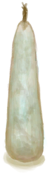

# 茉莉蜡烛  
> 一个便携光源。气味非常非常香。  
  
<table class="table table-bordered" data-toggle="table"  data-show-header="false"><thead style="display:none"><tr ><th  style="width:50%;text-align:left;vertical-align:top;"  >title</th><th  style="width:50%;text-align:left;vertical-align:top;"  ></th></tr></thead><tr ><td  style="width:50%;text-align:left;vertical-align:top;"  >**重量：**25  **标签：**	[“火源”](tag_FireSource.md)  ** 效果: ** [

[光亮](Light.md)](Light.md)<b>+20</b> [

[舒适度](Comfort.md)](Comfort.md)<b>+75</b> [

[不适](Discomfort.md)](Discomfort.md)<b>-500</b> [

[压力](Stress.md)](Stress.md)加成<b>-0.5</b> [

[情绪](Morale.md)](Morale.md)加成<b>+0.5</b></td><td  style="width:50%;text-align:left;vertical-align:top;"  >

<a href="CandleJasmineOn.md" style="color:black">茉莉蜡烛</a>

芳香蜡烛，可以用来增加一个地区的舒适度。它们美妙的香气有助于遮盖难闻的气味、减轻压力，提升情绪。  要制作它们，你需要研磨茉莉花，将它们与油混合并煮沸。然后配合脂肪或蜡通过对应的蓝图制作蜡烛。</td></tr></tbody></table>  
  
## 获取来源  

** 使用**[“火源”](tag_FireSource.md)点燃

[茉莉蜡烛(关)](CandleJasmineOff.md)

  
  
## 动作  

<table><tr><td rowspan="2" style="width:200px;text-align:center;font-size:1.3em;font-weight:bold">

熄灭

</td><td></td></tr><tr><td><b>自身：</b>→ [

[茉莉蜡烛(关)](CandleJasmineOff.md)](CandleJasmineOff.md)</td></tr></table>
  
  
  
## 可拖至  

[羽毛](Feathers.md)

[纤维](Fibers.md)

[枯叶](LeavesDry.md)

[鸟巢](Nest.md)

[纸](Papers.md)

[熏蜂器(关)](BeeSmokerOff.md)

[香茅蜡烛(关)](CandleCitronellaOff.md)

[茉莉蜡烛(关)](CandleJasmineOff.md)

[蜡烛(关)](CandleOff.md)

[炸药(关)](DynamiteOff.md)

[火把(关)](TorchOff.md)

[木屑](WoodShavings.md)

[过路的船只](PassingShip.md)

  
  
## 属性   

<table style="margin-bottom:0px;"><tr><td style="width:30%;text-align:left; background-color:#FEFEFE;font-size:1.3em;font-weight:bold;">燃料</td><td style="font-size:1em;background-color:#FEFEFE">初始：40 , 最大：40 每15分钟-1 , 最多需要：10小时</td></tr><tr style="background-color:#FFFFFF"><td colspan=2>** 到达0时： ** 自身: →消失</td></tr></table>
  

