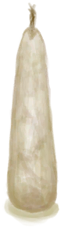
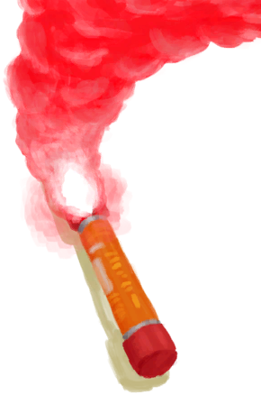
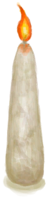
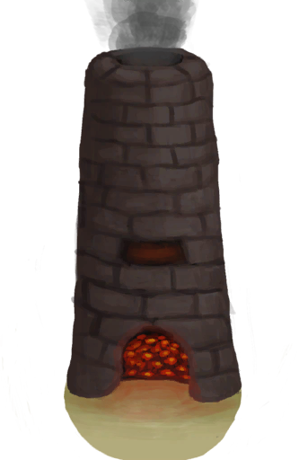

# 蜡烛  
> 一个便携光源。  
  
<table class="table table-bordered" data-toggle="table"  data-show-header="false"><thead style="display:none"><tr ><th  style="width:50%;text-align:left;vertical-align:top;"  >title</th><th  style="width:50%;text-align:left;vertical-align:top;"  ></th></tr></thead><tr ><td  style="width:50%;text-align:left;vertical-align:top;"  >**重量：**25</td><td  style="width:50%;text-align:left;vertical-align:top;"  >

<a href="CandleOff.md" style="color:black">蜡烛</a>

蜡烛是非常有效且持久的光源。它可以由油脂或者蜂蜡制成。 它们体积小并且持续时间长，便于随身携带以防你在晚上被困在丛林里。  更高级的香薰蜡烛也可以用一些特殊的油来制作。这些香薰蜡烛可以帮助你驱虫和放松心情。</td></tr></tbody></table>  
  
## 获取来源  

蓝图制造

[蜡烛(蓝图)](Bp_Candles.md)

熄灭

[蜡烛(开)](CandleOn.md)

  
  
## 可拖入  

<table style="margin-bottom:0px;"><tr><td style="width:40%;text-align:left; background-color:#FEFEFE"><b>拖入：</b>[

[火种](TinderLit.md)](TinderLit.md) | [

[火堆](Fire.md)](Fire.md) | [

[营火](Campfire.md)](Campfire.md) | [

[火炉](Stove.md)](Stove.md) | [

[烟熏炉](Smoker.md)](Smoker.md) | [

[瓦斯炉(开)](GasCookerOn.md)](GasCookerOn.md) | [

[燃烧的信号弹(开)](FlareHandOn.md)](FlareHandOn.md) | [

[蜡烛(开)](CandleOn.md)](CandleOn.md) | [

[窑炉](Kiln.md)](Kiln.md) | [

[高级窑炉](KilnAdvanced.md)](KilnAdvanced.md) | [

[熔炉](Forge.md)](Forge.md) | [

[蜡烛(开)](CandleOn.md)](CandleOn.md) | [

[茉莉蜡烛(开)](CandleJasmineOn.md)](CandleJasmineOn.md) | [

[香茅蜡烛(开)](CandleCitronellaOn.md)](CandleCitronellaOn.md)</td><td style="width:40%;font-size:1em;font-weight:bold;background-color:#FEFEFE">点燃  </td></tr><tr style="background-color:#FFFFFF"><td style=""><b>使用物：</b></td><td style=""><b>自身：</b>→ [

[蜡烛(开)](CandleOn.md)](CandleOn.md)</td></tr></table>
  
  
## 属性   

<table style="margin-bottom:0px;"><tr><td style="width:30%;text-align:left; background-color:#FEFEFE;font-size:1.3em;font-weight:bold;">燃料</td><td style="font-size:1em;background-color:#FEFEFE">初始：40 , 最大：40 -</td></tr><tr style="background-color:#FFFFFF"><td colspan=2>** 到达0时： ** 自身: →消失</td></tr></table>
  

