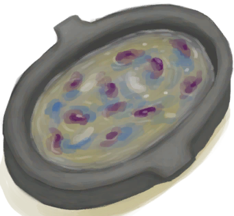
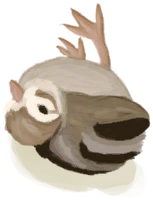

# “食用肉类动作(组)”  

食用 [

[蝙蝠尸体](Bat.md)](Bat.md)

食用 [

[烤蝙蝠](BatCooked.md)](BatCooked.md)

食用 [

[鸟肉](BirdMeat.md)](BirdMeat.md)

食用 [

[烤鸟肉](BirdMeatCooked.md)](BirdMeatCooked.md)

食用 [

[烟熏鸟肉](BirdMeatSmoked.md)](BirdMeatSmoked.md)

食用 [

[野猪肉](BoarMeat.md)](BoarMeat.md)

食用 [

[烤野猪肉](BoarMeatCooked.md)](BoarMeatCooked.md)

食用 [

[野猪肉干](BoarMeatDried.md)](BoarMeatDried.md)

食用 [

[腌野猪肉](BoarMeatSalted.md)](BoarMeatSalted.md)

食用 [

[腌制中的野猪肉](BoarMeatSaltedDrying.md)](BoarMeatSaltedDrying.md)

食用 [

[烟熏野猪肉](BoarMeatSmoked.md)](BoarMeatSmoked.md)

食用 [

[烤北梭鱼](BonefishCooked.md)](BonefishCooked.md)

食用 [

[北梭鱼肉](BonefishMeat.md)](BonefishMeat.md)

食用 [

[烟熏北梭鱼](BonefishSmoked.md)](BonefishSmoked.md)

食用 [

[虫子](Bugs.md)](Bugs.md)

食用 [

[黄油](Butter.md)](Butter.md)

食用 [

[鸡肉三明治](ChickenSandwich.md)](ChickenSandwich.md)

食用 [

[海螺肉](ConchMeat.md)](ConchMeat.md)

食用 [

[烤海螺肉](ConchMeatCooked.md)](ConchMeatCooked.md)

食用 [

[松软的海螺肉](ConchMeatSoft.md)](ConchMeatSoft.md)

食用 [

[松软的烤海螺肉](ConchMeatSoftCooked.md)](ConchMeatSoftCooked.md)

饮用 [

[骨头汤](BoneBroth.md)](BoneBroth.md)

食用 [

[椰子鱼](CoconutFish.md)](CoconutFish.md)

食用 [

[醉蟹](DrunkenCrab.md)](DrunkenCrab.md)

食用 [

[炸鱼薯条](FishNChips.md)](FishNChips.md)

食用 [

[鱼肉蛋饼](FishOmelette.md)](FishOmelette.md)

食用 [

[炖羊汤](GoatStew.md)](GoatStew.md)

食用 [

[肉食盛宴](HeartyFeast.md)](HeartyFeast.md)

食用 [

[蜜汁火腿](HoneyGlazedPork.md)](HoneyGlazedPork.md)

食用 [

[热带烤鸡](IslandChicken.md)](IslandChicken.md)

食用 [

[辣炒巨蜥肉](LizardFry.md)](LizardFry.md)

食用 [

[猕猴肉串](MacaqueSkewers.md)](MacaqueSkewers.md)

食用 [

[海鲜杂烩](SeafoodCup.md)](SeafoodCup.md)

食用 [

[螃蟹](Crab.md)](Crab.md)

食用 [

[烤螃蟹](CrabCooked.md)](CrabCooked.md)

食用 [

[蛋](Egg.md)](Egg.md)

食用 [

[水煮蛋](EggBoiled.md)](EggBoiled.md)

食用 [

[烤蛋](EggCooked.md)](EggCooked.md)

食用 [

[受精蛋](EggPartridgeFertilized.md)](EggPartridgeFertilized.md)

食用 [

[脂肪](Fat.md)](Fat.md)

食用 [

[鱼干](FishDried.md)](FishDried.md)

食用 [

[咸鱼](FishSalted.md)](FishSalted.md)

食用 [

[腌制中的咸鱼](FishSaltedDrying.md)](FishSaltedDrying.md)

食用 [

[鱼杂](FishScraps.md)](FishScraps.md)

食用 [

[烤鱼杂](FishScrapsCooked.md)](FishScrapsCooked.md)

食用 [

[鱼片](FishSlices.md)](FishSlices.md)

食用 [

[烤鱼片](FishSlicesCooked.md)](FishSlicesCooked.md)

食用 [

[鱼肉塔可](FishTaco.md)](FishTaco.md)

食用 [

[羊肉](GoatMeat.md)](GoatMeat.md)

食用 [

[烤羊肉](GoatMeatCooked.md)](GoatMeatCooked.md)

食用 [

[羊肉干](GoatMeatDried.md)](GoatMeatDried.md)

食用 [

[腌羊肉](GoatMeatSalted.md)](GoatMeatSalted.md)

食用 [

[腌制中的羊肉](GoatMeatSaltedDrying.md)](GoatMeatSaltedDrying.md)

食用 [

[烟熏羊肉](GoatMeatSmoked.md)](GoatMeatSmoked.md)

食用 [

[绯鲤](Goatfish.md)](Goatfish.md)

食用 [

[烤绯鲤](GoatfishCooked.md)](GoatfishCooked.md)

食用 [

[烟熏绯鲤](GoatfishSmoked.md)](GoatfishSmoked.md)

食用 [

[石斑鱼肉](GrouperMeat.md)](GrouperMeat.md)

食用 [

[烤石斑鱼](GrouperMeatCooked.md)](GrouperMeatCooked.md)

食用 [

[烟熏石斑鱼](GrouperMeatSmoked.md)](GrouperMeatSmoked.md)

食用 [

[鲱鱼](Herring.md)](Herring.md)

食用 [

[烤鲱鱼](HerringCooked.md)](HerringCooked.md)

食用 [

[烟熏鲱鱼](HerringSmoked.md)](HerringSmoked.md)

食用 [

[蜥蜴](Lizard.md)](Lizard.md)

食用 [

[烤蜥蜴](LizardCooked.md)](LizardCooked.md)

食用 [

[猕猴肉](MacaqueMeat.md)](MacaqueMeat.md)

食用 [

[烤猕猴肉](MacaqueMeatCooked.md)](MacaqueMeatCooked.md)

食用 [

[猕猴肉干](MacaqueMeatDried.md)](MacaqueMeatDried.md)

食用 [

[腌猕猴肉](MacaqueMeatSalted.md)](MacaqueMeatSalted.md)

食用 [

[腌制中的猕猴肉](MacaqueMeatSaltedDrying.md)](MacaqueMeatSaltedDrying.md)

食用 [

[烟熏猕猴肉](MacaqueMeatSmoked.md)](MacaqueMeatSmoked.md)

食用 [

[腌肉](MeatSaltedDried.md)](MeatSaltedDried.md)

食用 [

[腌制中的肉](MeatSaltedDrying.md)](MeatSaltedDrying.md)

食用 [

[巨蜥肉](MonitorMeat.md)](MonitorMeat.md)

食用 [

[烤巨蜥肉](MonitorMeatCooked.md)](MonitorMeatCooked.md)

食用 [

[巨蜥肉干](MonitorMeatDried.md)](MonitorMeatDried.md)

食用 [

[腌巨蜥肉](MonitorMeatSalted.md)](MonitorMeatSalted.md)

食用 [

[腌制中的巨蜥肉](MonitorMeatSaltedDrying.md)](MonitorMeatSaltedDrying.md)

食用 [

[烟熏巨蜥肉](MonitorMeatSmoked.md)](MonitorMeatSmoked.md)

食用 [

[老鼠尸体](Mouse.md)](Mouse.md)

食用 [

[烤老鼠](MouseCooked.md)](MouseCooked.md)

食用 [

[剥皮的老鼠](MouseSkinned.md)](MouseSkinned.md)

食用 [

[弹涂鱼](Mudskipper.md)](Mudskipper.md)

食用 [

[烤弹涂鱼](MudskipperCooked.md)](MudskipperCooked.md)

食用 [

[牡蛎肉](OysterMeat.md)](OysterMeat.md)

食用 [

[黄油焗牡蛎](OysterMeatBaked.md)](OysterMeatBaked.md)

食用 [

[烤牡蛎肉](OysterMeatCooked.md)](OysterMeatCooked.md)

食用 [

[鹦哥鱼](ParrotFish.md)](ParrotFish.md)

食用 [

[烤鹦哥鱼](ParrotFishCooked.md)](ParrotFishCooked.md)

食用 [

[烟熏鹦哥鱼](ParrotFishSmoked.md)](ParrotFishSmoked.md)

食用 [

[小灰山鹑尸体](PartridgeChickDead.md)](PartridgeChickDead.md)

食用 [

[虾](Prawns.md)](Prawns.md)

食用 [

[烤虾](PrawnsCooked.md)](PrawnsCooked.md)

食用 [

[烤海怪肉](SeahoundCooked.md)](SeahoundCooked.md)

食用 [

[海怪肉](Seahoundmeat.md)](Seahoundmeat.md)

食用 [

[烤鲨鱼肉](SharkCooked.md)](SharkCooked.md)

食用 [

[鲨鱼肉](SharkMeat.md)](SharkMeat.md)

食用 [

[烟熏鲨鱼肉](SharkSmoked.md)](SharkSmoked.md)

食用 [

[烤蛇肉](SnakeCooked.md)](SnakeCooked.md)

食用 [

[剥皮的蛇](SnakeSkinned.md)](SnakeSkinned.md)

食用 [

[烤马鲅鱼](ThreadfinCooked.md)](ThreadfinCooked.md)

食用 [

[马鲅鱼肉](ThreadfinMeat.md)](ThreadfinMeat.md)

食用 [

[烟熏马鲅鱼](ThreadfinSmoked.md)](ThreadfinSmoked.md)

食用 [

[海胆肉](UrchinMeat.md)](UrchinMeat.md)

食用 [

[烤海胆](UrchinMeatCooked.md)](UrchinMeatCooked.md)

  
  

