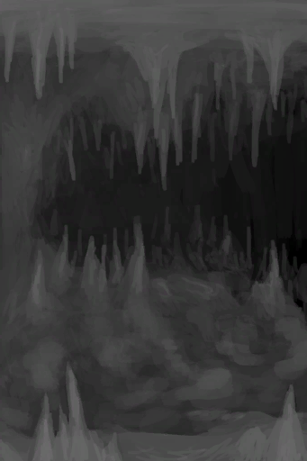

# 干涸的洞穴水潭  
> 得等它重新蓄水。  
  
  干涸的洞穴水潭  |   图片   
 ----  |  ----:   
 **环境：**[潮湿洞穴(环境)](Env_DampChamber.md)  **标签：**	[“脏容器（敞口）”](tag_ContainerDirty.md)  **储水量：**2400  |     
  
## 被动效果  
名称  |  条件  |  变化(每15分钟)  |  玩家状态  
----  |  ----  |  ----  |  ----  
Fill  |    |  [不安全的水](LQ_WaterUnsafe.md)+4 含水量+2  |    
