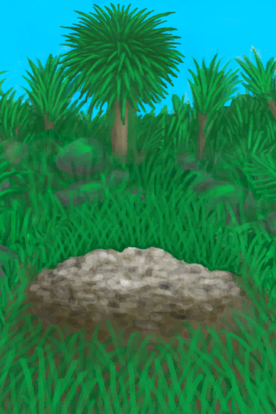

# 粪池  
> 我应该用铲子把它清理掉。  
  
<table class="table table-bordered" data-toggle="table"  data-show-header="false"><thead style="display:none"><tr ><th  style="width:50%;text-align:left;vertical-align:top;"  >title</th><th  style="width:50%;text-align:left;vertical-align:top;"  ></th></tr></thead><tr ><td  style="width:50%;text-align:left;vertical-align:top;"  >** 不可堆叠 **  ** 效果: ** [

[不适](Discomfort.md)](Discomfort.md)<b>+750</b></td><td  style="width:50%;text-align:left;vertical-align:top;"  >

<a href="Cesspool.md" style="color:black">粪池</a>

粪池是硝石矿床凝结硝石晶体后剩下的部分。臭气熏天，靠近它就会感觉非常不舒服。  需要用<b>铲子</b>才能清理。</td></tr></tbody></table>  
  
## 获取来源  

转化

[硝石矿床](NiterBed.md)

  
  
## 可拖入  

<table style="margin-bottom:0px;"><tr><td style="width:40%;text-align:left; background-color:#FEFEFE"><b>拖入：</b>[“铲子”](tag_Shovel.md)</td><td style="width:40%;font-size:1em;font-weight:bold;background-color:#FEFEFE">清理 (1小时) </td></tr><tr style="background-color:#FFFFFF"><td style=""><b>使用物：</b></td><td style=""><b>自身：</b>→消失</td></tr><tr><td colspan="2"><b>状态变化：</b>[

[污垢](Filth.md)](Filth.md)<b>+50</b></td></tr></table>
  
  

