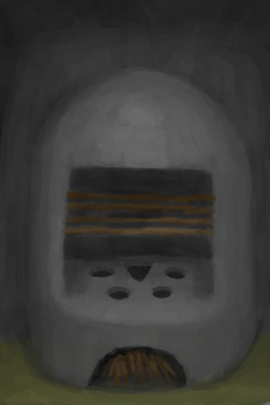

# 木炭  
> 直接吃可以止泻。碾碎它能得到灰烬。  
   
> 木炭可以用作燃料，也可以食用以治疗<b>腹泻</b>。 它也可以被粉碎成<b>灰烬</b>，用于多种制作配方。  一旦木炭计量达到100%，就可以从<b>营火</b>中提取木炭。也可以通过在<b>窑炉</b>中燃烧<b>木材</b>来生产。  
  
<table class="table table-bordered"><tbody><tr ><td  style="width:80%;text-align:left;vertical-align:top;" >**重量：**50</td><td  style="width:20%;text-align:left;vertical-align:top;" >

</td></tr></tbody></tbody></table>  
  
## 获取来源  
<table class="table table-bordered"><thead><tr ><th  style="text-align:left;vertical-align:top;" >来源</th><th  style="text-align:left;vertical-align:top;" >操作</th></tr></thead><tr ><td  style="text-align:left;vertical-align:top;" >[

[蒸馏器(关)](AlembicOff.md)](AlembicOff.md)</td><td  style="text-align:left;vertical-align:top;" >取出木炭和灰烬</td></tr><tr ><td  style="text-align:left;vertical-align:top;" >[

[营火(熄灭)](CampfireExtinguished.md)](CampfireExtinguished.md)</td><td  style="text-align:left;vertical-align:top;" >取出木炭和灰烬</td></tr><tr ><td  style="text-align:left;vertical-align:top;" >[

[粘土火盆(熄灭)](ClayFirePitExtinguished.md)](ClayFirePitExtinguished.md)</td><td  style="text-align:left;vertical-align:top;" >取出木炭和灰烬</td></tr><tr ><td  style="text-align:left;vertical-align:top;" >[

[火堆(熄灭)](FireExtinguished.md)](FireExtinguished.md)</td><td  style="text-align:left;vertical-align:top;" >取出木炭和灰烬</td></tr><tr ><td  style="text-align:left;vertical-align:top;" >[

[熔炉](Forge.md)](Forge.md)</td><td  style="text-align:left;vertical-align:top;" >转化</td></tr><tr ><td  style="text-align:left;vertical-align:top;" >[

[木材](Wood.md)](Wood.md) , [

[窑炉](Kiln.md)](Kiln.md)</td><td  style="text-align:left;vertical-align:top;" >制作木炭</td></tr><tr ><td  style="text-align:left;vertical-align:top;" >[

[窑炉](Kiln.md)](Kiln.md)</td><td  style="text-align:left;vertical-align:top;" >转化</td></tr><tr ><td  style="text-align:left;vertical-align:top;" >[

[木材](Wood.md)](Wood.md) , [

[高级窑炉](KilnAdvanced.md)](KilnAdvanced.md)</td><td  style="text-align:left;vertical-align:top;" >制作木炭</td></tr><tr ><td  style="text-align:left;vertical-align:top;" >[

[高级窑炉](KilnAdvanced.md)](KilnAdvanced.md)</td><td  style="text-align:left;vertical-align:top;" >转化</td></tr><tr ><td  style="text-align:left;vertical-align:top;" >[

[火炉(熄灭)](StoveExtinguished.md)](StoveExtinguished.md)</td><td  style="text-align:left;vertical-align:top;" >取出木炭和灰烬</td></tr><tr ><td  style="text-align:left;vertical-align:top;" >[

[烟熏炉](Smoker.md)](Smoker.md)</td><td  style="text-align:left;vertical-align:top;" >转化</td></tr><tr ><td  style="text-align:left;vertical-align:top;" >[

[补给胶囊](TV_SupplyCapsule.md)](TV_SupplyCapsule.md)</td><td  style="text-align:left;vertical-align:top;" >打开</td></tr><tr ><td  style="text-align:left;vertical-align:top;" >[

[火炭](Embers.md)](Embers.md)</td><td  style="text-align:left;vertical-align:top;" >转化</td></tr></tbody></table>  
  
## 动作  
<table class="table table-bordered"><thead><tr ><th  style="text-align:left;vertical-align:top;" >动作</th><th  style="text-align:left;vertical-align:top;" >耗时</th><th  style="text-align:left;vertical-align:top;" >条件</th><th  style="text-align:left;vertical-align:top;" >变化</th><th  style="text-align:left;vertical-align:top;" >状态</th></tr></thead><tr ><td  style="text-align:left;vertical-align:top;" >食用 </td><td  style="text-align:left;vertical-align:top;" >15分</td><td  style="text-align:left;vertical-align:top;" ></td><td  style="text-align:left;vertical-align:top;" >** 自身：** →消失</td><td  style="text-align:left;vertical-align:top;" >[

[情绪](Morale.md)](Morale.md)-10 [

[腹泻](Diarrhoea.md)](Diarrhoea.md)-50 [

[水分](Hydration.md)](Hydration.md)-15</td></tr></tbody></table>  
  
## 可拖入  
<table class="table table-bordered"><thead><tr ><th  style="text-align:left;vertical-align:top;" >使用</th><th  style="text-align:left;vertical-align:top;" >动作</th><th  style="text-align:left;vertical-align:top;" >耗时</th><th  style="text-align:left;vertical-align:top;" >条件</th><th  style="text-align:left;vertical-align:top;" >变化</th><th  style="text-align:left;vertical-align:top;" >玩家状态</th></tr></thead><tr ><td  style="text-align:left;vertical-align:top;" >[“锤”](tag_Hammer.md)</td><td  style="text-align:left;vertical-align:top;" >碾碎 [手部动作(组)](HandAction.md)</td><td  style="text-align:left;vertical-align:top;" >30分</td><td  style="text-align:left;vertical-align:top;" >[

[光亮](Light.md)](Light.md): 10-100</td><td  style="text-align:left;vertical-align:top;" >** 自身: ** →消失  ** 获得: **   [

[灰烬](Ash.md)](Ash.md)(+2) </td><td  style="text-align:left;vertical-align:top;" ></td></tr></tbody></table>  
  
## 可拖至  

[蒸馏器(关)](AlembicOff.md)

[蒸馏器(开)](AlembicOn.md)

[营火](Campfire.md)

[营火(熄灭)](CampfireExtinguished.md)

[粘土火盆](ClayFirePit.md)

[粘土火盆(熄灭)](ClayFirePitExtinguished.md)

[火堆](Fire.md)

[火堆(熄灭)](FireExtinguished.md)

[熔炉](Forge.md)

[熔炉(熄灭)](ForgeExtinguished.md)

[窑炉](Kiln.md)

[高级窑炉](KilnAdvanced.md)

[高级窑炉(熄灭)](KilnAdvancedExtinguished.md)

[窑炉(熄灭)](KilnExtinguished.md)

[火炉](Stove.md)

[火炉(熄灭)](StoveExtinguished.md)

[烟熏炉](Smoker.md)

[烟熏炉(熄灭)](SmokerExtinguished.md)

[烟熏炉(塑料布)(熄灭)](SmokerExtinguishedPlastic.md)

[烟熏炉(塑料布)(点燃)](SmokerPlastic.md)

[防毒面具](GasMaskRustic.md)

  
  
## 可用于蓝图  

[

[滤水器(蓝图)](Bp_WaterFilter.md)](Bp_WaterFilter.md)

[

[防毒面具(蓝图)](Bp_GasMask.md)](Bp_GasMask.md)

  
  
  

