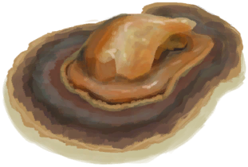
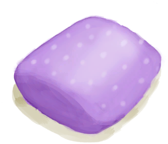

# 烧焦物  
> 这坨面目全非的烧焦物恐怕不宜食用。  
  
<table class="table table-bordered" data-toggle="table"  data-show-header="false"><thead style="display:none"><tr ><th  style="width:50%;text-align:left;vertical-align:top;"  >title</th><th  style="width:50%;text-align:left;vertical-align:top;"  ></th></tr></thead><tr ><td  style="width:50%;text-align:left;vertical-align:top;"  >**重量：**50  **标签：**	[“可烹饪的”](tag_Cookable.md)</td><td  style="width:50%;text-align:left;vertical-align:top;"  >

<a href="CharredRemains.md" style="color:black">烧焦物</a>

</td></tr></tbody></table>  
  
## 获取来源  
<table class="table table-bordered" data-toggle="table"  ><thead style=""><tr ><th  style="text-align:left;vertical-align:top;"  >来源</th><th  style="text-align:left;vertical-align:top;"  >操作</th></tr></thead><tr ><td  style="text-align:left;vertical-align:top;"  >[

[烤蝙蝠](BatCooked.md)](BatCooked.md) , [

[烤鸟肉](BirdMeatCooked.md)](BirdMeatCooked.md) , [

[烤野猪肉](BoarMeatCooked.md)](BoarMeatCooked.md) , [

[烤北梭鱼](BonefishCooked.md)](BonefishCooked.md) , [

[烤椰肉](CoconutMeatCooked.md)](CoconutMeatCooked.md) , [

[烤海螺肉](ConchMeatCooked.md)](ConchMeatCooked.md) , [

[松软的烤海螺肉](ConchMeatSoftCooked.md)](ConchMeatSoftCooked.md) , [

[烤螃蟹](CrabCooked.md)](CrabCooked.md) , [

[水煮蛋](EggBoiled.md)](EggBoiled.md) , [

[烤蛋](EggCooked.md)](EggCooked.md) , [

[烤鱼杂](FishScrapsCooked.md)](FishScrapsCooked.md) , [

[烤鱼片](FishSlicesCooked.md)](FishSlicesCooked.md) , [

[烤绯鲤](GoatfishCooked.md)](GoatfishCooked.md) , [

[烤羊肉](GoatMeatCooked.md)](GoatMeatCooked.md) , [

[烤石斑鱼](GrouperMeatCooked.md)](GrouperMeatCooked.md) , [

[烤鲱鱼](HerringCooked.md)](HerringCooked.md) , [

[烤蜥蜴](LizardCooked.md)](LizardCooked.md) , [

[烤猕猴肉](MacaqueMeatCooked.md)](MacaqueMeatCooked.md) , [

[烤巨蜥肉](MonitorMeatCooked.md)](MonitorMeatCooked.md) , [

[烤老鼠](MouseCooked.md)](MouseCooked.md) , [

[烤弹涂鱼](MudskipperCooked.md)](MudskipperCooked.md) , [

[烤牡蛎肉](OysterMeatCooked.md)](OysterMeatCooked.md) , [

[烤鹦哥鱼](ParrotFishCooked.md)](ParrotFishCooked.md) , [

[烤虾](PrawnsCooked.md)](PrawnsCooked.md) , [

[西米饼](SagoFlatbread.md)](SagoFlatbread.md) , [

[烤海怪肉](SeahoundCooked.md)](SeahoundCooked.md) , [

[烤鲨鱼肉](SharkCooked.md)](SharkCooked.md) , [

[烤蛇肉](SnakeCooked.md)](SnakeCooked.md) , [

[烤马鲅鱼](ThreadfinCooked.md)](ThreadfinCooked.md) , [

[烤热带杏仁](TropicalAlmondsRoasted.md)](TropicalAlmondsRoasted.md) , [

[烤海胆](UrchinMeatCooked.md)](UrchinMeatCooked.md) , [

[营火](Campfire.md)](Campfire.md)</td><td  style="text-align:left;vertical-align:top;"  >烧焦物</td></tr><tr ><td  style="text-align:left;vertical-align:top;"  >[

[烤蝙蝠](BatCooked.md)](BatCooked.md) , [

[烤鸟肉](BirdMeatCooked.md)](BirdMeatCooked.md) , [

[烤野猪肉](BoarMeatCooked.md)](BoarMeatCooked.md) , [

[烤北梭鱼](BonefishCooked.md)](BonefishCooked.md) , [

[烤椰肉](CoconutMeatCooked.md)](CoconutMeatCooked.md) , [

[烤海螺肉](ConchMeatCooked.md)](ConchMeatCooked.md) , [

[松软的烤海螺肉](ConchMeatSoftCooked.md)](ConchMeatSoftCooked.md) , [

[烤螃蟹](CrabCooked.md)](CrabCooked.md) , [

[水煮蛋](EggBoiled.md)](EggBoiled.md) , [

[烤蛋](EggCooked.md)](EggCooked.md) , [

[烤鱼杂](FishScrapsCooked.md)](FishScrapsCooked.md) , [

[烤鱼片](FishSlicesCooked.md)](FishSlicesCooked.md) , [

[烤绯鲤](GoatfishCooked.md)](GoatfishCooked.md) , [

[烤羊肉](GoatMeatCooked.md)](GoatMeatCooked.md) , [

[烤石斑鱼](GrouperMeatCooked.md)](GrouperMeatCooked.md) , [

[烤鲱鱼](HerringCooked.md)](HerringCooked.md) , [

[烤蜥蜴](LizardCooked.md)](LizardCooked.md) , [

[烤猕猴肉](MacaqueMeatCooked.md)](MacaqueMeatCooked.md) , [

[烤巨蜥肉](MonitorMeatCooked.md)](MonitorMeatCooked.md) , [

[烤老鼠](MouseCooked.md)](MouseCooked.md) , [

[烤弹涂鱼](MudskipperCooked.md)](MudskipperCooked.md) , [

[烤牡蛎肉](OysterMeatCooked.md)](OysterMeatCooked.md) , [

[烤鹦哥鱼](ParrotFishCooked.md)](ParrotFishCooked.md) , [

[烤虾](PrawnsCooked.md)](PrawnsCooked.md) , [

[西米饼](SagoFlatbread.md)](SagoFlatbread.md) , [

[烤海怪肉](SeahoundCooked.md)](SeahoundCooked.md) , [

[烤鲨鱼肉](SharkCooked.md)](SharkCooked.md) , [

[烤蛇肉](SnakeCooked.md)](SnakeCooked.md) , [

[烤马鲅鱼](ThreadfinCooked.md)](ThreadfinCooked.md) , [

[烤热带杏仁](TropicalAlmondsRoasted.md)](TropicalAlmondsRoasted.md) , [

[烤海胆](UrchinMeatCooked.md)](UrchinMeatCooked.md) , [

[粘土火盆](ClayFirePit.md)](ClayFirePit.md)</td><td  style="text-align:left;vertical-align:top;"  >烧焦物</td></tr><tr ><td  style="text-align:left;vertical-align:top;"  >[

[烤蝙蝠](BatCooked.md)](BatCooked.md) , [

[烤鸟肉](BirdMeatCooked.md)](BirdMeatCooked.md) , [

[烤野猪肉](BoarMeatCooked.md)](BoarMeatCooked.md) , [

[烤北梭鱼](BonefishCooked.md)](BonefishCooked.md) , [

[烤椰肉](CoconutMeatCooked.md)](CoconutMeatCooked.md) , [

[烤海螺肉](ConchMeatCooked.md)](ConchMeatCooked.md) , [

[松软的烤海螺肉](ConchMeatSoftCooked.md)](ConchMeatSoftCooked.md) , [

[烤螃蟹](CrabCooked.md)](CrabCooked.md) , [

[水煮蛋](EggBoiled.md)](EggBoiled.md) , [

[烤蛋](EggCooked.md)](EggCooked.md) , [

[烤鱼杂](FishScrapsCooked.md)](FishScrapsCooked.md) , [

[烤鱼片](FishSlicesCooked.md)](FishSlicesCooked.md) , [

[烤绯鲤](GoatfishCooked.md)](GoatfishCooked.md) , [

[烤羊肉](GoatMeatCooked.md)](GoatMeatCooked.md) , [

[烤石斑鱼](GrouperMeatCooked.md)](GrouperMeatCooked.md) , [

[烤蜥蜴](LizardCooked.md)](LizardCooked.md) , [

[烤猕猴肉](MacaqueMeatCooked.md)](MacaqueMeatCooked.md) , [

[烤老鼠](MouseCooked.md)](MouseCooked.md) , [

[烤弹涂鱼](MudskipperCooked.md)](MudskipperCooked.md) , [

[烤牡蛎肉](OysterMeatCooked.md)](OysterMeatCooked.md) , [

[烤鹦哥鱼](ParrotFishCooked.md)](ParrotFishCooked.md) , [

[烤虾](PrawnsCooked.md)](PrawnsCooked.md) , [

[西米饼](SagoFlatbread.md)](SagoFlatbread.md) , [

[西米饼](SagoFlatbread.md)](SagoFlatbread.md) , [

[烤鲨鱼肉](SharkCooked.md)](SharkCooked.md) , [

[烤蛇肉](SnakeCooked.md)](SnakeCooked.md) , [

[烤马鲅鱼](ThreadfinCooked.md)](ThreadfinCooked.md) , [

[烤热带杏仁](TropicalAlmondsRoasted.md)](TropicalAlmondsRoasted.md) , [

[烤海胆](UrchinMeatCooked.md)](UrchinMeatCooked.md) , [

[火堆](Fire.md)](Fire.md)</td><td  style="text-align:left;vertical-align:top;"  >烧焦物</td></tr><tr ><td  style="text-align:left;vertical-align:top;"  >[

[烤蝙蝠](BatCooked.md)](BatCooked.md) , [

[烤鸟肉](BirdMeatCooked.md)](BirdMeatCooked.md) , [

[烤野猪肉](BoarMeatCooked.md)](BoarMeatCooked.md) , [

[烤北梭鱼](BonefishCooked.md)](BonefishCooked.md) , [

[烤椰肉](CoconutMeatCooked.md)](CoconutMeatCooked.md) , [

[烤海螺肉](ConchMeatCooked.md)](ConchMeatCooked.md) , [

[松软的烤海螺肉](ConchMeatSoftCooked.md)](ConchMeatSoftCooked.md) , [

[烤螃蟹](CrabCooked.md)](CrabCooked.md) , [

[水煮蛋](EggBoiled.md)](EggBoiled.md) , [

[烤蛋](EggCooked.md)](EggCooked.md) , [

[烤鱼杂](FishScrapsCooked.md)](FishScrapsCooked.md) , [

[烤鱼片](FishSlicesCooked.md)](FishSlicesCooked.md) , [

[烤绯鲤](GoatfishCooked.md)](GoatfishCooked.md) , [

[烤羊肉](GoatMeatCooked.md)](GoatMeatCooked.md) , [

[烤石斑鱼](GrouperMeatCooked.md)](GrouperMeatCooked.md) , [

[烤鲱鱼](HerringCooked.md)](HerringCooked.md) , [

[烤蜥蜴](LizardCooked.md)](LizardCooked.md) , [

[烤猕猴肉](MacaqueMeatCooked.md)](MacaqueMeatCooked.md) , [

[烤巨蜥肉](MonitorMeatCooked.md)](MonitorMeatCooked.md) , [

[烤老鼠](MouseCooked.md)](MouseCooked.md) , [

[烤弹涂鱼](MudskipperCooked.md)](MudskipperCooked.md) , [

[烤牡蛎肉](OysterMeatCooked.md)](OysterMeatCooked.md) , [

[烤鹦哥鱼](ParrotFishCooked.md)](ParrotFishCooked.md) , [

[烤虾](PrawnsCooked.md)](PrawnsCooked.md) , [

[西米饼](SagoFlatbread.md)](SagoFlatbread.md) , [

[烤海怪肉](SeahoundCooked.md)](SeahoundCooked.md) , [

[烤鲨鱼肉](SharkCooked.md)](SharkCooked.md) , [

[烤蛇肉](SnakeCooked.md)](SnakeCooked.md) , [

[烤马鲅鱼](ThreadfinCooked.md)](ThreadfinCooked.md) , [

[烤热带杏仁](TropicalAlmondsRoasted.md)](TropicalAlmondsRoasted.md) , [

[烤海胆](UrchinMeatCooked.md)](UrchinMeatCooked.md) , [

[瓦斯炉(开)](GasCookerOn.md)](GasCookerOn.md)</td><td  style="text-align:left;vertical-align:top;"  >烧焦物</td></tr><tr ><td  style="text-align:left;vertical-align:top;"  >[

[烤弹涂鱼](MudskipperCooked.md)](MudskipperCooked.md) , [

[烤海螺肉](ConchMeatCooked.md)](ConchMeatCooked.md) , [

[松软的烤海螺肉](ConchMeatSoftCooked.md)](ConchMeatSoftCooked.md) , [

[烤螃蟹](CrabCooked.md)](CrabCooked.md) , [

[烤虾](PrawnsCooked.md)](PrawnsCooked.md) , [

[烤鱼杂](FishScrapsCooked.md)](FishScrapsCooked.md) , [

[烤热带杏仁](TropicalAlmondsRoasted.md)](TropicalAlmondsRoasted.md) , [

[烤蛋](EggCooked.md)](EggCooked.md) , [

[水煮蛋](EggBoiled.md)](EggBoiled.md) , [

[烤海胆](UrchinMeatCooked.md)](UrchinMeatCooked.md) , [

[西米饼](SagoFlatbread.md)](SagoFlatbread.md) , [

[烤椰肉](CoconutMeatCooked.md)](CoconutMeatCooked.md) , [

[烤鱼片](FishSlicesCooked.md)](FishSlicesCooked.md) , [

[烤老鼠](MouseCooked.md)](MouseCooked.md) , [

[烤蝙蝠](BatCooked.md)](BatCooked.md) , [

[烤蜥蜴](LizardCooked.md)](LizardCooked.md) , [

[烤蛇肉](SnakeCooked.md)](SnakeCooked.md) , [

[烤牡蛎肉](OysterMeatCooked.md)](OysterMeatCooked.md) , [

[火炉](Stove.md)](Stove.md)</td><td  style="text-align:left;vertical-align:top;"  >烧焦物</td></tr><tr ><td  style="text-align:left;vertical-align:top;"  >[

[烤海螺肉](ConchMeatCooked.md)](ConchMeatCooked.md) , [

[松软的烤海螺肉](ConchMeatSoftCooked.md)](ConchMeatSoftCooked.md) , [

[烤螃蟹](CrabCooked.md)](CrabCooked.md) , [

[烤热带杏仁](TropicalAlmondsRoasted.md)](TropicalAlmondsRoasted.md) , [

[烤蛋](EggCooked.md)](EggCooked.md) , [

[水煮蛋](EggBoiled.md)](EggBoiled.md) , [

[烟熏炉](Smoker.md)](Smoker.md)</td><td  style="text-align:left;vertical-align:top;"  >烧焦物</td></tr><tr ><td  style="text-align:left;vertical-align:top;"  >[

[烤海螺肉](ConchMeatCooked.md)](ConchMeatCooked.md) , [

[松软的烤海螺肉](ConchMeatSoftCooked.md)](ConchMeatSoftCooked.md) , [

[烤螃蟹](CrabCooked.md)](CrabCooked.md) , [

[烤热带杏仁](TropicalAlmondsRoasted.md)](TropicalAlmondsRoasted.md) , [

[烤蛋](EggCooked.md)](EggCooked.md) , [

[水煮蛋](EggBoiled.md)](EggBoiled.md) , [

[烟熏炉(塑料布)(点燃)](SmokerPlastic.md)](SmokerPlastic.md)</td><td  style="text-align:left;vertical-align:top;"  >烧焦物</td></tr></tbody></table>  
  
## 动作  
<table class="table table-bordered" data-toggle="table"  ><thead style=""><tr ><th  style="text-align:left;vertical-align:top;"  >动作</th><th  style="text-align:left;vertical-align:top;"  >耗时</th><th  style="text-align:left;vertical-align:top;"  data-sortable="true"  >条件</th><th  style="text-align:left;vertical-align:top;"  >变化</th><th  style="text-align:left;vertical-align:top;"  >状态</th></tr></thead><tr ><td  style="text-align:left;vertical-align:top;"  >吃烧焦物 [“进食动作(组)”](EatingAction.md)</td><td  style="text-align:left;vertical-align:top;"  >15分</td><td  style="text-align:left;vertical-align:top;"  ></td><td  style="text-align:left;vertical-align:top;"  >** 自身：** →消失</td><td  style="text-align:left;vertical-align:top;"  >[

[饱食](Satiation.md)](Satiation.md)+10 [

[胃](Stomach.md)](Stomach.md)+1 [

[水分](Hydration.md)](Hydration.md)-5 [

[情绪](Morale.md)](Morale.md)-15 [

[腹泻](Diarrhoea.md)](Diarrhoea.md)-7</td></tr><tr ><td  style="text-align:left;vertical-align:top;"  >丢弃 </td><td  style="text-align:left;vertical-align:top;"  >-</td><td  style="text-align:left;vertical-align:top;"  ></td><td  style="text-align:left;vertical-align:top;"  >** 自身：** →消失</td><td  style="text-align:left;vertical-align:top;"  ></td></tr></tbody></table>  
  
## 属性   
<table class="table table-bordered" data-toggle="table"  ><thead style=""><tr ><th  style="text-align:left;vertical-align:top;"  >属性</th><th  style="text-align:left;vertical-align:top;"  >值</th><th  style="text-align:left;vertical-align:top;"  >耗时</th><th  style="text-align:left;vertical-align:top;"  >变化</th></tr></thead><tr ><td  style="text-align:left;vertical-align:top;"  >耐久</td><td  style="text-align:left;vertical-align:top;"  >初始：192</td><td  style="text-align:left;vertical-align:top;"  >每15分钟-1 最多需要：2天</td><td  style="text-align:left;vertical-align:top;"  >** 到达0时： **  ** 自身 ** →消失</td></tr></tbody></table>  
  

