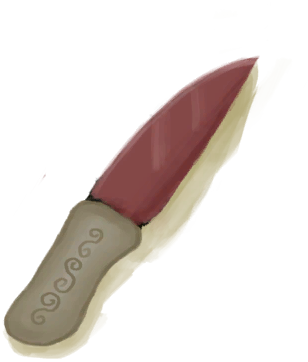

# 储物箱  
> 一个大型储物箱。  
   
> 一个大型储物箱，由<b>长木棍、细线和棕榈编织片</b>搭建而成。  虽然它太重了没法到处搬动，但它可以存放大量的东西，进而保持你的基地整洁。  
  
<table class="table table-bordered" data-toggle="table" ><tbody><tr ><td  style="width:80%;text-align:left;vertical-align:top;"  >** 可重命名 **  ** 不可堆叠 **  **标签：**	[“袋子”](tag_Bag.md), [“沉重的”](tag_Heavy.md), [“大的”](tag_Large.md)  **槽位：**20  **初始卡牌：**[

[陶碗](ClayBowl.md)](ClayBowl.md) , [

[陶碗](ClayBowl.md)](ClayBowl.md) , [

[陶碗](ClayBowl.md)](ClayBowl.md) , [

[陶罐](ClayVase.md)](ClayVase.md) , [

[手钻](HandDrill.md)](HandDrill.md) , [

[祖父的钝刀](KnifeGrandpaBlunt.md)](KnifeGrandpaBlunt.md) , [

[T恤](T-Shirt.md)](T-Shirt.md) , [

[塑料瓶](PlasticBottle.md)](PlasticBottle.md) , [

[扫帚](Broom.md)](Broom.md)  **过滤器：**~~[“袋子”](tag_Bag.md)~~ , ~~[“火源”](tag_FireSource.md)~~ , ~~[“火”](tag_Fire.md)~~ , ~~[“可泼溅的”](tag_Spillable.md)~~  **容量：**4000  **减重量：**-4000</td><td  style="width:20%;text-align:left;vertical-align:top;"  >

</td></tr></tbody></tbody></table>  
  

