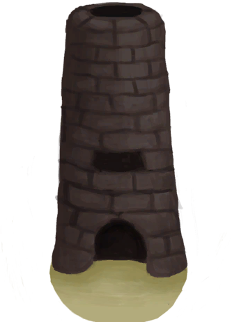
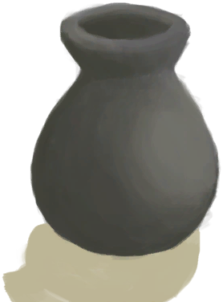

# 粘土  
> 一块粘土。  
   
> 粘土可以通过粉碎<b>干土</b>然后添加<b>水</b>，或单纯搅拌<b>泥</b>制成。  它是一种极其有用的材料，可用于制作多种<b>液体容器</b>和建筑。  
  
<table class="table table-bordered"><tbody><tr ><td  style="width:80%;text-align:left;vertical-align:top;" >**重量：**150  **标签：**	[“沉重的”](tag_Heavy.md)</td><td  style="width:20%;text-align:left;vertical-align:top;" >

</td></tr></tbody></tbody></table>  
  
## 获取来源  
<table class="table table-bordered"><thead><tr ><th  style="text-align:left;vertical-align:top;" >来源</th><th  style="text-align:left;vertical-align:top;" >操作</th></tr></thead><tr ><td  style="text-align:left;vertical-align:top;" >[

[泥堆](MudPile.md)](MudPile.md)</td><td  style="text-align:left;vertical-align:top;" >制作粘土</td></tr><tr ><td  style="text-align:left;vertical-align:top;" >[

[泥堆](MudPile.md)](MudPile.md)</td><td  style="text-align:left;vertical-align:top;" >制作粘土 ** 拖入：**[“锤”](tag_Hammer.md)</td></tr><tr ><td  style="text-align:left;vertical-align:top;" >[

[未烧制的陶碗](ClayBowlUnfired.md)](ClayBowlUnfired.md)</td><td  style="text-align:left;vertical-align:top;" >摔碎</td></tr><tr ><td  style="text-align:left;vertical-align:top;" >[

[细土](FineDirt.md)](FineDirt.md)</td><td  style="text-align:left;vertical-align:top;" >加水搅拌 ** 拖入：**[“水(任意)”](tag_WaterAny.md)</td></tr><tr ><td  style="text-align:left;vertical-align:top;" >[

[装饰品模具](MoldCopperDecoration.md)](MoldCopperDecoration.md)</td><td  style="text-align:left;vertical-align:top;" >回收</td></tr></tbody></table>  
  
## 可拖入  
<table class="table table-bordered"><thead><tr ><th  style="text-align:left;vertical-align:top;" >使用</th><th  style="text-align:left;vertical-align:top;" >动作</th><th  style="text-align:left;vertical-align:top;" >耗时</th><th  style="text-align:left;vertical-align:top;" >条件</th><th  style="text-align:left;vertical-align:top;" >变化</th><th  style="text-align:left;vertical-align:top;" >玩家状态</th></tr></thead><tr ><td  style="text-align:left;vertical-align:top;" >[“抗裂剂”](tag_Temper.md)</td><td  style="text-align:left;vertical-align:top;" >制作碗 [手部动作(组)](HandAction.md)</td><td  style="text-align:left;vertical-align:top;" >15分</td><td  style="text-align:left;vertical-align:top;" >[

[光亮](Light.md)](Light.md): 10-100</td><td  style="text-align:left;vertical-align:top;" >** 自身: ** → [

[未烧制的陶碗](ClayBowlUnfired.md)](ClayBowlUnfired.md)  ** 使用物: ** →消失</td><td  style="text-align:left;vertical-align:top;" ></td></tr></tbody></table>  
  
## 可用于蓝图  

[

[熏蜂器(蓝图)](Bp_BeeSmoker.md)](Bp_BeeSmoker.md)

[

[地窖(蓝图)](Bp_Cellar.md)](Bp_Cellar.md)

[

[熔炉(蓝图)](Bp_Forge.md)](Bp_Forge.md)

[

[高级窑炉(蓝图)](Bp_KilnAdvanced.md)](Bp_KilnAdvanced.md)

[

[装饰品模具(蓝图)](Bp_MoldDecoration.md)](Bp_MoldDecoration.md)

[

[硝石矿床(蓝图)](Bp_NiterBed.md)](Bp_NiterBed.md)

[

[补给箱(蓝图)](Bp_SupplyChest.md)](Bp_SupplyChest.md)

[

[蓄水池(蓝图)](Bp_WaterReservoir.md)](Bp_WaterReservoir.md)

[

[水槽(蓝图)](Bp_WateringTrough.md)](Bp_WateringTrough.md)

[

[蒸馏器(蓝图)](Bp_Alembic.md)](Bp_Alembic.md)

[

[陶碗(蓝图)](Bp_ClayBowl.md)](Bp_ClayBowl.md)

[

[粘土火盆(蓝图)](Bp_ClayFirePit.md)](Bp_ClayFirePit.md)

[

[小陶罐(蓝图)](Bp_ClayJar.md)](Bp_ClayJar.md)

[

[保鲜罐(蓝图)](Bp_ClayPotCooler.md)](Bp_ClayPotCooler.md)

[

[陶罐(蓝图)](Bp_ClayVase.md)](Bp_ClayVase.md)

[

[烹饪锅(蓝图)](Bp_CookingPot.md)](Bp_CookingPot.md)

[

[釉面陶罐(蓝图)](Bp_GlazedVase.md)](Bp_GlazedVase.md)

  
  
  

