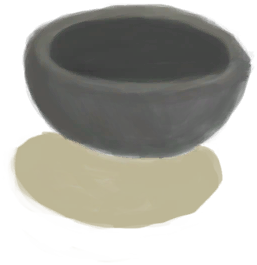

# 陶碗  
> 非常适合用来盛水。  
  
<table class="table table-bordered" data-toggle="table"  data-show-header="false"><thead style="display:none"><tr ><th  style="width:50%;text-align:left;vertical-align:top;"  >title</th><th  style="width:50%;text-align:left;vertical-align:top;"  ></th></tr></thead><tr ><td  style="width:50%;text-align:left;vertical-align:top;"  >**重量：**100  **标签：**	[“储水容器”](tag_WaterContainer.md), [“粘土”](tag_Clay.md), [“容器（敞口）”](tag_ContainerOpen.md), [“碗（容器）”](tag_ContainerBowl.md), [“可泼溅的”](tag_Spillable.md), [“美丽的/好看的”](tag_Pretty.md)  **储水量：**300</td><td  style="width:50%;text-align:left;vertical-align:top;"  >

<a href="ClayBowl.md" style="color:black">陶碗</a>

陶碗可以用来准备多种食物，或用作简易的储水容器。如果你身处在没有<b>椰子树</b>的地区，陶碗则是<b>椰壳碗</b>的完美替代品。  组合<b>粘土</b>和抗裂剂（如<b>灰烬、纤维或沙子</b>），可以很容易地制作陶碗。 作为非常简单的作品，普通的<b>营火</b>就可以烧制陶碗，不需要<b>窑炉</b>。</td></tr></tbody></table>  
  
## 获取来源  
<table class="table table-bordered" data-toggle="table"  ><thead style=""><tr ><th  style="text-align:left;vertical-align:top;"  >来源</th><th  style="text-align:left;vertical-align:top;"  >操作</th></tr></thead><tr ><td  style="text-align:left;vertical-align:top;"  >[

[未烧制的陶碗](ClayBowlUnfired.md)](ClayBowlUnfired.md) , [

[营火](Campfire.md)](Campfire.md)</td><td  style="text-align:left;vertical-align:top;"  >烧制陶碗</td></tr><tr ><td  style="text-align:left;vertical-align:top;"  >[

[未烧制的陶碗](ClayBowlUnfired.md)](ClayBowlUnfired.md) , [

[粘土火盆](ClayFirePit.md)](ClayFirePit.md)</td><td  style="text-align:left;vertical-align:top;"  >烧制陶碗</td></tr><tr ><td  style="text-align:left;vertical-align:top;"  >[

[未烧制的陶碗](ClayBowlUnfired.md)](ClayBowlUnfired.md) , [

[火堆](Fire.md)](Fire.md)</td><td  style="text-align:left;vertical-align:top;"  >烧制陶碗</td></tr><tr ><td  style="text-align:left;vertical-align:top;"  >[

[未烧制的陶碗](ClayBowlUnfired.md)](ClayBowlUnfired.md) , [

[瓦斯炉(开)](GasCookerOn.md)](GasCookerOn.md)</td><td  style="text-align:left;vertical-align:top;"  >烧制陶碗</td></tr><tr ><td  style="text-align:left;vertical-align:top;"  >[

[未烧制的陶碗](ClayBowlUnfired.md)](ClayBowlUnfired.md) , [

[窑炉](Kiln.md)](Kiln.md)</td><td  style="text-align:left;vertical-align:top;"  >烧制陶碗</td></tr><tr ><td  style="text-align:left;vertical-align:top;"  >[

[未烧制的陶碗](ClayBowlUnfired.md)](ClayBowlUnfired.md) , [

[高级窑炉](KilnAdvanced.md)](KilnAdvanced.md)</td><td  style="text-align:left;vertical-align:top;"  >烧制陶碗</td></tr><tr ><td  style="text-align:left;vertical-align:top;"  >[

[烟熏炉](Smoker.md)](Smoker.md)</td><td  style="text-align:left;vertical-align:top;"  >烧制陶碗 ** 拖入：**[未烧制的陶碗](ClayBowlUnfired.md)</td></tr><tr ><td  style="text-align:left;vertical-align:top;"  >[

[烟熏炉(塑料布)(点燃)](SmokerPlastic.md)](SmokerPlastic.md)</td><td  style="text-align:left;vertical-align:top;"  >烧制陶碗 ** 拖入：**[未烧制的陶碗](ClayBowlUnfired.md)</td></tr><tr ><td  style="text-align:left;vertical-align:top;"  >[

[椰壶](CoconutFlask.md)](CoconutFlask.md)</td><td  style="text-align:left;vertical-align:top;"  >从陶碗中倒入</td></tr></tbody></table>  
  
## 动作  
<table class="table table-bordered" data-toggle="table"  ><thead style=""><tr ><th  style="text-align:left;vertical-align:top;"  >动作</th><th  style="text-align:left;vertical-align:top;"  data-sortable="true"  >耗时</th><th  style="text-align:left;vertical-align:top;"  >条件</th><th  style="text-align:left;vertical-align:top;"  >变化</th><th  style="text-align:left;vertical-align:top;"  data-sortable="true"  >状态</th></tr></thead><tr ><td  style="text-align:left;vertical-align:top;"  >收集雨水 </td><td  style="text-align:left;vertical-align:top;"  >-</td><td  style="text-align:left;vertical-align:top;"  >[

[降水值](RainValue.md)](RainValue.md): 1-5</td><td  style="text-align:left;vertical-align:top;"  >** 获得： ** ** [rain]  ** [水](LQ_Water.md)(+50) </td><td  style="text-align:left;vertical-align:top;"  ></td></tr></tbody></table>  
  
## 可拖至  

[蜂箱](BeeSkep.md)

[繁殖中的蜂群](BeeSkepSwarming.md)

[巢脾](BeeHoneycomb.md)

[中陷阱的猕猴](CageTrapMacaque.md)

[椰肉](CoconutMeat.md)

[母猪](BoarEnclosureFemale.md)

[公猪](BoarEnclosureMale.md)

[小猪](BoarEnclosurePiglet.md)

[母猪](BoarTiedFemale.md)

[公猪](BoarTiedMale.md)

[小猪](BoarTiedPiglet.md)

[忠犬朋友](DogFriend.md)

[母山羊](GoatEnclosureFemale.md)

[小羊](GoatEnclosureKid.md)

[哺乳期山羊](GoatEnclosureLactating.md)

[哺乳期山羊](GoatEnclosureLactating.md)

[公山羊](GoatEnclosureMale.md)

[母山羊](GoatTiedFemale.md)

[哺乳期山羊](GoatTiedFemaleLactating.md)

[小羊](GoatTiedKid.md)

[公山羊](GoatTiedMale.md)

[祖父](Grandfather.md)

[祖父](Grandfather.md)

[祖父(健康)](GrandfatherHealthy.md)

[猕猴朋友](MacaqueFriend.md)

[受伤的猕猴](MacaqueWounded.md)

[西米饼](SagoFlatbread.md)

[应急水包](WaterRation.md)

[干涸的小水塘(湿地)](Puddle.md)

[蓄水池](WaterReservoir.md)

[蓄水池(满)](WaterReservoirFull.md)

[蓄水池（灌溉中）](WaterReservoirIrrigating.md)

  
  
## 可用于蓝图  

[

[水窖(蓝图)](Bp_Cistern.md)](Bp_Cistern.md)

[

[蜂蜜(蓝图)](Bp_Honey.md)](Bp_Honey.md)

[

[硫磺农药(蓝图)](Bp_PesticideBrimstone.md)](Bp_PesticideBrimstone.md)

[

[辣椒农药(蓝图)](Bp_PesticideChilli.md)](Bp_PesticideChilli.md)

[

[金鸡纳树皮粉(蓝图)](Bp_Quinine.md)](Bp_Quinine.md)

[

[肥皂(蓝图)](Bp_Soap.md)](Bp_Soap.md)

[

[水井(蓝图)](Bp_Well.md)](Bp_Well.md)

[

[奶酪(蓝图)](Bp_Cheese.md)](Bp_Cheese.md)

[

[椰奶(蓝图)](Bp_CoconutMilk.md)](Bp_CoconutMilk.md)

[

[蜜糖(蓝图)](Bp_HoneyCandy.md)](Bp_HoneyCandy.md)

  
  
  

