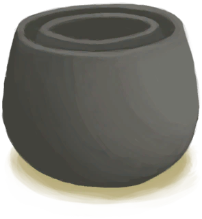
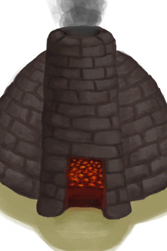

# 未烧制的保鲜罐  
> 它需要在窑炉里烧制。  
  
<table class="table table-bordered" data-toggle="table"  data-show-header="false"><thead style="display:none"><tr ><th  style="width:50%;text-align:left;vertical-align:top;"  >title</th><th  style="width:50%;text-align:left;vertical-align:top;"  ></th></tr></thead><tr ><td  style="width:50%;text-align:left;vertical-align:top;"  >**重量：**500  **标签：**	[“粘土”](tag_Clay.md), [“沉重的”](tag_Heavy.md)</td><td  style="width:50%;text-align:left;vertical-align:top;"  >

<a href="ClayPotCoolerUnfired.md" style="color:black">未烧制的保鲜罐</a>

利用液体蒸发吸热的原理，这种双层陶瓷装置可以保持食物凉爽，从而保鲜更久。 确保定期给设备添水，因为它需要<b>水</b>才能工作。  要制作它，你需要<b>粘土、沙子和一块大布</b>。</td></tr></tbody></table>  
  
## 获取来源  

蓝图制造

[保鲜罐(蓝图)](Bp_ClayPotCooler.md)

  
  
## 可用于转化  
<table class="table table-bordered" data-toggle="table"  ><thead style=""><tr ><th  style="text-align:left;vertical-align:top;"  >转化为</th><th  style="text-align:left;vertical-align:top;"  >容器</th></tr></thead><tr ><td  style="text-align:left;vertical-align:top;"  >[

[保鲜罐](ClayPotCoolerUndeployed.md)](ClayPotCoolerUndeployed.md)</td><td  style="text-align:left;vertical-align:top;"  >[

[窑炉](Kiln.md)](Kiln.md)</td></tr><tr ><td  style="text-align:left;vertical-align:top;"  >[

[保鲜罐](ClayPotCoolerUndeployed.md)](ClayPotCoolerUndeployed.md)</td><td  style="text-align:left;vertical-align:top;"  >[

[高级窑炉](KilnAdvanced.md)](KilnAdvanced.md)</td></tr></tbody></table>  
  

