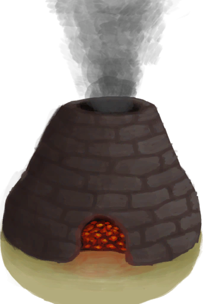

# 未烧制的陶罐  
> 它需要在窑炉里烧制。  
  
<table class="table table-bordered table8682" data-toggle="table"  data-show-header="false"><thead style="display:none"><tr ><th  style="width:50%;"  >title</th><th  style="width:50%;"  ></th></tr></thead><tr ><td  style="width:50%;"  >**重量：**250  **标签：**	[“可烹饪的”](tag_Cookable.md), [“大的”](tag_Large.md), [“粘土”](tag_Clay.md), [“可泼溅的”](tag_Spillable.md), [“沉重的”](tag_Heavy.md)</td><td  style="width:50%;"  >

<a href="ClayVaseUnfired.md" style="color:black">未烧制的陶罐</a>

一个大罐子，能装<b>4份</b>水。  此设计限制了内部液体的液面面积，使内部的液体蒸发速度变慢。  可以用<b>粘土和抗裂剂</b>制成，并在任何<b>窑炉</b>中烧制。</td></tr></tbody></table>  
  
## 获取来源  

蓝图制造

[陶罐(蓝图)](Bp_ClayVase.md)

手工陶罐

[未烧制的陶碗](ClayBowlUnfired.md)

完成陶罐

[未烧制的陶罐](ClayVaseUnfinished.md)

  
  
## 可拖至  

[烟熏炉](Smoker.md)

[烟熏炉(塑料布)(点燃)](SmokerPlastic.md)

  
  
## 可用于转化  
<table class="table table-bordered table5244" data-toggle="table"  ><thead style=""><tr ><th  style=""  >转化为</th><th  style=""  >容器</th></tr></thead><tr ><td  style=""  >[

[陶罐](ClayVase.md)](ClayVase.md)</td><td  style=""  >[

[窑炉](Kiln.md)](Kiln.md)</td></tr><tr ><td  style=""  >[

[陶罐](ClayVase.md)](ClayVase.md)</td><td  style=""  >[

[高级窑炉](KilnAdvanced.md)](KilnAdvanced.md)</td></tr></tbody></table>  
  

