# 布  
> 一块布，可以直接用它做衣服。或者在织布机上和线团组合一起织成一块更大的布。  
   
> 布料可以通过在<b>织机</b>上编织细线制成，可以用于许多服装和实用物品。 它有4种不同的尺寸：小、普通、大和超大。每种尺寸都可以在<b>织机</b>上撕成更小的片或扩大。  布料还可以临时制作成<b>绷带</b>以及<b>绑手带或包脚布</b>，帮助你在这些部位免受伤害。 大布也可以当做<b>简易防毒面具</b>，对火山的有毒烟雾提供一定的防护效果。   
  
<table class="table table-bordered" data-toggle="table" ><tbody><tr ><td  style="width:80%;text-align:left;vertical-align:top;"  >** 不可删除 **  **重量：**50</td><td  style="width:20%;text-align:left;vertical-align:top;"  >
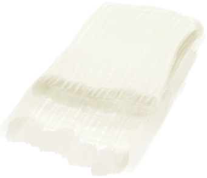
</td></tr></tbody></tbody></table>  
  
## 获取来源  
<table class="table table-bordered" data-toggle="table" ><thead><tr ><th  style="text-align:left;vertical-align:top;"  >来源</th><th  style="text-align:left;vertical-align:top;"  >操作</th></tr></thead><tr ><td  style="text-align:left;vertical-align:top;"  >[
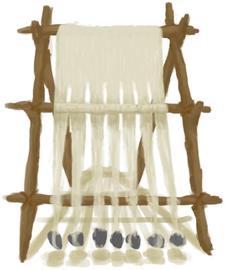
[织布机](Loom.md)](Loom.md)</td><td  style="text-align:left;vertical-align:top;"  >扩大布匹 ** 拖入：**[布片](ClothSmall.md)</td></tr><tr ><td  style="text-align:left;vertical-align:top;"  >[
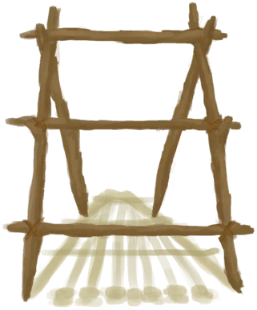
[织布机（空）](LoomEmpty.md)](LoomEmpty.md)</td><td  style="text-align:left;vertical-align:top;"  >解编布匹 ** 拖入：**[大块的布](ClothLarge.md)</td></tr><tr ><td  style="text-align:left;vertical-align:top;"  >[
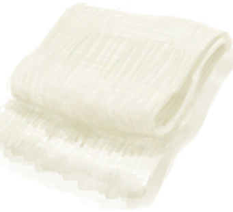
[大块的布](ClothLarge.md)](ClothLarge.md)</td><td  style="text-align:left;vertical-align:top;"  >撕开布料</td></tr><tr ><td  style="text-align:left;vertical-align:top;"  >[
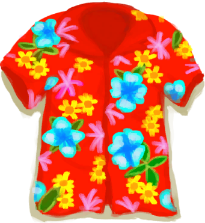
[夏威夷衬衫](HawaiianShirt.md)](HawaiianShirt.md)</td><td  style="text-align:left;vertical-align:top;"  >撕开布料</td></tr><tr ><td  style="text-align:left;vertical-align:top;"  >[

[夏威夷衬衫](HawaiianShirt.md)](HawaiianShirt.md)</td><td  style="text-align:left;vertical-align:top;"  >转化</td></tr><tr ><td  style="text-align:left;vertical-align:top;"  >[

[卫衣](HoodieRetromation.md)](HoodieRetromation.md)</td><td  style="text-align:left;vertical-align:top;"  >撕开布料</td></tr><tr ><td  style="text-align:left;vertical-align:top;"  >[

[卫衣](HoodieRetromation.md)](HoodieRetromation.md)</td><td  style="text-align:left;vertical-align:top;"  >转化</td></tr><tr ><td  style="text-align:left;vertical-align:top;"  >[

[临时防毒面具](MaskMakeshift.md)](MaskMakeshift.md)</td><td  style="text-align:left;vertical-align:top;"  >转化</td></tr><tr ><td  style="text-align:left;vertical-align:top;"  >[

[军裤](MilitaryPants.md)](MilitaryPants.md)</td><td  style="text-align:left;vertical-align:top;"  >撕开布料</td></tr><tr ><td  style="text-align:left;vertical-align:top;"  >[

[军裤](MilitaryPants.md)](MilitaryPants.md)</td><td  style="text-align:left;vertical-align:top;"  >转化</td></tr><tr ><td  style="text-align:left;vertical-align:top;"  >[布制裤子](PantsCloth.md)</td><td  style="text-align:left;vertical-align:top;"  >撕开布料</td></tr><tr ><td  style="text-align:left;vertical-align:top;"  >[
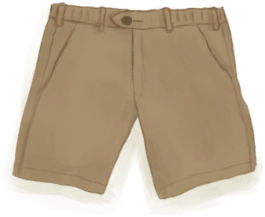
[短裤](Shorts.md)](Shorts.md)</td><td  style="text-align:left;vertical-align:top;"  >撕开布料</td></tr><tr ><td  style="text-align:left;vertical-align:top;"  >[

[短裤](Shorts.md)](Shorts.md)</td><td  style="text-align:left;vertical-align:top;"  >转化</td></tr><tr ><td  style="text-align:left;vertical-align:top;"  >[
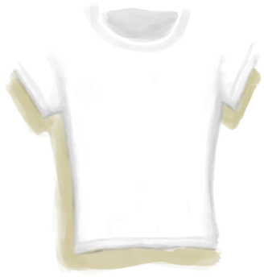
[T恤](T-Shirt.md)](T-Shirt.md)</td><td  style="text-align:left;vertical-align:top;"  >撕开布料</td></tr><tr ><td  style="text-align:left;vertical-align:top;"  >[

[T恤](T-Shirt.md)](T-Shirt.md)</td><td  style="text-align:left;vertical-align:top;"  >转化</td></tr><tr ><td  style="text-align:left;vertical-align:top;"  >[
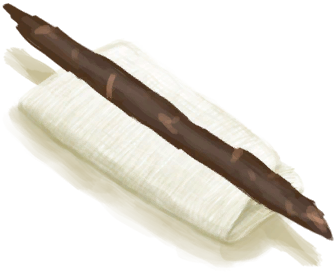
[止血带](Tourniquet.md)](Tourniquet.md)</td><td  style="text-align:left;vertical-align:top;"  >拆解</td></tr><tr ><td  style="text-align:left;vertical-align:top;"  >[

[止血带](Tourniquet.md)](Tourniquet.md)</td><td  style="text-align:left;vertical-align:top;"  >转化</td></tr><tr ><td  style="text-align:left;vertical-align:top;"  >[
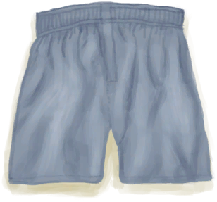
[内裤](Underwear.md)](Underwear.md)</td><td  style="text-align:left;vertical-align:top;"  >撕开布料</td></tr><tr ><td  style="text-align:left;vertical-align:top;"  >[

[内裤](Underwear.md)](Underwear.md)</td><td  style="text-align:left;vertical-align:top;"  >转化</td></tr><tr ><td  style="text-align:left;vertical-align:top;"  >[
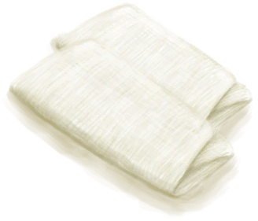
[临时绷带](ImprovisedDressing.md)](ImprovisedDressing.md)</td><td  style="text-align:left;vertical-align:top;"  >还原成布匹</td></tr><tr ><td  style="text-align:left;vertical-align:top;"  >[

[临时绷带](ImprovisedDressing.md)](ImprovisedDressing.md)</td><td  style="text-align:left;vertical-align:top;"  >转化</td></tr><tr ><td  style="text-align:left;vertical-align:top;"  >[
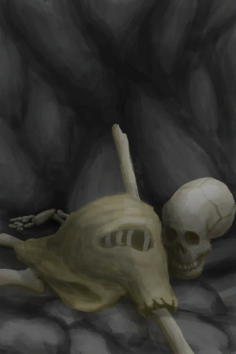
[骷髅(坑洞)](Skeleton.md)](Skeleton.md)</td><td  style="text-align:left;vertical-align:top;"  >采集</td></tr><tr ><td  style="text-align:left;vertical-align:top;"  >[

[树液收集处](PalmTreeSapStation.md)](PalmTreeSapStation.md)</td><td  style="text-align:left;vertical-align:top;"  >砍倒 ** 拖入：**[石斧](StoneAxe.md)</td></tr><tr ><td  style="text-align:left;vertical-align:top;"  >[

[树液收集处](PalmTreeSapStation.md)](PalmTreeSapStation.md)</td><td  style="text-align:left;vertical-align:top;"  >砍倒 ** 拖入：**[“斧”](tag_Axe.md)</td></tr><tr ><td  style="text-align:left;vertical-align:top;"  >[

[树液补给点(空)](PalmTreeSapStationEmpty.md)](PalmTreeSapStationEmpty.md)</td><td  style="text-align:left;vertical-align:top;"  >砍倒 ** 拖入：**[石斧](StoneAxe.md)</td></tr><tr ><td  style="text-align:left;vertical-align:top;"  >[

[树液补给点(空)](PalmTreeSapStationEmpty.md)](PalmTreeSapStationEmpty.md)</td><td  style="text-align:left;vertical-align:top;"  >砍倒 ** 拖入：**[“斧”](tag_Axe.md)</td></tr><tr ><td  style="text-align:left;vertical-align:top;"  >[
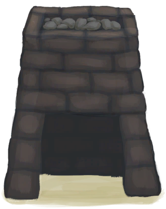
[滤水器](WaterFilter.md)](WaterFilter.md)</td><td  style="text-align:left;vertical-align:top;"  >拆除 ** 拖入：**[“锤”](tag_Hammer.md)</td></tr></tbody></table>  
  
## 动作  
<table class="table table-bordered" data-toggle="table" ><thead><tr ><th  style="text-align:left;vertical-align:top;"  >动作</th><th  style="text-align:left;vertical-align:top;"  >耗时</th><th  style="text-align:left;vertical-align:top;"  data-sortable="true"  >条件</th><th  style="text-align:left;vertical-align:top;"  >变化</th><th  style="text-align:left;vertical-align:top;"  >状态</th></tr></thead><tr ><td  style="text-align:left;vertical-align:top;"  >撕开布料 [“手部动作(组)”](HandAction.md)</td><td  style="text-align:left;vertical-align:top;"  >1TP</td><td  style="text-align:left;vertical-align:top;"  ></td><td  style="text-align:left;vertical-align:top;"  >** 自身：** →消失  ** 获得： ** ** [Small Cloth]  **   [
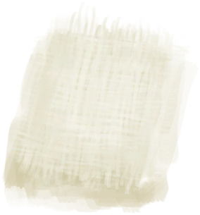
[布片](ClothSmall.md)](ClothSmall.md)(+2) </td><td  style="text-align:left;vertical-align:top;"  ></td></tr><tr ><td  style="text-align:left;vertical-align:top;"  >制作绷带 [“手部动作(组)”](HandAction.md)</td><td  style="text-align:left;vertical-align:top;"  >1TP</td><td  style="text-align:left;vertical-align:top;"  ></td><td  style="text-align:left;vertical-align:top;"  >** 自身：** → [

[临时绷带](ImprovisedDressing.md)](ImprovisedDressing.md)</td><td  style="text-align:left;vertical-align:top;"  >[

[情绪](Morale.md)](Morale.md)+2 [

[纺织(技能)](Skill_Tailoring.md)](Skill_Tailoring.md)+0.5</td></tr><tr ><td  style="text-align:left;vertical-align:top;"  >制作包脚布 [“手部动作(组)”](HandAction.md)</td><td  style="text-align:left;vertical-align:top;"  >1TP</td><td  style="text-align:left;vertical-align:top;"  ></td><td  style="text-align:left;vertical-align:top;"  >** 自身：** → [

[包脚布](FootWrappings.md)](FootWrappings.md)</td><td  style="text-align:left;vertical-align:top;"  >[

[情绪](Morale.md)](Morale.md)+2 [

[纺织(技能)](Skill_Tailoring.md)](Skill_Tailoring.md)+0.5</td></tr><tr ><td  style="text-align:left;vertical-align:top;"  >制作绑手带 [“手部动作(组)”](HandAction.md)</td><td  style="text-align:left;vertical-align:top;"  >2TP</td><td  style="text-align:left;vertical-align:top;"  ></td><td  style="text-align:left;vertical-align:top;"  >** 自身：** → [
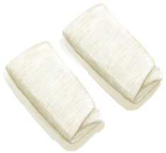
[绑手带](HandWrappings.md)](HandWrappings.md)</td><td  style="text-align:left;vertical-align:top;"  >[

[情绪](Morale.md)](Morale.md)+2 [

[纺织(技能)](Skill_Tailoring.md)](Skill_Tailoring.md)+0.5</td></tr></tbody></table>  
  
## 可拖入  
<table class="table table-bordered" data-toggle="table" ><thead><tr ><th  style="text-align:left;vertical-align:top;"  >使用</th><th  style="text-align:left;vertical-align:top;"  >动作</th><th  style="text-align:left;vertical-align:top;"  >耗时</th><th  style="text-align:left;vertical-align:top;"  >条件</th><th  style="text-align:left;vertical-align:top;"  >变化</th><th  style="text-align:left;vertical-align:top;"  data-sortable="true"  >玩家状态</th></tr></thead><tr ><td  style="text-align:left;vertical-align:top;"  >[
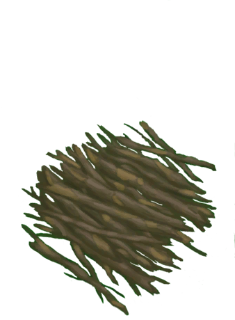
[小树枝](Sticks.md)](Sticks.md)</td><td  style="text-align:left;vertical-align:top;"  >制作止血带 [“手部动作(组)”](HandAction.md)</td><td  style="text-align:left;vertical-align:top;"  >1TP</td><td  style="text-align:left;vertical-align:top;"  >[

[光亮](Light.md)](Light.md): 10-100</td><td  style="text-align:left;vertical-align:top;"  >** 自身: ** → [

[止血带](Tourniquet.md)](Tourniquet.md)  ** 使用物: ** →消失</td><td  style="text-align:left;vertical-align:top;"  ></td></tr></tbody></table>  
  
## 可拖至  

[织布机](Loom.md)

[织布机（空）](LoomEmpty.md)

[头部（内层）(蓝图)](InnerHeadBlueprint.md)

[左脚（内层）(蓝图)](InnerLeftFootBlueprint.md)

[左手(蓝图)](LeftHandBlueprint.md)

[右手(蓝图)](RightHandBlueprint.md)

  
  
## 可用于蓝图  

[

[火把(蓝图)](Bp_Torch.md)](Bp_Torch.md)

[

[止血带(蓝图)](Bp_Tourniquet.md)](Bp_Tourniquet.md)

[

[滤水器(蓝图)](Bp_WaterFilter.md)](Bp_WaterFilter.md)

  
  
  

