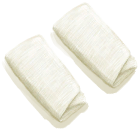

# 布片  
> 一块小布，可以直接用它做衣服。或者在织布机上和更多布一起织成更大的一块。  
  
<table class="table table-bordered" data-toggle="table"  data-show-header="false"><thead style="display:none"><tr ><th  style="width:50%;text-align:left;vertical-align:top;"  >title</th><th  style="width:50%;text-align:left;vertical-align:top;"  ></th></tr></thead><tr ><td  style="width:50%;text-align:left;vertical-align:top;"  >** 不可删除 **  **重量：**25</td><td  style="width:50%;text-align:left;vertical-align:top;"  >

<a href="ClothSmall.md" style="color:black">布片</a>

布料可以通过在<b>织机</b>上编织细线制成，可以用于许多服装和实用物品。 它有4种不同的尺寸：小、普通、大和超大。每种尺寸都可以在<b>织机</b>上撕成更小的片或扩大。  布料还可以临时制作成<b>绷带</b>以及<b>绑手带或包脚布</b>，帮助你在这些部位免受伤害。 大布也可以当做<b>简易防毒面具</b>，对火山的有毒烟雾提供一定的防护效果。 </td></tr></tbody></table>  
  
## 获取来源  
<table class="table table-bordered" data-toggle="table"  ><thead style=""><tr ><th  style="text-align:left;vertical-align:top;"  >来源</th><th  style="text-align:left;vertical-align:top;"  >操作</th></tr></thead><tr ><td  style="text-align:left;vertical-align:top;"  >[

[织布机](Loom.md)](Loom.md)</td><td  style="text-align:left;vertical-align:top;"  >织布</td></tr><tr ><td  style="text-align:left;vertical-align:top;"  >[

[织布机（空）](LoomEmpty.md)](LoomEmpty.md)</td><td  style="text-align:left;vertical-align:top;"  >解编布匹 ** 拖入：**[布](Cloth.md)</td></tr><tr ><td  style="text-align:left;vertical-align:top;"  >[

[草木灰敷料](AshDressing.md)](AshDressing.md)</td><td  style="text-align:left;vertical-align:top;"  >去除灰烬</td></tr><tr ><td  style="text-align:left;vertical-align:top;"  >[

[草木灰敷料](AshDressing.md)](AshDressing.md)</td><td  style="text-align:left;vertical-align:top;"  >转化</td></tr><tr ><td  style="text-align:left;vertical-align:top;"  >[

[布](Cloth.md)](Cloth.md)</td><td  style="text-align:left;vertical-align:top;"  >撕开布料</td></tr><tr ><td  style="text-align:left;vertical-align:top;"  >[

[大块的布](ClothLarge.md)](ClothLarge.md)</td><td  style="text-align:left;vertical-align:top;"  >撕开布料</td></tr><tr ><td  style="text-align:left;vertical-align:top;"  >[

[超大块布](ClothVeryLarge.md)](ClothVeryLarge.md)</td><td  style="text-align:left;vertical-align:top;"  >撕开布料</td></tr><tr ><td  style="text-align:left;vertical-align:top;"  >[

[包脚布](FootWrappings.md)](FootWrappings.md)</td><td  style="text-align:left;vertical-align:top;"  >撕开布料</td></tr><tr ><td  style="text-align:left;vertical-align:top;"  >[

[包脚布](FootWrappings.md)](FootWrappings.md)</td><td  style="text-align:left;vertical-align:top;"  >转化</td></tr><tr ><td  style="text-align:left;vertical-align:top;"  >[

[绑手带](HandWrappings.md)](HandWrappings.md)</td><td  style="text-align:left;vertical-align:top;"  >撕开布料</td></tr><tr ><td  style="text-align:left;vertical-align:top;"  >[

[绑手带](HandWrappings.md)](HandWrappings.md)</td><td  style="text-align:left;vertical-align:top;"  >转化</td></tr><tr ><td  style="text-align:left;vertical-align:top;"  >[

[求生帽](HatSurvival.md)](HatSurvival.md)</td><td  style="text-align:left;vertical-align:top;"  >转化</td></tr><tr ><td  style="text-align:left;vertical-align:top;"  >[

[头巾](HeadWrappings.md)](HeadWrappings.md)</td><td  style="text-align:left;vertical-align:top;"  >撕开布料</td></tr><tr ><td  style="text-align:left;vertical-align:top;"  >[

[袜子](Socks.md)](Socks.md)</td><td  style="text-align:left;vertical-align:top;"  >撕开布料</td></tr><tr ><td  style="text-align:left;vertical-align:top;"  >[

[袜子](Socks.md)](Socks.md)</td><td  style="text-align:left;vertical-align:top;"  >转化</td></tr><tr ><td  style="text-align:left;vertical-align:top;"  >[

[伤口敷料](WoundDressing.md)](WoundDressing.md)</td><td  style="text-align:left;vertical-align:top;"  >转化</td></tr></tbody></table>  
  
## 可拖入  
<table class="table table-bordered" data-toggle="table"  ><thead style=""><tr ><th  style="text-align:left;vertical-align:top;"  >使用</th><th  style="text-align:left;vertical-align:top;"  >动作</th><th  style="text-align:left;vertical-align:top;"  >耗时</th><th  style="text-align:left;vertical-align:top;"  >条件</th><th  style="text-align:left;vertical-align:top;"  >变化</th><th  style="text-align:left;vertical-align:top;"  data-sortable="true"  >玩家状态</th></tr></thead><tr ><td  style="text-align:left;vertical-align:top;"  >[

[灰烬](Ash.md)](Ash.md)</td><td  style="text-align:left;vertical-align:top;"  >制作草木灰敷料 [“手部动作(组)”](HandAction.md)</td><td  style="text-align:left;vertical-align:top;"  >15分</td><td  style="text-align:left;vertical-align:top;"  >[

[光亮](Light.md)](Light.md): 10-100</td><td  style="text-align:left;vertical-align:top;"  >** 自身: ** → [

[草木灰敷料](AshDressing.md)](AshDressing.md)  ** 使用物: ** →消失</td><td  style="text-align:left;vertical-align:top;"  ></td></tr></tbody></table>  
  
## 可拖至  

[织布机](Loom.md)

[织布机（空）](LoomEmpty.md)

  
  
## 可用于蓝图  

[

[草木灰敷料(蓝图)](Bp_AshDressing.md)](Bp_AshDressing.md)

[

[投石索(蓝图)](Bp_Sling.md)](Bp_Sling.md)

[

[奶酪(蓝图)](Bp_Cheese.md)](Bp_Cheese.md)

  
  
  

