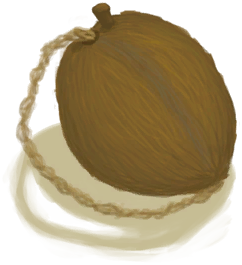
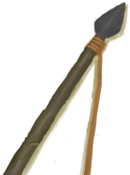

# Ambrosia75(未实装)  
  
<table class="table table-bordered" data-toggle="table"  data-show-header="false"><thead style="display:none"><tr ><th  style="width:50%;text-align:left;vertical-align:top;"  >title</th><th  style="width:50%;text-align:left;vertical-align:top;"  ></th></tr></thead><tr ><td  style="width:50%;text-align:left;vertical-align:top;"  >**重量：**100  **标签：**	[“储水容器”](tag_WaterContainer.md)</td><td  style="width:50%;text-align:left;vertical-align:top;"  >

<a href="CoconutFlaskAmbrosiaSpearSkill75.md" style="color:black">Ambrosia75</a>

</td></tr></tbody></table>  
  
## 动作  

<table><tr><td rowspan="2" style="width:200px;text-align:center;font-size:1.3em;font-weight:bold">

饮用

</td><td></td></tr><tr><td><b>自身：</b>→消失</td></tr><tr><td colspan="2"><b>状态变化：</b>[

[枪术(技能)](Skill_SpearFighting.md)](Skill_SpearFighting.md)<b>+75</b>, [

[追踪技能(技能)](Skill_Tracking.md)](Skill_Tracking.md)<b>+75</b>, [

[潜行(技能)](Skill_Stealth.md)](Skill_Stealth.md)<b>+75</b></td></tr></table>
  

<table><tr><td rowspan="2" style="width:200px;text-align:center;font-size:1.3em;font-weight:bold">

倒空

</td><td></td></tr><tr><td><b>自身：</b>→ [

[椰壶](CoconutFlask.md)](CoconutFlask.md)</td></tr></table>
  

<table><tr><td rowspan="2" style="width:200px;text-align:center;font-size:1.3em;font-weight:bold">

技能

15分

</td><td></td></tr><tr><td><b>自身：</b>→ [

[椰壶](CoconutFlask.md)](CoconutFlask.md)</td></tr><tr><td colspan="2"><b>状态变化：</b>[

[击鼓(技能)](Skill_Percussion.md)](Skill_Percussion.md)<b>+150</b></td></tr></table>
  
  
  
## 可拖至  

[蜂箱](BeeSkep.md)

[繁殖中的蜂群](BeeSkepSwarming.md)

[中陷阱的猕猴](CageTrapMacaque.md)

[母猪](BoarEnclosureFemale.md)

[公猪](BoarEnclosureMale.md)

[小猪](BoarEnclosurePiglet.md)

[母猪](BoarTiedFemale.md)

[公猪](BoarTiedMale.md)

[小猪](BoarTiedPiglet.md)

[忠犬朋友](DogFriend.md)

[母山羊](GoatEnclosureFemale.md)

[小羊](GoatEnclosureKid.md)

[泌乳期山羊](GoatEnclosureLactating.md)

[公山羊](GoatEnclosureMale.md)

[母山羊](GoatTiedFemale.md)

[泌乳期山羊](GoatTiedFemaleLactating.md)

[小羊](GoatTiedKid.md)

[公山羊](GoatTiedMale.md)

[祖父](Grandfather.md)

[祖父(健康)](GrandfatherHealthy.md)

[猕猴朋友](MacaqueFriend.md)

[受伤的猕猴](MacaqueWounded.md)

[西米饼](SagoFlatbread.md)

[应急水包](WaterRation.md)

[干涸的小水塘(湿地)](Puddle.md)

[蓄水池](WaterReservoir.md)

[蓄水池(满)](WaterReservoirFull.md)

[蓄水池（灌溉中）](WaterReservoirIrrigating.md)

  
  

