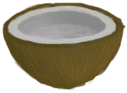

[返回首页](index.md)   |  [查看所有物品](object.md)
# 半个椰子  
> 里面有椰肉。  
  
  属性  |   图片   
 ----  |  ----:   
 **重量：**75  **标签：**	[“椰子（会腐败）”](tag_CoconutSpoilable.md)  |     
  
## 获取来源  
来源  |  操作  
----  |  ----  
[椰子](Coconut.md) , [“锤”](tag_Hammer.md)  |  敲开椰子  
[带孔椰子](CoconutPerforated.md) , [“锤”](tag_Hammer.md)  |  敲开椰子  
[韦斯顿](Weston.md) , [“锤”](tag_Hammer.md)  |  杀害！  
## 动作  
动作  |  时间  |  条件  |  变化  |  状态  
----  |  ----  |  ----  |  ----  |  ----  
刮椰肉  |  15分  |    |  → [椰子壳](CoconutShell.md)  [椰肉](CoconutMeat.md)(1)  |    
## 变化  
操作  |  值  |  时间  |  变化  
----  |  ----  |  ----  |  ----  
耐久  |  初始：192 最大：192  |  每天-1 最多需要：2天  |  → [椰子壳](CoconutShell.md)  
