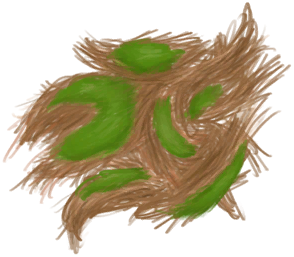

# 椰子皮  
> 能从中提取纤维。  
  
<table class="table table-bordered" data-toggle="table"  data-show-header="false"><thead style="display:none"><tr ><th  style="width:50%;text-align:left;vertical-align:top;"  >title</th><th  style="width:50%;text-align:left;vertical-align:top;"  ></th></tr></thead><tr ><td  style="width:50%;text-align:left;vertical-align:top;"  >**重量：**15  **标签：**	[“燃料”](tag_Fuel.md)</td><td  style="width:50%;text-align:left;vertical-align:top;"  >

<a href="CoconutHusk.md" style="color:black">椰子皮</a>

用石头或锋利的工具剥<b>椰子</b>时收集。 你可以从中提取<b>纤维</b>，或者将其制成<b>椰子凉鞋</b>以获得一些足部防护。</td></tr></tbody></table>  
  
## 获取来源  

** 使用**[“切割工具”](tag_Cutter.md) , [“一级矛”](tag_Spear.md)剥

[青椰子](CoconutHusked.md)

** 使用**[“斧”](tag_Axe.md)剥

[青椰子](CoconutHusked.md)

** 使用**[“锤”](tag_Hammer.md)剥

[青椰子](CoconutHusked.md)

** 使用**[青椰子](CoconutHusked.md)剥椰子

[猕猴朋友](MacaqueFriend.md)

  
  
## 动作  

<table><tr><td rowspan="2" style="width:200px;text-align:center;font-size:1.3em;font-weight:bold">

提取纤维

15分

</td><td>[“手部动作(组)”](HandAction.md)</td></tr><tr><td><b>自身：</b>→消失</td></tr><tr><td colspan="2"><b>状态变化：</b>[

[压力](Stress.md)](Stress.md)<b>-10</b> 加成<b>-1</b></td></tr><tr><td colspan="2">[

[纤维](Fibers.md)](Fibers.md)(<b>+2</b>)</td></tr></table>
  
  
  
## 可拖至  

[堆肥箱](CompostBin.md)

[蒸馏器(关)](AlembicOff.md)

[蒸馏器(开)](AlembicOn.md)

[营火](Campfire.md)

[营火(熄灭)](CampfireExtinguished.md)

[粘土火盆](ClayFirePit.md)

[粘土火盆(熄灭)](ClayFirePitExtinguished.md)

[火堆](Fire.md)

[火堆(熄灭)](FireExtinguished.md)

[熔炉](Forge.md)

[熔炉(熄灭)](ForgeExtinguished.md)

[窑炉](Kiln.md)

[高级窑炉](KilnAdvanced.md)

[高级窑炉(熄灭)](KilnAdvancedExtinguished.md)

[窑炉(熄灭)](KilnExtinguished.md)

[火炉](Stove.md)

[火炉(熄灭)](StoveExtinguished.md)

  
  
## 可用于蓝图  

<a href="Bp_CoconutSandals.md" style="color:black">椰子凉鞋</a>

  
  
  

